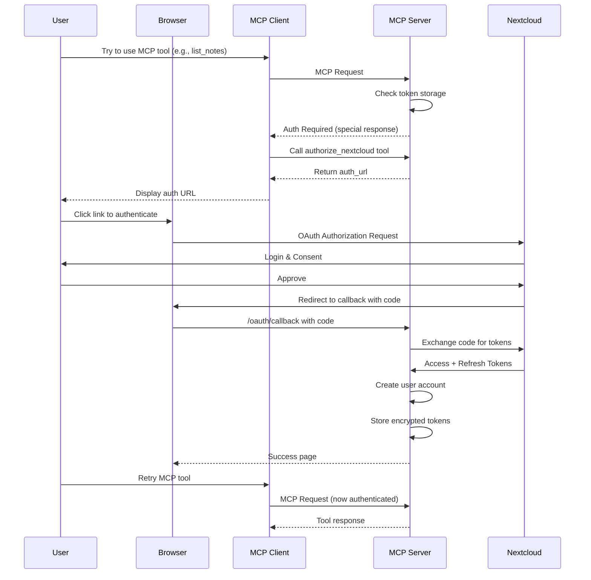
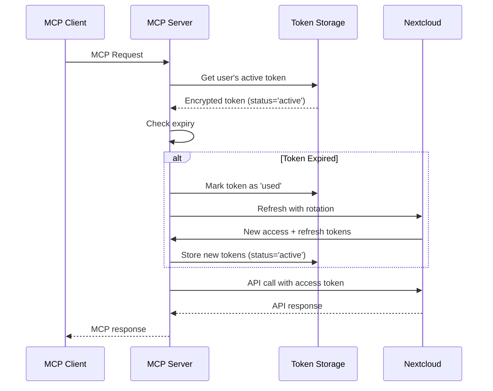
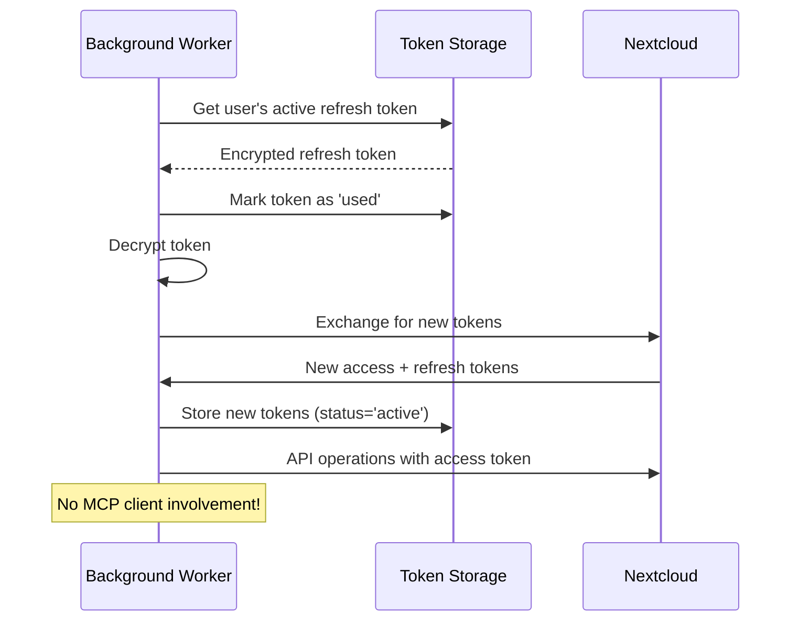

# ADR-004: MCP Server as OAuth Client for Offline Access

**Status**: Draft
**Date**: 2025-11-02
**Supersedes**: ADR-002

## Context

ADR-002 attempted to solve the problem of background workers accessing user data by proposing token exchange patterns. However, it fundamentally misunderstood the MCP protocol's authentication architecture. The MCP protocol assumes that:

1. The MCP **client** (e.g., Claude Desktop, IDE) manages OAuth flows
2. The MCP **server** receives pre-authenticated tokens with each request
3. The server never sees or stores refresh tokens

This architecture makes offline/background operations impossible because the server cannot obtain tokens outside of active MCP sessions. ADR-002's proposed solutions (service accounts, token exchange) were either OAuth-violating or circular in dependency.

## Problem Statement

We need a way for:
1. Background workers to access user data when users are offline
2. The MCP server to maintain persistent access to Nextcloud
3. Proper OAuth compliance with user consent
4. Clean separation of authentication concerns

The core issue: **How can the MCP server obtain and refresh tokens independently of MCP client sessions?**

## Decision

We will implement a **"Sign-in with Nextcloud" architecture** where:

1. **Nextcloud as Identity Provider**: Users authenticate using Nextcloud's OAuth/OIDC
2. **MCP Server as OAuth Client**: The MCP server acts as a registered OAuth client to Nextcloud
3. **Single Authentication Flow**: One OAuth flow bootstraps both user identity and API access

The MCP server becomes a full OAuth client application that:
- Registers with Nextcloud's OAuth provider
- Uses Nextcloud OIDC as the primary authentication mechanism
- Stores refresh tokens securely with rotation
- Uses stored tokens for both MCP sessions and background operations

## Architecture

### OAuth Flow

```
┌─────────────┐                      ┌─────────────────┐                     ┌────────────┐
│  MCP Client ├───────────────────>  │   MCP Server    ├────────────────────>│ Nextcloud  │
│  (Claude)   │  (MCP Protocol)      │  (OAuth Client) │   (OIDC + APIs)     │   APIs     │
└─────────────┘                      └─────────────────┘                     └────────────┘
                                             │
                                      ┌──────▼────────┐
                                      │ Token Storage │
                                      │ (Rotated Tokens)
                                      └───────────────┘
```

### Authentication Flows

#### Initial Setup (One-Time)



#### Subsequent MCP Sessions



#### Background Operations



## Implementation

### 1. Sign-in with Nextcloud Token Verifier

```python
class NextcloudIdentityTokenVerifier(TokenVerifier):
    """Uses Nextcloud as the sole identity provider."""

    def __init__(self, token_storage: RefreshTokenStorage):
        self.storage = token_storage

    async def verify_token(self, token: str) -> AccessToken | None:
        # Token represents a Nextcloud session ID after OAuth
        session = await self.storage.get_session(token)
        if not session:
            # User needs to complete Sign-in with Nextcloud
            return AccessToken(
                token=token,
                scopes=["nextcloud:auth:required"],
                resource=json.dumps({
                    "needs_auth": True,
                    "auth_type": "sign_in_with_nextcloud"
                })
            )

        # Get active token for this user
        nc_tokens = await self.storage.get_active_tokens(session.user_id)

        if not nc_tokens:
            # Session exists but tokens revoked/expired
            return AccessToken(
                token=token,
                scopes=["nextcloud:auth:required"],
                resource=json.dumps({
                    "user_id": session.user_id,
                    "needs_reauth": True
                })
            )

        # Refresh if expired (with rotation)
        if nc_tokens.is_expired():
            nc_tokens = await self.rotate_refresh_token(
                session.user_id,
                nc_tokens
            )

        # Return Nextcloud access token for API use
        return AccessToken(
            token=nc_tokens.access_token,
            scopes=nc_tokens.scopes,
            resource=json.dumps({
                "user_id": session.user_id,
                "nc_user": nc_tokens.username
            })
        )

    async def rotate_refresh_token(self, user_id: str, old_tokens: TokenSet):
        """Implement proper token rotation with reuse detection."""
        # Mark old token as 'used'
        await self.storage.mark_token_used(old_tokens.token_id)

        try:
            # Exchange for new tokens
            new_tokens = await self.oauth_client.refresh(old_tokens.refresh_token)

            # Store new tokens in same family
            await self.storage.store_tokens(
                user_id=user_id,
                token_family_id=old_tokens.token_family_id,
                access_token=new_tokens.access_token,
                refresh_token=new_tokens.refresh_token,
                status='active'
            )

            return new_tokens

        except RefreshTokenReuseError:
            # Possible token theft - revoke entire family
            await self.storage.revoke_token_family(old_tokens.token_family_id)
            await self.alert_user_possible_breach(user_id)
            raise
```

### 2. OAuth Flow Initiation

```python
@mcp.tool()
async def authorize_nextcloud(ctx: Context) -> dict:
    """Initiate Sign-in with Nextcloud OAuth flow."""
    access_token = ctx.request_context.request.user.access_token
    auth_state = json.loads(access_token.resource)

    if not auth_state.get("needs_auth"):
        return {"status": "already_authorized"}

    # Generate OAuth URL with PKCE
    state = generate_secure_state()
    code_verifier = generate_pkce_verifier()
    code_challenge = generate_pkce_challenge(code_verifier)

    # Store PKCE verifier for callback
    await store_oauth_state(state, code_verifier)

    auth_url = (
        f"{NEXTCLOUD_URL}/apps/oidc/authorize?"
        f"client_id={MCP_SERVER_CLIENT_ID}&"
        f"redirect_uri={MCP_SERVER_URL}/oauth/callback&"
        f"response_type=code&"
        f"scope=openid profile email offline_access notes:read notes:write&"
        f"state={state}&"
        f"code_challenge={code_challenge}&"
        f"code_challenge_method=S256"
    )

    return {
        "status": "authorization_required",
        "auth_url": auth_url,
        "message": "Please visit the URL to sign in with Nextcloud"
    }

@app.get("/oauth/callback")
async def oauth_callback(code: str, state: str):
    """Handle OAuth callback and create user account."""
    # Verify state and retrieve PKCE verifier
    code_verifier = await get_oauth_state(state)
    if not code_verifier:
        return {"error": "Invalid state"}

    # Exchange code for tokens
    tokens = await oauth_client.exchange_code(
        code=code,
        code_verifier=code_verifier
    )

    # Decode ID token to get user info
    userinfo = decode_id_token(tokens.id_token)

    # Create or update user account
    user = await create_or_update_user(
        nc_username=userinfo.preferred_username,
        nc_sub=userinfo.sub,
        email=userinfo.email
    )

    # Generate new token family for this authentication
    token_family_id = str(uuid4())

    # Store tokens with rotation support
    await token_storage.store_tokens(
        user_id=user.id,
        token_family_id=token_family_id,
        access_token=tokens.access_token,
        refresh_token=tokens.refresh_token,
        status='active',
        nc_username=userinfo.preferred_username
    )

    # Create session for MCP
    session_token = generate_session_token()
    await token_storage.create_session(session_token, user.id)

    return HTMLResponse("""
        <html>
        <body>
            <h1>Authorization Successful!</h1>
            <p>You can now close this window and return to your MCP client.</p>
            <script>window.close();</script>
        </body>
        </html>
    """)
```

### 3. Token Storage Schema with Rotation

```sql
-- User accounts (created from Nextcloud OIDC)
CREATE TABLE users (
    id TEXT PRIMARY KEY,
    nc_sub TEXT UNIQUE NOT NULL,      -- Nextcloud OIDC subject
    nc_username TEXT NOT NULL,
    email TEXT,
    created_at INTEGER NOT NULL,
    last_login INTEGER NOT NULL
);

-- Token storage with rotation support
CREATE TABLE user_nextcloud_tokens (
    id INTEGER PRIMARY KEY AUTOINCREMENT,
    user_id TEXT NOT NULL REFERENCES users(id),
    token_family_id TEXT NOT NULL,    -- Groups all tokens in rotation chain
    encrypted_access_token BLOB NOT NULL,
    encrypted_refresh_token BLOB NOT NULL,
    access_expires_at INTEGER NOT NULL,
    status TEXT NOT NULL CHECK(status IN ('active', 'used', 'revoked')),
    scopes TEXT NOT NULL,
    created_at INTEGER NOT NULL,
    used_at INTEGER,                  -- When token was exchanged

    -- Only one active token per family
    UNIQUE(token_family_id, status) WHERE status = 'active'
);

-- Index for quick lookups
CREATE INDEX idx_active_tokens ON user_nextcloud_tokens(user_id, status)
    WHERE status = 'active';
CREATE INDEX idx_token_families ON user_nextcloud_tokens(token_family_id);

-- MCP session mapping
CREATE TABLE mcp_sessions (
    session_token TEXT PRIMARY KEY,
    user_id TEXT NOT NULL REFERENCES users(id),
    created_at INTEGER NOT NULL,
    expires_at INTEGER NOT NULL
);

-- Audit log for security
CREATE TABLE token_audit_log (
    id INTEGER PRIMARY KEY AUTOINCREMENT,
    user_id TEXT NOT NULL,
    token_family_id TEXT,
    operation TEXT NOT NULL,  -- 'authorize', 'refresh', 'revoke', 'reuse_detected'
    timestamp INTEGER NOT NULL,
    ip_address TEXT,
    user_agent TEXT,
    details TEXT
);
```

### 4. Background Worker with Token Rotation

```python
class BackgroundSyncWorker:
    """Sync user data with proper token rotation."""

    def __init__(self, token_storage: RefreshTokenStorage):
        self.storage = token_storage
        self.nextcloud_url = os.getenv("NEXTCLOUD_HOST")

    async def sync_user_data(self, user_id: str):
        """Sync data using rotated tokens."""
        # Get active refresh token
        tokens = await self.storage.get_active_tokens(user_id)
        if not tokens:
            logger.warning(f"No active tokens for user {user_id}")
            return

        # Mark token as used immediately
        await self.storage.mark_token_used(tokens.id)

        try:
            # Exchange for new tokens (rotation)
            oauth_client = NextcloudOAuthClient.from_discovery(self.nextcloud_url)
            new_tokens = await oauth_client.refresh(tokens.refresh_token)

            # Store new tokens in same family
            await self.storage.store_tokens(
                user_id=user_id,
                token_family_id=tokens.token_family_id,
                access_token=new_tokens.access_token,
                refresh_token=new_tokens.refresh_token,
                status='active'
            )

            # Create Nextcloud client with new access token
            client = NextcloudClient.from_token(
                base_url=self.nextcloud_url,
                token=new_tokens.access_token,
                username=tokens.nc_username
            )

            # Perform sync operations
            await self.sync_notes(user_id, client)
            await self.sync_calendar(user_id, client)

        except HTTPStatusError as e:
            if e.response.status_code == 401:
                # Token revoked or reuse detected
                await self.storage.revoke_token_family(tokens.token_family_id)
                await self.log_security_event(user_id, "token_revoked", tokens.token_family_id)
            raise
        except Exception as e:
            # Revert token status on failure
            await self.storage.revert_token_status(tokens.id)
            raise
```

### 5. Reuse Detection

```python
class RefreshTokenStorage:
    """Storage with reuse detection."""

    async def get_active_tokens(self, user_id: str) -> TokenSet | None:
        """Get active tokens, detecting reuse attempts."""
        async with self.db.execute(
            """
            SELECT id, token_family_id, encrypted_access_token,
                   encrypted_refresh_token, status, access_expires_at
            FROM user_nextcloud_tokens
            WHERE user_id = ? AND status = 'active'
            ORDER BY created_at DESC
            LIMIT 1
            """,
            (user_id,)
        ) as cursor:
            row = await cursor.fetchone()
            if not row:
                return None

            return self._decrypt_tokens(row)

    async def mark_token_used(self, token_id: int):
        """Mark token as used - critical for reuse detection."""
        result = await self.db.execute(
            """
            UPDATE user_nextcloud_tokens
            SET status = 'used', used_at = ?
            WHERE id = ? AND status = 'active'
            """,
            (int(time.time()), token_id)
        )

        if result.rowcount == 0:
            # Token was already used - possible attack!
            await self.handle_token_reuse(token_id)

    async def handle_token_reuse(self, token_id: int):
        """Detect and handle refresh token reuse."""
        # Get token family
        cursor = await self.db.execute(
            "SELECT token_family_id, user_id FROM user_nextcloud_tokens WHERE id = ?",
            (token_id,)
        )
        row = await cursor.fetchone()

        if row:
            # Revoke entire token family
            await self.revoke_token_family(row['token_family_id'])

            # Log security event
            await self.log_security_event(
                row['user_id'],
                'reuse_detected',
                f"Token {token_id} reused, family {row['token_family_id']} revoked"
            )

    async def revoke_token_family(self, token_family_id: str):
        """Revoke all tokens in a family."""
        await self.db.execute(
            """
            UPDATE user_nextcloud_tokens
            SET status = 'revoked'
            WHERE token_family_id = ? AND status IN ('active', 'used')
            """,
            (token_family_id,)
        )
```

## Advantages

1. **True Offline Access**: Background workers can operate without active MCP sessions
2. **OAuth Compliant**: Proper user consent and token lifecycle with rotation
3. **Single Sign-On**: Users authenticate once with their Nextcloud credentials
4. **Security**: Full token rotation with reuse detection
5. **Simplicity**: No separate app authentication layer to maintain
6. **User Control**: Users can revoke access at any time through Nextcloud

## Disadvantages

1. **Nextcloud Dependency**: The MCP server requires Nextcloud OIDC for all authentication
2. **Token Management**: Complex token rotation logic
3. **Migration**: Existing deployments need architectural changes

## Security Considerations

### Token Storage
- All refresh tokens MUST be encrypted at rest (Fernet or similar)
- Database access must be restricted to the MCP server process
- Consider using hardware security modules (HSM) for production

### Token Rotation
- **Full rotation implemented**: Each refresh creates new access AND refresh tokens
- **Reuse detection**: Any attempt to use an already-used token revokes the entire family
- **Atomic operations**: Token status updates must be atomic to prevent race conditions
- **Audit logging**: All token operations are logged for security analysis

### Revocation
- Implement webhook listener for Nextcloud revocation events
- Immediate family revocation on reuse detection
- Clear session mappings on logout

### Scope Management
- Request minimal scopes needed for operations
- Allow users to customize scope grants
- Implement per-tool scope checking

## Migration Strategy

### Phase 1: Parallel Operation
1. Keep existing pass-through authentication
2. Add Sign-in with Nextcloud as optional feature
3. Test with subset of users

### Phase 2: Gradual Migration
1. New users default to Sign-in with Nextcloud
2. Prompt existing users to migrate
3. Maintain backward compatibility

### Phase 3: Deprecation
1. Announce end-of-life for pass-through mode
2. Provide migration tools
3. Remove legacy code

## Alternatives Considered

### 1. Pass-Through Only (Current)
- **Pros**: Simple, stateless
- **Cons**: No offline access possible
- **Rejected**: Doesn't meet requirements

### 2. Service Accounts (ADR-002 Tier 1)
- **Pros**: Simple to implement
- **Cons**: Violates OAuth principles, creates audit issues
- **Rejected**: Security and compliance concerns

### 3. Token Exchange (ADR-002 Tier 2)
- **Pros**: Standards-based (RFC 8693)
- **Cons**: Circular dependency, doesn't solve bootstrap problem
- **Rejected**: Doesn't enable true offline access

### 4. Double OAuth (Initial ADR-004 Draft)
- **Pros**: Separation of concerns
- **Cons**: Users must authenticate twice, complex to maintain two auth systems
- **Rejected**: Poor user experience, unnecessary complexity

## References

- [RFC 6749: OAuth 2.0](https://datatracker.ietf.org/doc/html/rfc6749)
- [RFC 6749 Section 1.5: Refresh Tokens](https://datatracker.ietf.org/doc/html/rfc6749#section-1.5)
- [RFC 7636: PKCE](https://datatracker.ietf.org/doc/html/rfc7636)
- [OAuth 2.0 Security Best Practices](https://datatracker.ietf.org/doc/html/draft-ietf-oauth-security-topics)
- [OpenID Connect Core 1.0](https://openid.net/specs/openid-connect-core-1_0.html)

## Decision Outcome

This architecture provides a clean, OAuth-compliant solution for offline access while maintaining security boundaries. The MCP server uses "Sign-in with Nextcloud" as its primary authentication mechanism, creating a seamless user experience while enabling full offline capabilities.

The implementation of proper token rotation with reuse detection ensures security against token theft, while the simplified authentication flow improves user experience compared to a double OAuth approach.

The additional complexity of token rotation is justified by the security benefits and follows industry best practices for OAuth implementations requiring offline access.