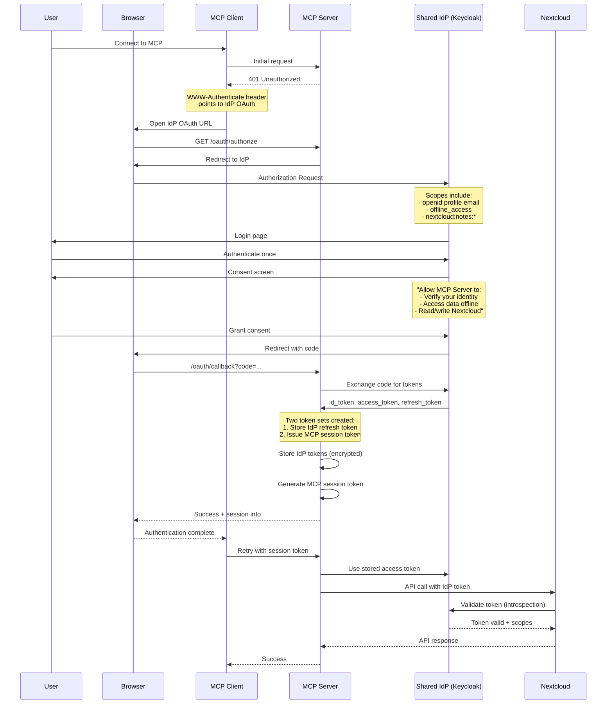
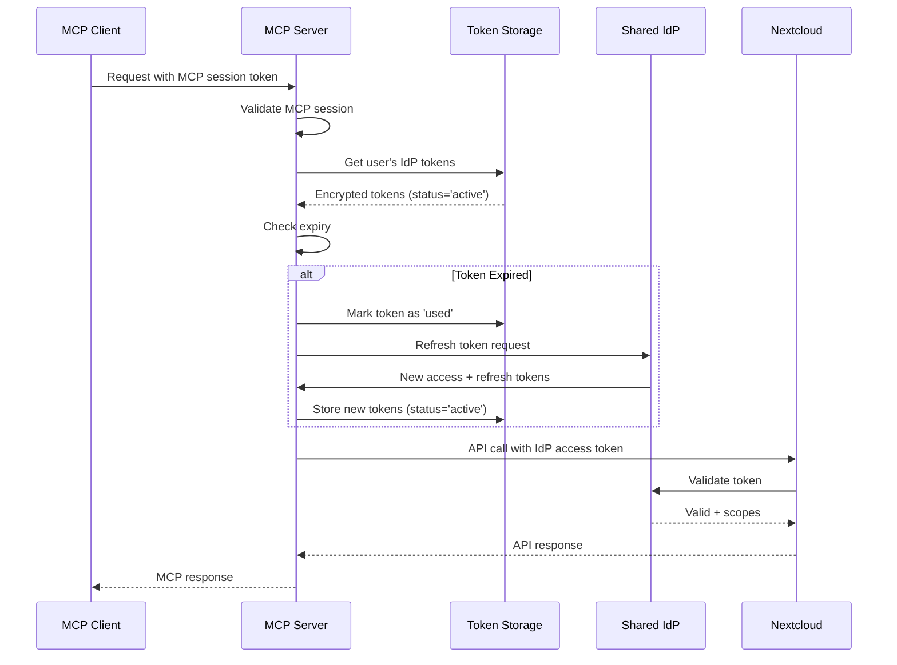
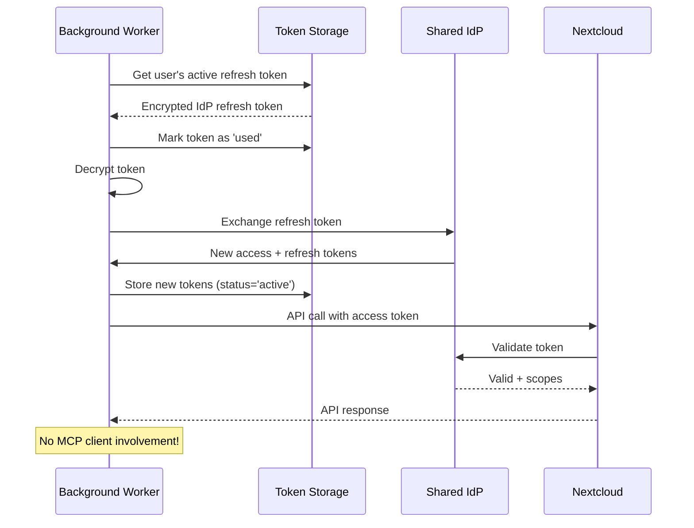

# ADR-004: Federated Authentication Architecture for Offline Access

**Status**: Draft
**Date**: 2025-11-02
**Supersedes**: ADR-002

## Context

ADR-002 attempted to solve the problem of background workers accessing user data by proposing token exchange patterns. However, it fundamentally misunderstood the MCP protocol's authentication architecture and OAuth delegation patterns.

The real challenge is that:
1. The MCP server needs to access Nextcloud APIs on behalf of users
2. Background workers need to operate when users are offline
3. We need proper OAuth compliance with user consent
4. Modern enterprise environments use federated identity providers

The solution is a **Federated Authentication Architecture** where both the MCP server and Nextcloud trust the same Identity Provider (IdP).

## Problem Statement

We need a way for:
1. Users to authenticate once to a central identity provider
2. The MCP server to obtain delegated access to Nextcloud resources
3. Background workers to access user data using stored refresh tokens
4. Clean separation between identity management and resource access

The core issue: **How can the MCP server obtain refresh tokens from a shared IdP to access Nextcloud on behalf of users?**

## Decision

We will implement a **Federated Authentication Architecture using a Shared Identity Provider** where:

1. **Shared IdP**: A central identity provider (e.g., Keycloak, Okta, Azure AD) manages user authentication
2. **MCP Server as OAuth Client**: The MCP server registers with the shared IdP to request tokens
3. **Nextcloud as Resource Server**: Nextcloud validates tokens issued by the shared IdP
4. **On-Behalf-Of Flow**: The MCP server requests tokens scoped for Nextcloud access

The MCP server will:
- Act as an OAuth client to the shared IdP
- Request tokens on behalf of users, scoped for Nextcloud API access
- Store refresh tokens securely with rotation
- Use stored tokens for both MCP sessions and background operations

## Architecture

### Federated OAuth Architecture

```
┌─────────────┐                ┌─────────────────┐                ┌──────────────┐              ┌────────────┐
│  MCP Client │◄──────401──────│   MCP Server    │◄────OAuth──────│  Shared IdP  │──Validates──►│ Nextcloud  │
│  (Claude)   │                │  (OAuth Client) │   (On-Behalf)  │  (Keycloak)  │   Tokens     │(Resource)  │
└─────────────┘                └─────────────────┘                └──────────────┘              └────────────┘
                                        │
                                ┌───────▼────────┐
                                │ Token Storage  │
                                │ (IdP Tokens)   │
                                └────────────────┘
```

**Key Components:**
- **MCP Client**: Initiates connection, receives 401, opens OAuth flow
- **MCP Server**: OAuth client to IdP, stores tokens, generates session tokens
- **Shared IdP**: Central authentication, issues tokens with Nextcloud scopes
- **Nextcloud**: Resource server, validates IdP tokens for API access

### Authentication Flows

#### Initial Setup (One-Time)



#### Subsequent MCP Sessions



#### Background Operations



## Implementation

### 1. Federated Token Verifier

```python
class FederatedTokenVerifier(TokenVerifier):
    """Verifies MCP session tokens and manages IdP tokens."""

    def __init__(self, token_storage: RefreshTokenStorage, idp_client: OAuthClient):
        self.storage = token_storage
        self.idp_client = idp_client

    async def verify_token(self, token: str) -> AccessToken | None:
        # Verify MCP session token
        session = await self.verify_mcp_session(token)
        if not session:
            return None  # Will trigger 401 response

        # Get stored IdP tokens for this user
        idp_tokens = await self.storage.get_active_tokens(session.user_id)

        if not idp_tokens:
            # User needs to complete OAuth flow with IdP
            return None  # Triggers 401 with WWW-Authenticate header

        # Refresh if expired (with rotation)
        if idp_tokens.is_expired():
            idp_tokens = await self.rotate_refresh_token(
                session.user_id,
                idp_tokens
            )

        # Return IdP access token for Nextcloud API use
        return AccessToken(
            token=idp_tokens.access_token,
            scopes=idp_tokens.scopes,
            resource=json.dumps({
                "user_id": session.user_id,
                "idp_sub": idp_tokens.subject
            })
        )

    async def rotate_refresh_token(self, user_id: str, old_tokens: TokenSet):
        """Rotate IdP refresh tokens with reuse detection."""
        # Mark old token as 'used'
        await self.storage.mark_token_used(old_tokens.token_id)

        try:
            # Exchange with IdP for new tokens
            new_tokens = await self.idp_client.refresh(old_tokens.refresh_token)

            # Store new tokens in same family
            await self.storage.store_tokens(
                user_id=user_id,
                token_family_id=old_tokens.token_family_id,
                access_token=new_tokens.access_token,
                refresh_token=new_tokens.refresh_token,
                status='active'
            )

            return new_tokens

        except RefreshTokenReuseError:
            # Possible token theft - revoke entire family
            await self.storage.revoke_token_family(old_tokens.token_family_id)
            await self.alert_user_possible_breach(user_id)
            raise
```

### 2. OAuth Endpoints (MCP Server as OAuth Client)

```python
@app.get("/oauth/authorize")
async def oauth_authorize(
    response_type: str = "code",
    client_id: str = None,
    redirect_uri: str = None,
    scope: str = None,
    state: str = None
):
    """MCP Server OAuth endpoint - redirects to Shared IdP."""
    # Store MCP client details for callback
    session_id = str(uuid4())
    await store_oauth_session(
        session_id=session_id,
        client_id=client_id,
        redirect_uri=redirect_uri,
        state=state
    )

    # Build IdP authorization URL with all needed scopes
    idp_state = f"{session_id}:{generate_secure_state()}"
    idp_auth_url = (
        f"{IDP_AUTHORIZATION_ENDPOINT}?"
        f"client_id={MCP_SERVER_CLIENT_ID}&"
        f"redirect_uri={MCP_SERVER_URL}/oauth/callback&"
        f"response_type=code&"
        f"scope=openid profile email offline_access "  # Identity + offline
        f"nextcloud:notes:read nextcloud:notes:write "  # Nextcloud scopes
        f"nextcloud:calendar:read nextcloud:calendar:write&"
        f"state={idp_state}&"
        f"prompt=consent"  # Ensure refresh token is issued
    )

    return RedirectResponse(idp_auth_url)

@app.get("/oauth/callback")
async def oauth_callback(code: str, state: str):
    """Handle callback from Shared IdP."""
    # Extract session ID from state
    session_id, _ = state.split(":", 1)
    oauth_session = await get_oauth_session(session_id)

    if not oauth_session:
        return {"error": "Invalid session"}

    # Exchange code with IdP for tokens
    tokens = await idp_client.exchange_code(
        code=code,
        redirect_uri=f"{MCP_SERVER_URL}/oauth/callback"
    )

    # Decode ID token to get user info
    userinfo = decode_id_token(tokens.id_token)

    # Create or update user account
    user = await create_or_update_user(
        idp_sub=userinfo.sub,
        username=userinfo.preferred_username,
        email=userinfo.email
    )

    # Generate new token family for rotation
    token_family_id = str(uuid4())

    # Store IdP tokens (these have Nextcloud scopes)
    await token_storage.store_tokens(
        user_id=user.id,
        token_family_id=token_family_id,
        access_token=tokens.access_token,
        refresh_token=tokens.refresh_token,
        status='active',
        scopes=tokens.scope,
        idp_subject=userinfo.sub
    )

    # Generate MCP session token for the client
    mcp_session_token = generate_mcp_session_token(user.id)

    # Store MCP session
    await store_mcp_session(mcp_session_token, user.id)

    # Return success page with session info
    # (Implementation depends on client type - could be redirect, postMessage, etc.)
    return HTMLResponse(f"""
        <html>
        <body>
            <h1>Authorization Successful!</h1>
            <p>Session token: {mcp_session_token}</p>
            <p>You can now close this window and return to your MCP client.</p>
            <script>
                // Post message to opener if available
                if (window.opener) {{
                    window.opener.postMessage({{
                        type: 'auth_complete',
                        session_token: '{mcp_session_token}'
                    }}, '*');
                }}
                window.close();
            </script>
        </body>
        </html>
    """)

@app.post("/oauth/token")
async def oauth_token(
    grant_type: str = Form(...),
    code: str = Form(None),
    refresh_token: str = Form(None)
):
    """Token endpoint for MCP clients."""
    if grant_type == "authorization_code":
        # Exchange authorization code for MCP tokens
        # (This would be used if implementing full OAuth server)
        pass
    elif grant_type == "refresh_token":
        # Refresh MCP session token
        # (Separate from IdP token refresh)
        pass

    # For now, session tokens are issued directly in callback
    return {"error": "Not implemented"}
```

### 3. 401 Response with WWW-Authenticate

```python
@mcp.tool()
async def list_notes(ctx: Context) -> dict:
    """List notes - automatically triggers OAuth if needed."""
    try:
        # FastMCP automatically calls token verifier
        # If it returns None, a 401 is sent
        client = get_client_from_context(ctx)
        notes = await client.notes.list_notes()
        return {"notes": notes}
    except Unauthorized:
        # Return 401 with WWW-Authenticate header
        raise HTTPException(
            status_code=401,
            headers={
                "WWW-Authenticate": (
                    f'Bearer realm="{MCP_SERVER_URL}/oauth/authorize", '
                    f'error="invalid_token", '
                    f'error_description="Authentication required"'
                )
            }
        )
```

### 4. Token Storage Schema

```sql
-- User accounts (created from IdP identity)
CREATE TABLE users (
    id TEXT PRIMARY KEY,
    idp_sub TEXT UNIQUE NOT NULL,      -- IdP subject identifier
    username TEXT NOT NULL,
    email TEXT,
    created_at INTEGER NOT NULL,
    last_login INTEGER NOT NULL
);

-- IdP tokens with rotation support
CREATE TABLE idp_tokens (
    id INTEGER PRIMARY KEY AUTOINCREMENT,
    user_id TEXT NOT NULL REFERENCES users(id),
    token_family_id TEXT NOT NULL,    -- Groups all tokens in rotation chain
    encrypted_access_token BLOB NOT NULL,
    encrypted_refresh_token BLOB NOT NULL,
    access_expires_at INTEGER NOT NULL,
    status TEXT NOT NULL CHECK(status IN ('active', 'used', 'revoked')),
    scopes TEXT NOT NULL,              -- Includes Nextcloud scopes
    idp_subject TEXT NOT NULL,         -- IdP user identifier
    created_at INTEGER NOT NULL,
    used_at INTEGER,                   -- When token was exchanged

    -- Only one active token per family
    UNIQUE(token_family_id, status) WHERE status = 'active'
);

-- Index for quick lookups
CREATE INDEX idx_active_tokens ON idp_tokens(user_id, status)
    WHERE status = 'active';
CREATE INDEX idx_token_families ON idp_tokens(token_family_id);

-- MCP session tokens (separate from IdP tokens)
CREATE TABLE mcp_sessions (
    session_token TEXT PRIMARY KEY,
    user_id TEXT NOT NULL REFERENCES users(id),
    created_at INTEGER NOT NULL,
    expires_at INTEGER NOT NULL,
    last_used INTEGER
);

-- OAuth flow sessions (temporary during auth)
CREATE TABLE oauth_sessions (
    session_id TEXT PRIMARY KEY,
    client_id TEXT,
    redirect_uri TEXT,
    state TEXT,
    created_at INTEGER NOT NULL,
    expires_at INTEGER NOT NULL
);

-- Audit log for security
CREATE TABLE token_audit_log (
    id INTEGER PRIMARY KEY AUTOINCREMENT,
    user_id TEXT NOT NULL,
    token_family_id TEXT,
    operation TEXT NOT NULL,  -- 'authorize', 'refresh', 'revoke', 'reuse_detected'
    timestamp INTEGER NOT NULL,
    ip_address TEXT,
    user_agent TEXT,
    details TEXT
);
```

### 5. Background Worker with IdP Token Refresh

```python
class BackgroundSyncWorker:
    """Sync user data using IdP tokens."""

    def __init__(self, token_storage: RefreshTokenStorage):
        self.storage = token_storage
        self.idp_client = OAuthClient.from_discovery(IDP_DISCOVERY_URL)
        self.nextcloud_url = os.getenv("NEXTCLOUD_HOST")

    async def sync_user_data(self, user_id: str):
        """Sync data using IdP tokens with Nextcloud scopes."""
        # Get active refresh token from IdP
        tokens = await self.storage.get_active_tokens(user_id)
        if not tokens:
            logger.warning(f"No active IdP tokens for user {user_id}")
            return

        # Mark token as used immediately (rotation)
        await self.storage.mark_token_used(tokens.id)

        try:
            # Exchange with IdP for new tokens
            new_tokens = await self.idp_client.refresh(tokens.refresh_token)

            # Store new tokens in same family
            await self.storage.store_tokens(
                user_id=user_id,
                token_family_id=tokens.token_family_id,
                access_token=new_tokens.access_token,
                refresh_token=new_tokens.refresh_token,
                status='active'
            )

            # Create Nextcloud client with IdP access token
            # Nextcloud will validate this token with the IdP
            client = NextcloudClient.from_token(
                base_url=self.nextcloud_url,
                token=new_tokens.access_token,
                username=tokens.username
            )

            # Perform sync operations
            await self.sync_notes(user_id, client)
            await self.sync_calendar(user_id, client)
            await self.sync_contacts(user_id, client)

        except HTTPStatusError as e:
            if e.response.status_code == 401:
                # Token rejected by IdP or Nextcloud
                await self.storage.revoke_token_family(tokens.token_family_id)
                await self.log_security_event(user_id, "token_revoked", tokens.token_family_id)
            raise
        except Exception as e:
            # Revert token status on failure
            await self.storage.revert_token_status(tokens.id)
            raise

    async def log_security_event(self, user_id: str, event: str, details: str):
        """Log security events for audit."""
        await self.storage.log_audit(
            user_id=user_id,
            operation=event,
            details=details
        )
```

### 6. Configuration

```python
# Environment variables for federated setup
IDP_DISCOVERY_URL = os.getenv("IDP_DISCOVERY_URL")  # e.g., https://keycloak.example.com/realms/master/.well-known/openid-configuration
MCP_SERVER_CLIENT_ID = os.getenv("MCP_SERVER_CLIENT_ID")  # MCP server's client ID in IdP
MCP_SERVER_CLIENT_SECRET = os.getenv("MCP_SERVER_CLIENT_SECRET")  # Client secret
MCP_SERVER_URL = os.getenv("MCP_SERVER_URL", "http://localhost:8000")

# Nextcloud configuration
NEXTCLOUD_HOST = os.getenv("NEXTCLOUD_HOST")  # Nextcloud instance URL

# Parse IdP discovery document
async def setup_idp_client():
    """Initialize OAuth client from IdP discovery."""
    async with httpx.AsyncClient() as client:
        discovery = await client.get(IDP_DISCOVERY_URL)
        discovery_doc = discovery.json()

    return OAuthClient(
        authorization_endpoint=discovery_doc["authorization_endpoint"],
        token_endpoint=discovery_doc["token_endpoint"],
        introspection_endpoint=discovery_doc.get("introspection_endpoint"),
        userinfo_endpoint=discovery_doc["userinfo_endpoint"],
        client_id=MCP_SERVER_CLIENT_ID,
        client_secret=MCP_SERVER_CLIENT_SECRET
    )
```

## Advantages

1. **Single Sign-On**: Users authenticate once to the shared IdP
2. **Federated Identity**: Enterprise-ready with support for SAML, LDAP backends
3. **True Offline Access**: Background workers operate with stored IdP refresh tokens
4. **OAuth Compliant**: Proper delegation with on-behalf-of pattern
5. **Security Isolation**: MCP clients never see IdP or Nextcloud credentials
6. **Flexible Backend**: Can swap Nextcloud for other resources without changing auth
7. **Standard Pattern**: Industry-standard federated OAuth architecture

## Disadvantages

1. **IdP Dependency**: Requires a shared identity provider infrastructure
2. **Complex Token Lifecycle**: Managing tokens from IdP for Nextcloud access
3. **Token Validation Overhead**: Nextcloud must validate tokens with IdP
4. **Migration Complexity**: Existing deployments need IdP setup

## Security Considerations

### Token Storage
- All refresh tokens MUST be encrypted at rest (Fernet or similar)
- Database access must be restricted to the MCP server process
- Consider using hardware security modules (HSM) for production

### Token Rotation
- **Full rotation implemented**: Each refresh creates new access AND refresh tokens
- **Reuse detection**: Any attempt to use an already-used token revokes the entire family
- **Atomic operations**: Token status updates must be atomic to prevent race conditions
- **Audit logging**: All token operations are logged for security analysis

### Trust Relationships
- **IdP Trust**: Both MCP server and Nextcloud must trust the IdP
- **Audience Validation**: Tokens must include proper audience claims
- **Scope Verification**: Each service validates only its required scopes
- **Certificate Pinning**: Consider pinning IdP certificates in production

### Revocation
- Implement webhook listener for IdP revocation events
- Immediate family revocation on reuse detection
- Clear MCP sessions on logout
- Propagate revocation to Nextcloud if needed

## Migration Strategy

### Phase 1: IdP Setup
1. Deploy shared IdP (Keycloak recommended)
2. Register MCP server as OAuth client
3. Configure Nextcloud to accept IdP tokens
4. Test token validation flow

### Phase 2: Parallel Operation
1. Keep existing pass-through authentication
2. Add federated auth as optional feature flag
3. Test with subset of users
4. Monitor token lifecycle and refresh patterns

### Phase 3: Migration
1. Migrate existing users to IdP accounts
2. Map existing permissions to IdP scopes
3. Update clients to use new OAuth flow
4. Maintain backward compatibility period

### Phase 4: Deprecation
1. Announce end-of-life for pass-through mode
2. Complete user migration
3. Remove legacy authentication code
4. Document new auth flow

## Alternatives Considered

### 1. Pass-Through Only (Current)
- **Pros**: Simple, stateless
- **Cons**: No offline access possible
- **Rejected**: Doesn't meet requirements

### 2. Service Accounts (ADR-002 Tier 1)
- **Pros**: Simple to implement
- **Cons**: Violates OAuth principles, creates audit issues
- **Rejected**: Security and compliance concerns

### 3. Token Exchange (ADR-002 Tier 2)
- **Pros**: Standards-based (RFC 8693)
- **Cons**: Circular dependency, doesn't solve bootstrap problem
- **Rejected**: Doesn't enable true offline access

### 4. Sign-in with Nextcloud (Previous ADR-004)
- **Pros**: Direct Nextcloud integration
- **Cons**: Tight coupling, no enterprise IdP support
- **Rejected**: Not suitable for federated environments

### 5. Double OAuth (Manual)
- **Pros**: Clear separation of concerns
- **Cons**: Poor UX with two login prompts
- **Rejected**: Users shouldn't authenticate twice

## Decision Outcome

The Federated Authentication Architecture provides a clean, enterprise-ready solution for offline access while maintaining OAuth compliance. By using a shared identity provider, we achieve:

1. **Single user authentication** to a trusted IdP
2. **Delegated access** to Nextcloud resources via scoped tokens
3. **Offline capabilities** through secure refresh token storage and rotation
4. **Enterprise integration** with existing identity infrastructure

This architecture follows industry best practices for federated systems and positions the MCP server as a standard OAuth client in an enterprise identity ecosystem.

## References

- [RFC 6749: OAuth 2.0](https://datatracker.ietf.org/doc/html/rfc6749)
- [RFC 8693: OAuth 2.0 Token Exchange](https://datatracker.ietf.org/doc/html/rfc8693)
- [RFC 7636: PKCE](https://datatracker.ietf.org/doc/html/rfc7636)
- [OAuth 2.0 Security Best Practices](https://datatracker.ietf.org/doc/html/draft-ietf-oauth-security-topics)
- [OpenID Connect Core 1.0](https://openid.net/specs/openid-connect-core-1_0.html)
- [OAuth 2.0 for Native Apps](https://datatracker.ietf.org/doc/html/rfc8252)
- [OAuth 2.0 Device Authorization Grant](https://datatracker.ietf.org/doc/html/rfc8628)