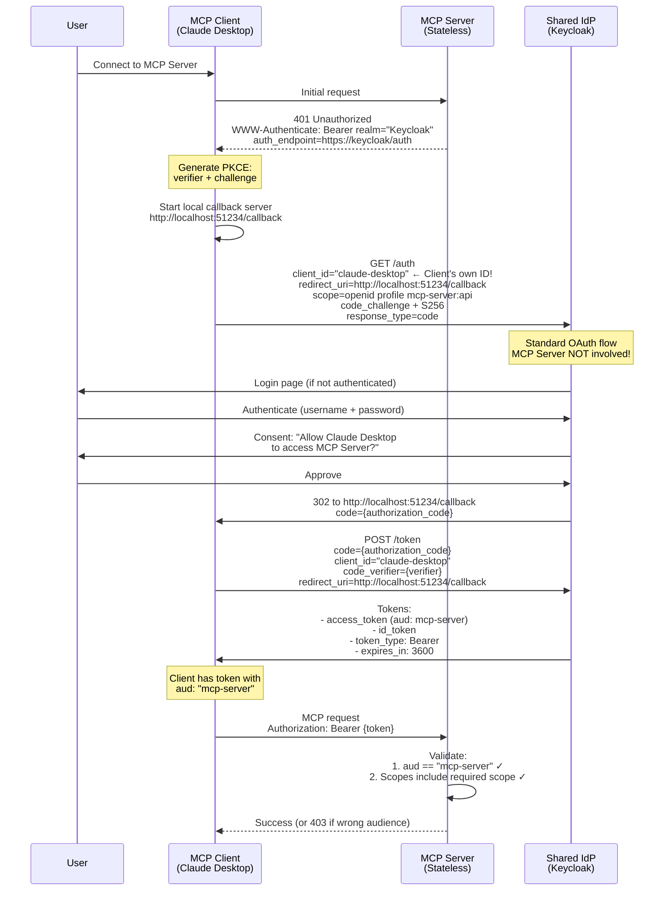
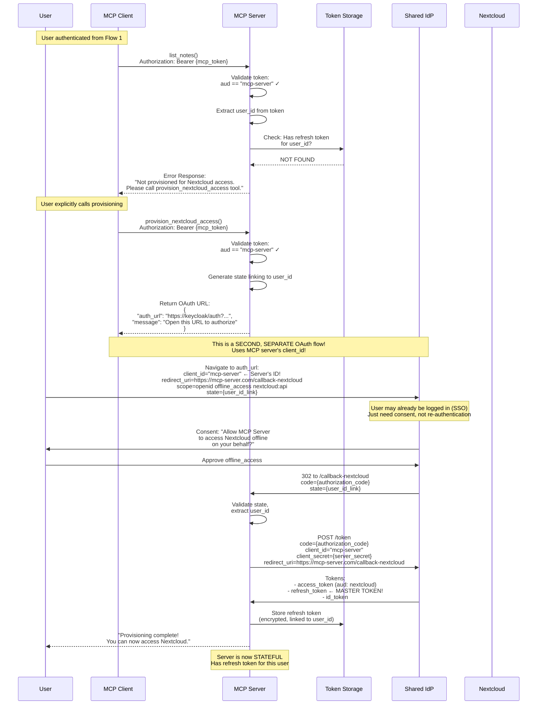
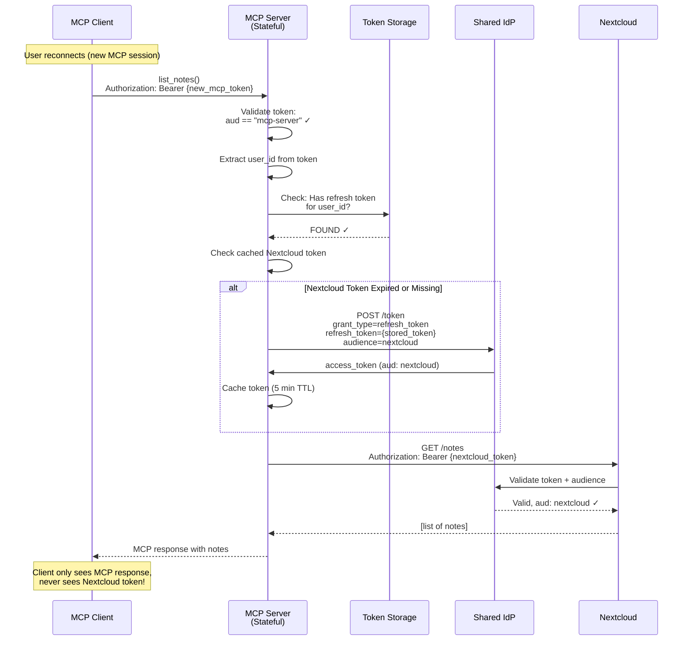

# ADR-004: Federated Authentication Architecture for Offline Access

**Status**: Draft
**Date**: 2025-11-02
**Supersedes**: ADR-002

## Context

ADR-002 attempted to solve the problem of background workers accessing user data by proposing token exchange patterns. However, it fundamentally misunderstood the MCP protocol's authentication architecture and OAuth delegation patterns.

The real challenge is that:
1. The MCP server needs to access Nextcloud APIs on behalf of users
2. Background workers need to operate when users are offline
3. We need proper OAuth compliance with user consent
4. Modern enterprise environments use federated identity providers

The solution is a **Federated Authentication Architecture** where both the MCP server and Nextcloud trust the same Identity Provider (IdP).

## Problem Statement

We need a way for:
1. Users to authenticate once to a central identity provider
2. The MCP server to obtain delegated access to Nextcloud resources
3. Background workers to access user data using stored refresh tokens
4. Clean separation between identity management and resource access

The core issue: **How can the MCP server obtain refresh tokens from a shared IdP to access Nextcloud on behalf of users?**

## Decision

We will implement a **Federated Authentication Architecture using a Shared Identity Provider** where:

1. **Shared IdP**: A central identity provider (e.g., Keycloak, Okta, Azure AD) manages user authentication
2. **MCP Server as OAuth Client**: The MCP server registers with the shared IdP to request tokens
3. **Nextcloud as Resource Server**: Nextcloud validates tokens issued by the shared IdP
4. **On-Behalf-Of Flow**: The MCP server requests tokens scoped for Nextcloud access

The MCP server will:
- Act as an OAuth client to the shared IdP
- Request tokens on behalf of users, scoped for Nextcloud API access
- Store refresh tokens securely with rotation
- Use stored tokens for both MCP sessions and background operations

## Architecture

### Progressive Consent Architecture with Dual OAuth Flows

The MCP server implements **progressive consent** - separate authorization flows for client authentication and resource access. This architecture uses **two distinct, sequential OAuth flows**:

#### The Core Principle

Three separate OAuth clients are registered at the Identity Provider (IdP):
1. **MCP Client** (e.g., `client_id="claude-desktop"`) - The native application
2. **MCP Server** (e.g., `client_id="mcp-server"`) - The intermediary server
3. **Nextcloud** (e.g., `client_id="nextcloud"`) - The resource server

**CRITICAL**: Each flow uses a DIFFERENT `client_id` for proper OAuth delegation.

#### Flow 1: Client Authentication (Always Required)

The MCP client authenticates itself to the MCP server using its own OAuth credentials:

- **Initiator**: MCP Client
- **Client ID**: `claude-desktop` (the MCP client's own ID)
- **Scopes**: `openid profile mcp-server:api`
- **Flow**: Standard PKCE OAuth 2.0
- **User Consent**: "Allow **Claude Desktop** to access **MCP Server**?"
- **Result**: Access token with `aud: "mcp-server"`
- **Server State**: **STATELESS** - server just validates tokens, has no Nextcloud access

At this point:
- ✅ MCP client can authenticate to MCP server
- ❌ MCP server CANNOT access Nextcloud APIs
- ❌ No refresh tokens stored anywhere

#### Flow 2: Resource Provisioning (Triggered Explicitly)

When the user attempts to use a Nextcloud tool, the server initiates a second OAuth flow to obtain delegated access:

- **Trigger**: User calls a Nextcloud tool (e.g., `list_notes`) and server has no refresh token
- **Server Response**: Error message directing user to call `provision_nextcloud_access` tool
- **Initiator**: MCP Server (on user's explicit request)
- **Client ID**: `mcp-server` (the SERVER's own ID)
- **Scopes**: `openid offline_access nextcloud:api nextcloud:notes:* nextcloud:calendar:*`
- **Flow**: Standard OAuth 2.0 authorization code flow
- **User Consent**: "Allow **MCP Server** to access **Nextcloud** offline on your behalf?"
- **Result**: Refresh token with `aud: "nextcloud"`
- **Server State**: **STATEFUL** - server stores encrypted refresh token

After provisioning:
- ✅ MCP client still authenticates with `aud: "mcp-server"` tokens
- ✅ MCP server can now access Nextcloud APIs using stored refresh token
- ✅ Background workers can operate offline

#### Token Types and Lifecycles

1. **MCP Access Tokens** (audience: "mcp-server")
   - Issued to MCP client in Flow 1
   - Authenticates MCP client to MCP server
   - Short-lived (1 hour)
   - Cannot access Nextcloud directly
   - MCP client sends with every request

2. **Nextcloud Access Tokens** (audience: "nextcloud")
   - Obtained by MCP server using stored refresh token
   - Used for Nextcloud API access
   - Never exposed to MCP clients
   - Short-lived (5-15 minutes), cached by server

3. **Master Refresh Token** (can mint audience: "nextcloud" tokens)
   - Issued to MCP server in Flow 2
   - Stored encrypted in server's database
   - Enables offline access to Nextcloud
   - Used by server to mint Nextcloud access tokens

```
┌──────────────┐                                  ┌──────────────┐
│  MCP Client  │──────Flow 1: Authenticate───────►│   Shared IdP │
│ (Native App) │  client_id="claude-desktop"      │  (Keycloak)  │
│              │  scope="mcp-server:api"          │              │
│              │◄─────────────────────────────────┤              │
│              │  access_token (aud: mcp-server)  │              │
└──────┬───────┘                                  └──────────────┘
       │
       │ Bearer token
       │ (aud: mcp-server)
       ▼
┌──────────────┐
│  MCP Server  │  1. Validate aud == "mcp-server" ✓
│  (Stateless) │  2. Check for Nextcloud refresh token ✗
│              │  3. Return: "Not provisioned - run provision_nextcloud_access"
└──────┬───────┘
       │
       │ User calls provision_nextcloud_access tool
       │
       ▼
┌──────────────┐                                  ┌──────────────┐
│  MCP Server  │──────Flow 2: Provision Access───►│   Shared IdP │
│              │  client_id="mcp-server"          │  (Keycloak)  │
│              │  scope="offline_access nextcloud:*" │           │
│              │◄─────────────────────────────────┤              │
│              │  refresh_token (aud: nextcloud)  │              │
└──────┬───────┘                                  └──────────────┘
       │
       │ Store encrypted refresh token
       ▼
┌──────────────┐
│  MCP Server  │  Now STATEFUL - can access Nextcloud
│ (Stateful)   │  ├─ Validate MCP tokens (aud: mcp-server)
│              │  ├─ Mint Nextcloud tokens (aud: nextcloud)
│              │  └─ Access Nextcloud APIs
└──────────────┘
```

**Key Innovations:**

1. **Separate Client Identities**: MCP client uses its own `client_id`, not the server's
2. **Stateless by Default**: Server starts with zero stored state
3. **Explicit Provisioning**: Resource access requested via separate tool call
4. **Progressive Consent**: Users understand what they're authorizing at each step
5. **SSO Efficiency**: If authenticated in Flow 1, Flow 2 only needs consent (no re-login)

### MCP Client Registration

**IMPORTANT**: MCP SDK clients (like Claude Desktop) are **proper OAuth clients registered at the IdP level**, not with the MCP server itself.

#### Client Registration Options

**Option 1: Dynamic Client Registration (DCR) - Recommended**
```python
# MCP client registers itself at IdP startup
import httpx

async def register_with_idp():
    response = await httpx.post(
        "https://idp.example.com/register",
        json={
            "client_name": "Claude Desktop",
            "redirect_uris": ["http://localhost:51234/callback"],
            "grant_types": ["authorization_code", "refresh_token"],
            "token_endpoint_auth_method": "none",  # Public client with PKCE
            "application_type": "native",
        }
    )
    client_id = response.json()["client_id"]
    # Store client_id for subsequent OAuth flows
```

**Option 2: Pre-registered Client**
```bash
# Admin pre-registers known MCP clients in Keycloak/Nextcloud
# Client IDs: "claude-desktop", "continue-dev", "zed-editor", etc.
```

**Key Points:**
- MCP clients are registered at **IdP level** (Nextcloud OIDC, Keycloak, Auth0, etc.)
- MCP server validates `client_id` against IdP registry during authorization
- Public clients use PKCE (no client_secret) per RFC 8252
- Each MCP client has its own identity and permissions

### Authentication Flows

#### Flow 1: MCP Client Authentication (Always Required)

This is a standard OAuth 2.0 PKCE flow where the MCP client authenticates to the MCP server. **The server has no involvement in this flow beyond returning the challenge endpoint.**



**Key Points:**
- **No server interception**: MCP server is NOT involved in the OAuth flow
- **Client's credentials**: Flow uses `client_id="claude-desktop"`, not the server's ID
- **Direct callback**: IdP redirects directly to client's localhost callback
- **Stateless server**: Server just validates the resulting token's audience

**After Flow 1:**
- ✅ MCP client authenticated with token (aud: "mcp-server")
- ❌ MCP server has NO Nextcloud access
- ❌ MCP server has NO stored tokens

---

#### Flow 2: Nextcloud Resource Provisioning (Triggered Explicitly)

This flow is initiated when the user calls a Nextcloud tool and the server discovers it has no refresh token. **This is a completely separate OAuth flow using the server's credentials.**



**Key Points:**
- **Separate flow**: This is Flow 2, completely independent from Flow 1
- **Server's credentials**: Uses `client_id="mcp-server"`, the SERVER's own ID
- **Server callback**: IdP redirects to server's callback endpoint
- **User intent**: User explicitly requested this provisioning
- **SSO benefit**: If user authenticated in Flow 1, only consent needed here

**After Flow 2:**
- ✅ MCP client still uses same token (aud: "mcp-server")
- ✅ MCP server now has refresh token (can mint aud: "nextcloud" tokens)
- ✅ Background workers can operate offline

---

#### Subsequent Sessions (Using Provisioned Access)

Once provisioned, subsequent MCP sessions work seamlessly:



**Key Points:**
- **No re-provisioning**: Refresh token persists across MCP sessions
- **Token caching**: Nextcloud access tokens cached to reduce IdP calls
- **Audience isolation**: MCP client never sees Nextcloud tokens

---

#### Background Operations


**Token Rotation Strategy:**
- **Access Tokens**: Refreshed frequently (every 5-60 minutes) as needed
- **Master Refresh Token**: Only rotated periodically (e.g., daily/weekly) or when explicitly refreshing the MCP session
- **Separation**: Getting Nextcloud access tokens does NOT rotate the master refresh token

## Implementation

### 1. Token Broker Service

```python
import jwt
from datetime import datetime, timedelta

class TokenBrokerService:
    """
    Token broker that exchanges master refresh tokens for audience-specific access tokens.
    Works alongside the required_scopes decorator which handles MCP token validation.
    """

    def __init__(self,
                 token_storage: RefreshTokenStorage,
                 idp_client: OAuthClient):
        self.storage = token_storage
        self.idp_client = idp_client
        self.nextcloud_token_cache = {}  # Short-lived cache

    async def get_nextcloud_token(self, user_id: str) -> str | None:
        """
        Get or refresh token with Nextcloud audience.
        Called AFTER the required_scopes decorator has validated the MCP token.
        """
        # Check cache first
        cached = self.nextcloud_token_cache.get(user_id)
        if cached and cached['exp'] > datetime.utcnow().timestamp():
            return cached['token']

        # Get master refresh token (stored during OAuth flow)
        refresh_token = await self.storage.get_refresh_token(user_id)
        if not refresh_token:
            logger.warning(f"No refresh token for user {user_id}")
            return None  # User needs to re-authenticate

        try:
            # Request new ACCESS token with Nextcloud audience
            # This does NOT rotate the master refresh token!
            response = await self.idp_client.refresh_token(
                refresh_token=refresh_token,
                audience='nextcloud'  # CRITICAL: Request Nextcloud audience
            )

            # Verify the new token has correct audience
            payload = jwt.decode(
                response.access_token,
                options={"verify_signature": False}
            )

            audiences = payload.get('aud', [])
            if isinstance(audiences, str):
                audiences = [audiences]

            if 'nextcloud' not in audiences:
                raise ValueError(f"IdP returned wrong audience: {audiences}")

            # Cache for short period (5 minutes)
            self.nextcloud_token_cache[user_id] = {
                'token': response.access_token,
                'exp': payload.get('exp', 0)
            }

            return response.access_token

        except Exception as e:
            logger.error(f"Failed to get Nextcloud token: {e}")
            return None

    async def refresh_master_token(self, user_id: str):
        """
        Refresh the master refresh token (with rotation).
        This should only be called periodically (e.g., weekly) or when
        explicitly refreshing the MCP session, NOT on every API call.
        """
        old_refresh = await self.storage.get_refresh_token(user_id)
        if not old_refresh:
            raise ValueError("No refresh token found")

        # Mark as used (rotation)
        await self.storage.mark_token_used(old_refresh.token_id)

        try:
            # Get new refresh token from IdP
            response = await self.idp_client.refresh_token(
                refresh_token=old_refresh.token,
                scope='openid profile offline_access nextcloud:*'
            )

            # Store new refresh token
            await self.storage.store_refresh_token(
                user_id=user_id,
                token_family_id=old_refresh.token_family_id,
                refresh_token=response.refresh_token,
                status='active'
            )

            return response.refresh_token

        except RefreshTokenReuseError:
            # Possible token theft - revoke entire family
            await self.storage.revoke_token_family(old_refresh.token_family_id)
            await self.alert_user_possible_breach(user_id)
            raise

# Integration with FastMCP framework
class MCPTokenVerifier(TokenVerifier):
    """
    Simple verifier that checks audience for MCP tokens.
    Used by FastMCP framework alongside required_scopes decorator.
    """

    async def verify_token(self, token: str) -> AccessToken | None:
        """Verify token has correct audience for MCP server."""
        try:
            payload = jwt.decode(
                token,
                options={"verify_signature": False}  # IdP handles signature
            )

            # CRITICAL: Verify audience is MCP server
            audiences = payload.get('aud', [])
            if isinstance(audiences, str):
                audiences = [audiences]

            if 'mcp-server' not in audiences:
                logger.warning(f"Token rejected: wrong audience {audiences}")
                return None

            # Check expiry
            if payload.get('exp', 0) < datetime.utcnow().timestamp():
                return None

            return AccessToken(
                token=token,  # Keep original MCP token
                scopes=payload.get('scope', '').split(),
                resource=json.dumps({
                    "user_id": payload['sub'],
                    "session_id": payload.get('jti')
                })
            )

        except jwt.InvalidTokenError:
            return None
```

### 2. MCP Tool for Resource Provisioning

**CRITICAL**: Flow 1 (client authentication) does NOT use MCP server endpoints. The MCP client authenticates directly with the IdP using its own `client_id`. The server only validates the resulting tokens.

For Flow 2 (Nextcloud provisioning), we provide an MCP tool that returns an OAuth URL:

```python
from urllib.parse import urlencode
import secrets

@mcp.tool()
@required_scopes("mcp:provision")  # Or allow all authenticated users
async def provision_nextcloud_access(ctx: Context) -> dict:
    """
    Initiate OAuth flow to grant MCP server access to Nextcloud on your behalf.

    This starts Flow 2, where you authorize the MCP server to access Nextcloud
    resources offline (when you're not connected).

    Returns:
        dict: OAuth authorization URL to visit in your browser
    """
    # Get user_id from MCP token (already validated by required_scopes)
    token_payload = jwt.decode(
        ctx.authorization.token,
        options={"verify_signature": False}
    )
    user_id = token_payload['sub']

    # Check if already provisioned
    token_storage = get_token_storage(ctx)
    existing_token = await token_storage.get_refresh_token(user_id)
    if existing_token:
        return {
            "status": "already_provisioned",
            "message": "MCP server already has Nextcloud access for this user."
        }

    # Generate state to link callback to this user
    state = secrets.token_urlsafe(32)
    await store_provisioning_session(
        state=state,
        user_id=user_id,
        created_at=datetime.utcnow()
    )

    # Build OAuth URL for Flow 2
    # CRITICAL: This uses the MCP server's client_id, not the MCP client's!
    idp_params = {
        "client_id": MCP_SERVER_CLIENT_ID,  # Server's ID!
        "redirect_uri": f"{MCP_SERVER_URL}/oauth/callback-nextcloud",
        "response_type": "code",
        "scope": "openid offline_access "
                 "nextcloud:notes:read nextcloud:notes:write "
                 "nextcloud:calendar:read nextcloud:calendar:write",
        "state": state,
        "prompt": "consent"  # Ensure user sees consent screen
    }

    auth_url = f"{IDP_AUTHORIZATION_ENDPOINT}?{urlencode(idp_params)}"

    return {
        "status": "pending",
        "auth_url": auth_url,
        "message": "Please open the URL in your browser to authorize Nextcloud access.",
        "instructions": "After authorizing, the MCP server will be able to access Nextcloud on your behalf."
    }

```

### 3. OAuth Callback for Resource Provisioning (Flow 2)

```python
@app.get("/oauth/callback-nextcloud")
async def oauth_callback_nextcloud(code: str, state: str):
    """
    Handle IdP callback for Flow 2 (Nextcloud resource provisioning).

    This endpoint receives the authorization code after the user consents to
    the MCP server accessing Nextcloud on their behalf.
    """
    # Retrieve provisioning session
    session = await get_provisioning_session(state)
    if not session:
        return HTMLResponse(
            "<html><body>"
            "<h1>Error</h1>"
            "<p>Invalid or expired authorization request.</p>"
            "</body></html>",
            status_code=400
        )

    user_id = session.user_id

    try:
        # Exchange authorization code for tokens
        # CRITICAL: This uses the MCP server's client credentials!
        tokens = await idp_client.exchange_code(
            code=code,
            redirect_uri=f"{MCP_SERVER_URL}/oauth/callback-nextcloud",
            client_id=MCP_SERVER_CLIENT_ID,
            client_secret=MCP_SERVER_CLIENT_SECRET
        )

        # Verify the refresh token has correct audience
        # NOTE: The access token will have aud: "nextcloud", and the
        # refresh token should be able to mint tokens with that audience
        payload = jwt.decode(
            tokens.access_token,
            options={"verify_signature": False}
        )

        audiences = payload.get('aud', [])
        if isinstance(audiences, str):
            audiences = [audiences]

        if 'nextcloud' not in audiences:
            raise ValueError(f"IdP returned token with wrong audience: {audiences}")

        # Generate new token family for rotation
        token_family_id = str(uuid4())

        # Store master refresh token (encrypted)
        # This token can mint tokens with aud: "nextcloud"
        token_storage = get_token_storage()
        await token_storage.store_tokens(
            user_id=user_id,
            token_family_id=token_family_id,
            access_token=tokens.access_token,  # Initial Nextcloud access token
            refresh_token=tokens.refresh_token,  # Master refresh token!
            status='active',
            scopes=tokens.scope,
            idp_subject=payload['sub']
        )

        # Delete provisioning session
        await delete_provisioning_session(state)

        # Return success page
        return HTMLResponse(
            "<html><body>"
            "<h1>Success!</h1>"
            "<p>MCP server has been granted access to Nextcloud on your behalf.</p>"
            "<p>You can close this window and return to your MCP client.</p>"
            "</body></html>"
        )

    except Exception as e:
        logger.error(f"Failed to exchange authorization code: {e}")
        return HTMLResponse(
            "<html><body>"
            "<h1>Error</h1>"
            "<p>Failed to complete authorization. Please try again.</p>"
            f"<p>Error: {str(e)}</p>"
            "</body></html>",
            status_code=500
        )

```

**NOTE**: The MCP server does NOT need to provide `/oauth/authorize` or `/oauth/token` endpoints for Flow 1. The MCP client authenticates directly with the IdP using its own `client_id`, and the IdP issues tokens directly to the client. The MCP server only validates these tokens.

### 4. MCP Tool Token Verification with Audience Check

```python
from functools import wraps

def required_scopes(*scopes):
    """
    Decorator that verifies token audience and scopes.
    The existing required_scopes decorator needs to be updated
    to verify audience: "mcp-server" for all incoming tokens.
    """
    def decorator(func):
        @wraps(func)
        async def wrapper(ctx: Context, *args, **kwargs):
            # Get token from context (set by FastMCP framework)
            token = ctx.authorization.token if ctx.authorization else None

            if not token:
                raise Unauthorized("No token provided")

            # Decode and verify audience
            try:
                payload = jwt.decode(
                    token,
                    options={"verify_signature": False}  # IdP handles signature
                )

                # CRITICAL: Verify token is for MCP server
                audiences = payload.get('aud', [])
                if isinstance(audiences, str):
                    audiences = [audiences]

                if 'mcp-server' not in audiences:
                    raise Unauthorized(f"Invalid audience: {audiences}")

                # Verify required scopes
                token_scopes = set(payload.get('scope', '').split())
                required = set(scopes)

                if not required.issubset(token_scopes):
                    missing = required - token_scopes
                    raise Forbidden(f"Missing scopes: {missing}")

                # Token is valid for MCP server with required scopes
                return await func(ctx, *args, **kwargs)

            except jwt.InvalidTokenError as e:
                raise Unauthorized(f"Invalid token: {e}")

        return wrapper
    return decorator

# Example usage in MCP tools
@mcp.tool()
@required_scopes("notes:read")
async def list_notes(ctx: Context) -> dict:
    """List notes - token audience and scopes are automatically verified."""
    # Token already verified to have audience: "mcp-server"
    # Now get Nextcloud token for backend access

    token_broker = get_token_broker(ctx)
    nextcloud_token = await token_broker.get_nextcloud_token(ctx.user_id)

    # Use Nextcloud token for API access
    client = NextcloudClient.from_token(
        base_url=NEXTCLOUD_HOST,
        token=nextcloud_token  # Token with aud: "nextcloud"
    )

    notes = await client.notes.list_notes()
    return {"notes": notes}
```

### 4. Token Storage Schema

```sql
-- User accounts (created from IdP identity)
CREATE TABLE users (
    id TEXT PRIMARY KEY,
    idp_sub TEXT UNIQUE NOT NULL,      -- IdP subject identifier
    username TEXT NOT NULL,
    email TEXT,
    created_at INTEGER NOT NULL,
    last_login INTEGER NOT NULL
);

-- IdP tokens with rotation support
CREATE TABLE idp_tokens (
    id INTEGER PRIMARY KEY AUTOINCREMENT,
    user_id TEXT NOT NULL REFERENCES users(id),
    token_family_id TEXT NOT NULL,    -- Groups all tokens in rotation chain
    encrypted_access_token BLOB NOT NULL,
    encrypted_refresh_token BLOB NOT NULL,
    access_expires_at INTEGER NOT NULL,
    status TEXT NOT NULL CHECK(status IN ('active', 'used', 'revoked')),
    scopes TEXT NOT NULL,              -- Includes Nextcloud scopes
    idp_subject TEXT NOT NULL,         -- IdP user identifier
    created_at INTEGER NOT NULL,
    used_at INTEGER,                   -- When token was exchanged

    -- Only one active token per family
    UNIQUE(token_family_id, status) WHERE status = 'active'
);

-- Index for quick lookups
CREATE INDEX idx_active_tokens ON idp_tokens(user_id, status)
    WHERE status = 'active';
CREATE INDEX idx_token_families ON idp_tokens(token_family_id);

-- MCP session tokens (separate from IdP tokens)
CREATE TABLE mcp_sessions (
    session_token TEXT PRIMARY KEY,
    user_id TEXT NOT NULL REFERENCES users(id),
    created_at INTEGER NOT NULL,
    expires_at INTEGER NOT NULL,
    last_used INTEGER
);

-- OAuth flow sessions with PKCE support (temporary during auth)
CREATE TABLE oauth_sessions (
    session_id TEXT PRIMARY KEY,
    client_id TEXT,
    client_redirect_uri TEXT NOT NULL,  -- Client's localhost redirect URI
    state TEXT,
    code_challenge TEXT,                -- PKCE code challenge from client
    code_challenge_method TEXT,         -- PKCE method (S256)
    mcp_authorization_code TEXT UNIQUE, -- MCP-generated code (e.g., mcp-code-xyz)
    idp_access_token TEXT,              -- Stored after IdP exchange in /oauth/callback
    user_id TEXT,                       -- Set after IdP authentication
    created_at INTEGER NOT NULL,
    expires_at INTEGER NOT NULL
);

-- Audit log for security
CREATE TABLE token_audit_log (
    id INTEGER PRIMARY KEY AUTOINCREMENT,
    user_id TEXT NOT NULL,
    token_family_id TEXT,
    operation TEXT NOT NULL,  -- 'authorize', 'refresh', 'revoke', 'reuse_detected'
    timestamp INTEGER NOT NULL,
    ip_address TEXT,
    user_agent TEXT,
    details TEXT
);
```

### 5. Background Worker (Access Token Only)

```python
class BackgroundSyncWorker:
    """Background workers use master refresh token to get Nextcloud access tokens."""

    def __init__(self, token_storage: RefreshTokenStorage):
        self.storage = token_storage
        self.idp_client = OAuthClient.from_discovery(IDP_DISCOVERY_URL)
        self.nextcloud_url = os.getenv("NEXTCLOUD_HOST")
        self.nextcloud_token_cache = {}  # Short-lived cache

    async def sync_user_data(self, user_id: str):
        """
        Sync data using master refresh token to get Nextcloud access tokens.

        Key Points:
        - Workers use the master refresh token stored during OAuth flow
        - Workers request access tokens with audience: "nextcloud"
        - NO refresh token rotation during normal operations
        - Master refresh token only rotated periodically (e.g., weekly)
        """
        # Get master refresh token (stored during initial OAuth)
        master_refresh_token = await self.storage.get_refresh_token(user_id)
        if not master_refresh_token:
            logger.warning(f"No master refresh token for user {user_id}")
            return

        try:
            # Check cache for valid Nextcloud access token
            cached = self.nextcloud_token_cache.get(user_id)
            if cached and cached['exp'] > datetime.utcnow().timestamp():
                nextcloud_token = cached['token']
            else:
                # Get new ACCESS token with Nextcloud audience
                # This does NOT rotate the refresh token!
                response = await self.idp_client.refresh_token(
                    refresh_token=master_refresh_token,
                    audience='nextcloud'  # Request Nextcloud audience
                )

                # Verify audience is for Nextcloud (security check)
                payload = jwt.decode(
                    response.access_token,
                    options={"verify_signature": False}
                )

                audiences = payload.get('aud', [])
                if isinstance(audiences, str):
                    audiences = [audiences]

                if 'nextcloud' not in audiences:
                    raise ValueError(f"IdP returned wrong audience: {audiences}")

                # Cache the access token for 5 minutes
                self.nextcloud_token_cache[user_id] = {
                    'token': response.access_token,
                    'exp': payload.get('exp', 0)
                }
                nextcloud_token = response.access_token

            # Create Nextcloud client with access token
            # Token has audience: "nextcloud" and proper scopes
            client = NextcloudClient.from_token(
                base_url=self.nextcloud_url,
                token=nextcloud_token,  # Access token with aud: nextcloud
                username=user_id
            )

            # Perform sync operations with Nextcloud
            await self.sync_notes(user_id, client)
            await self.sync_calendar(user_id, client)
            await self.sync_contacts(user_id, client)

            logger.info(f"Background sync completed for user {user_id}")

        except HTTPStatusError as e:
            if e.response.status_code == 401:
                # Access token rejected - try clearing cache
                self.nextcloud_token_cache.pop(user_id, None)
                # If persistent, may need to trigger re-authentication
                await self.log_security_event(
                    user_id,
                    "access_token_rejected",
                    f"Nextcloud rejected access token for user {user_id}"
                )
            raise
        except Exception as e:
            logger.error(f"Background sync failed for user {user_id}: {e}")
            raise

    async def log_security_event(self, user_id: str, event: str, details: str):
        """Log security events for audit."""
        await self.storage.log_audit(
            user_id=user_id,
            operation=event,
            details=details,
            timestamp=datetime.utcnow().isoformat()
        )
```

### 6. Configuration

```python
# Environment variables for federated setup
IDP_DISCOVERY_URL = os.getenv("IDP_DISCOVERY_URL")  # e.g., https://keycloak.example.com/realms/master/.well-known/openid-configuration
MCP_SERVER_CLIENT_ID = os.getenv("MCP_SERVER_CLIENT_ID")  # MCP server's client ID in IdP
MCP_SERVER_CLIENT_SECRET = os.getenv("MCP_SERVER_CLIENT_SECRET")  # Client secret
MCP_SERVER_URL = os.getenv("MCP_SERVER_URL", "http://localhost:8000")

# Nextcloud configuration
NEXTCLOUD_HOST = os.getenv("NEXTCLOUD_HOST")  # Nextcloud instance URL

# Parse IdP discovery document
async def setup_idp_client():
    """Initialize OAuth client from IdP discovery."""
    async with httpx.AsyncClient() as client:
        discovery = await client.get(IDP_DISCOVERY_URL)
        discovery_doc = discovery.json()

    return OAuthClient(
        authorization_endpoint=discovery_doc["authorization_endpoint"],
        token_endpoint=discovery_doc["token_endpoint"],
        introspection_endpoint=discovery_doc.get("introspection_endpoint"),
        userinfo_endpoint=discovery_doc["userinfo_endpoint"],
        client_id=MCP_SERVER_CLIENT_ID,
        client_secret=MCP_SERVER_CLIENT_SECRET
    )
```

## Advantages

1. **Single Sign-On**: Users authenticate once to the shared IdP
2. **Federated Identity**: Enterprise-ready with support for SAML, LDAP backends
3. **True Offline Access**: Background workers operate with stored IdP refresh tokens
4. **OAuth Compliant**: Proper delegation with on-behalf-of pattern
5. **Security Isolation**: MCP clients never see IdP or Nextcloud credentials
6. **Flexible Backend**: Can swap Nextcloud for other resources without changing auth
7. **Standard Pattern**: Industry-standard federated OAuth architecture

## Disadvantages

1. **IdP Dependency**: Requires a shared identity provider infrastructure
2. **Complex Token Lifecycle**: Managing tokens from IdP for Nextcloud access
3. **Token Validation Overhead**: Nextcloud must validate tokens with IdP
4. **Migration Complexity**: Existing deployments need IdP setup

## Security Considerations

### Progressive Consent Security Model

The dual OAuth flow architecture provides enhanced security through:

1. **Separate Client Identities**:
   - MCP client authenticates with its own `client_id` (e.g., "claude-desktop")
   - MCP server has its own `client_id` (e.g., "mcp-server")
   - Each entity's permissions are independently managed at IdP level
   - Compromised client credentials don't grant server-level access

2. **Explicit User Consent**:
   - Flow 1: User consents to "Claude Desktop accessing MCP Server"
   - Flow 2: User consents to "MCP Server accessing Nextcloud offline"
   - Two separate, understandable authorization decisions
   - Users understand the security model

3. **Stateless by Default**:
   - Server starts with zero stored credentials
   - No automatic provisioning of resource access
   - User must explicitly authorize offline access via `provision_nextcloud_access` tool
   - Reduces attack surface for initial deployment

4. **Least Privilege**:
   - Flow 1 only grants MCP server authentication, no resource access
   - Flow 2 only requested when user actually needs Nextcloud functionality
   - Unused features don't get provisioned

5. **Defense in Depth**:
   - Even if MCP client is compromised, attacker only gets `aud:"mcp-server"` tokens
   - Cannot directly access Nextcloud without server's stored refresh token
   - Server-side refresh token is encrypted at rest
   - Multiple layers of protection

### Audience Isolation Architecture

#### Core Security Principle: Token Audience Separation
The architecture enforces **strict audience isolation** to prevent token misuse:

- **Tokens with `audience: "mcp-server"`** can ONLY authenticate to MCP server
- **Tokens with `audience: "nextcloud"`** can ONLY access Nextcloud APIs
- **No token has multiple audiences** - this would be a security boundary violation
- **Compromised MCP tokens cannot access Nextcloud** directly

#### Token Broker Security Model

The MCP server acts as a **secure token broker**:
1. Validates incoming tokens have `audience: "mcp-server"`
2. Uses stored refresh tokens to obtain `audience: "nextcloud"` tokens
3. Never exposes Nextcloud tokens to MCP clients
4. Maintains separate token lifecycles for each audience

#### Audience Validation Examples
```python
# MCP Access Token (from IdP)
{
  "aud": "mcp-server",      # Single audience ONLY
  "sub": "user-123",
  "scope": "mcp:full",
  "exp": 1234567890
}

# Nextcloud Access Token (obtained via refresh)
{
  "aud": "nextcloud",        # Different audience
  "sub": "user-123",
  "scope": "notes:read calendar:write",
  "exp": 1234567890
}

# Master Refresh Token Claims (stored by server)
{
  "sub": "user-123",
  "scope": "openid offline_access nextcloud:notes:read nextcloud:calendar:write",
  # Can mint tokens with aud: "nextcloud" via refresh grant
}
```

### PKCE Protection (Flow 1)
- **Mandatory for native clients** (RFC 7636)
- Applied in Flow 1 (MCP client → IdP authentication)
- Code verifier: 43-128 character random string
- Code challenge: SHA256(code_verifier)
- Prevents authorization code interception
- Validated by IdP before token issuance
- **Note**: Flow 2 uses confidential client pattern (server has client_secret)

### Native Client Security
- **Localhost redirect only** (RFC 8252)
  - Restrict to `http://localhost:*` or `http://127.0.0.1:*`
  - Dynamic port allocation per session
  - No custom URL schemes allowed
- **System browser required** - no embedded browsers
- **302 redirect flow** - direct redirect, no HTML page

### Token Storage Security
- **Master refresh tokens**: Encrypted at rest (Fernet/AES-256)
- **Audience-specific caching**: Short-lived cache for Nextcloud tokens
- **Database isolation**: Refresh tokens never exposed to application layer
- **Key rotation**: Support for encryption key rotation
- **Hardware security**: Consider HSM for production

### Token Rotation with Audience Preservation
- **Rotation maintains audience**: New tokens keep same audience
- **Reuse detection**: Previous use revokes entire token family
- **Atomic operations**: Database transactions prevent races
- **Audit trail**: All exchanges logged with audience info

### Trust Boundaries

```
┌──────────────┐     aud:"mcp-server"     ┌──────────────┐
│  MCP Client  │──────────────────────────►│  MCP Server  │
└──────────────┘                           └───────┬──────┘
                                                   │
                                          Refresh for different
                                               audience
                                                   │
┌──────────────┐     aud:"nextcloud"      ┌───────▼──────┐
│  Nextcloud   │◄──────────────────────────│     IdP      │
└──────────────┘                           └──────────────┘
```

1. **MCP Client → MCP Server**: Only `aud:"mcp-server"` tokens
2. **MCP Server → IdP**: Refresh with audience parameter
3. **MCP Server → Nextcloud**: Only `aud:"nextcloud"` tokens
4. **No direct path**: Client cannot use MCP tokens for Nextcloud

### Revocation and Breach Response
- **Audience-specific revocation**: Can revoke MCP without affecting Nextcloud
- **Token family tracking**: All tokens from same refresh chain
- **Immediate propagation**: Revocation flows through trust chain
- **Breach isolation**: Compromised MCP tokens don't grant Nextcloud access

## Migration Strategy

### Phase 1: IdP Setup
1. Deploy shared IdP (Keycloak recommended)
2. Register MCP server as OAuth client
3. Configure Nextcloud to accept IdP tokens
4. Test token validation flow

### Phase 2: Parallel Operation
1. Keep existing pass-through authentication
2. Add federated auth as optional feature flag
3. Test with subset of users
4. Monitor token lifecycle and refresh patterns

### Phase 3: Migration
1. Migrate existing users to IdP accounts
2. Map existing permissions to IdP scopes
3. Update clients to use new OAuth flow
4. Maintain backward compatibility period

### Phase 4: Deprecation
1. Announce end-of-life for pass-through mode
2. Complete user migration
3. Remove legacy authentication code
4. Document new auth flow

## Alternatives Considered

### 1. Pass-Through Only (Current)
- **Pros**: Simple, stateless
- **Cons**: No offline access possible
- **Rejected**: Doesn't meet requirements

### 2. Service Accounts (ADR-002 Tier 1)
- **Pros**: Simple to implement
- **Cons**: Violates OAuth principles, creates audit issues
- **Rejected**: Security and compliance concerns

### 3. Token Exchange (ADR-002 Tier 2)
- **Pros**: Standards-based (RFC 8693)
- **Cons**: Circular dependency, doesn't solve bootstrap problem
- **Rejected**: Doesn't enable true offline access

### 4. Sign-in with Nextcloud (Previous ADR-004)
- **Pros**: Direct Nextcloud integration
- **Cons**: Tight coupling, no enterprise IdP support
- **Rejected**: Not suitable for federated environments

### 5. Double OAuth (Manual)
- **Pros**: Clear separation of concerns
- **Cons**: Poor UX with two login prompts
- **Rejected**: Users shouldn't authenticate twice

## Token Exchange Pattern Implementation

### How Audience-Specific Token Exchange Works

The key to this architecture is the IdP's ability to issue tokens with different audiences from a single refresh token. This is achieved through:

#### 1. Keycloak Configuration

```javascript
// Keycloak Client Configuration for MCP Server
{
  "clientId": "mcp-server",
  "standardFlowEnabled": true,
  "serviceAccountsEnabled": false,
  "publicClient": false,
  "attributes": {
    // Allow refresh tokens to request different audiences
    "oauth2.device.authorization.grant.enabled": "false",
    "oidc.ciba.grant.enabled": "false",
    "oauth2.token.exchange.grant.enabled": "true"  // Enable token exchange
  }
}

// Audience Mapper Configuration
{
  "name": "dynamic-audience-mapper",
  "protocol": "openid-connect",
  "protocolMapper": "oidc-audience-mapper",
  "config": {
    "included.client.audience": "mcp-server",  // Default audience
    "access.token.claim": "true",
    "id.token.claim": "false"
  }
}

// Scope-to-Audience Mapping
{
  "mcp:*": "mcp-server",        // MCP scopes → mcp-server audience
  "nextcloud:*": "nextcloud"     // Nextcloud scopes → nextcloud audience
}
```

#### 2. Refresh Token with Audience Parameter

When the MCP server needs a token for a specific audience:

```http
POST /realms/nextcloud-mcp/protocol/openid-connect/token
Content-Type: application/x-www-form-urlencoded

grant_type=refresh_token
&refresh_token=eyJhbGc...
&client_id=mcp-server
&client_secret=secret
&audience=nextcloud  # Request specific audience
```

Response:
```json
{
  "access_token": "eyJhbGc...",  // Token with aud: "nextcloud"
  "expires_in": 300,
  "refresh_token": "eyJhbGc...",  // Same or rotated refresh token
  "token_type": "Bearer"
}
```

#### 3. Alternative: Token Exchange (RFC 8693)

For IdPs that support token exchange:

```http
POST /realms/nextcloud-mcp/protocol/openid-connect/token
Content-Type: application/x-www-form-urlencoded

grant_type=urn:ietf:params:oauth:grant-type:token-exchange
&subject_token=eyJhbGc...  # Token with aud: "mcp-server"
&subject_token_type=urn:ietf:params:oauth:token-type:access_token
&requested_token_type=urn:ietf:params:oauth:token-type:access_token
&audience=nextcloud  # Request different audience
```

### Why This Pattern Is Secure

1. **Audience Validation at Every Layer**:
   - MCP server validates `aud: "mcp-server"` for incoming requests
   - Nextcloud validates `aud: "nextcloud"` for API calls
   - Tokens with wrong audience are rejected

2. **Unidirectional Token Flow**:
   - Client → MCP: Only `aud: "mcp-server"`
   - MCP → Nextcloud: Only `aud: "nextcloud"`
   - No reverse flow possible

3. **Breach Containment**:
   - Stolen MCP token: Cannot access Nextcloud
   - Stolen Nextcloud token: Cannot authenticate to MCP
   - Stolen refresh token: Requires client credentials to use

### Configuration for Popular IdPs

#### Keycloak
- Enable Token Exchange in realm settings
- Configure audience mappers per client
- Use protocol mappers for dynamic audiences

#### Auth0
- Use custom rules for audience selection
- Configure API identifiers as audiences
- Enable refresh token rotation

#### Azure AD
- Configure app registrations for each audience
- Use scope-to-resource mapping
- Enable conditional access policies

#### Okta
- Define custom authorization servers
- Configure audience claim per API
- Use inline hooks for dynamic audiences

## Decision Outcome

The **Progressive Consent Architecture with Dual OAuth Flows** provides a secure, enterprise-ready solution for offline access while maintaining strict security boundaries and user transparency. By using separate OAuth flows for client authentication and resource provisioning, we achieve:

1. **Security through separation**: Two distinct OAuth flows with different client identities
2. **Explicit user consent**: Users understand exactly what they're authorizing
3. **Offline capabilities**: Master refresh tokens enable background operations
4. **Enterprise compliance**: Follows OAuth best practices and security standards
5. **Stateless by default**: Server only stores credentials when explicitly provisioned

### Key Implementation: Two Completely Separate OAuth Flows

The **Progressive Consent architecture** solves the critical challenges of token brokering while maintaining standards compliance:

#### Flow 1: MCP Client Authentication (Always Required)
- **Purpose**: Authenticate MCP client to MCP server
- **Participants**: MCP Client (e.g., Claude Desktop) ↔ IdP
- **Client ID**: MCP client's own ID (e.g., "claude-desktop")
- **Scopes**: `openid profile mcp-server:api`
- **User Consent**: "Allow **Claude Desktop** to access **MCP Server**?"
- **Result**: Access token with `aud: "mcp-server"`
- **Server State**: STATELESS - server just validates tokens
- **Key Point**: **MCP server is NOT involved in this flow** - client authenticates directly with IdP

#### Flow 2: Resource Provisioning (Explicit, On-Demand)
- **Purpose**: Grant MCP server offline access to Nextcloud
- **Trigger**: User calls `provision_nextcloud_access` tool
- **Participants**: User → MCP Server ↔ IdP
- **Client ID**: MCP server's own ID (e.g., "mcp-server")
- **Scopes**: `openid offline_access nextcloud:*`
- **User Consent**: "Allow **MCP Server** to access **Nextcloud** offline?"
- **Result**: Refresh token with `aud: "nextcloud"`
- **Server State**: STATEFUL - server stores encrypted refresh token
- **Key Point**: **This is a separate, independent OAuth flow** initiated by server

**Benefits:**
- **Standards-compliant**: Two proper OAuth 2.0 flows, no server interception
- **Secure**: Separate client identities, no credential sharing
- **Transparent**: Users explicitly understand each authorization
- **Efficient**: Nextcloud consent only needed once per user
- **SSO-friendly**: If authenticated in Flow 1, Flow 2 only requires consent (no re-login)
- **Least privilege**: Flow 2 only triggered when user needs Nextcloud functionality

### Token Lifecycle Clarification

- **Access Token Refresh**: Happens frequently (every 5-60 minutes) without rotating the master refresh token
- **Master Refresh Token**: Only rotated periodically (e.g., weekly) or during explicit session refresh
- **Audience Separation**: Each token request specifies the target audience (mcp-server or nextcloud)

This architecture follows industry best practices for federated systems and positions the MCP server as a secure token broker in an enterprise identity ecosystem.

## Implementation Status

**Current Status**: Partially Implemented (Refactoring Required)

The current implementation (`nextcloud_mcp_server/auth/oauth_routes.py`) implements a **simplified hybrid flow** but needs refactoring to match the progressive consent architecture documented above:

### What's Currently Implemented ✅

1. **Basic OAuth endpoints**: `/oauth/authorize`, `/oauth/callback`, `/oauth/token`
2. **PKCE validation**: Code challenge/verifier flow works
3. **Session storage**: OAuth sessions stored in SQLite
4. **Token storage**: Master refresh tokens stored encrypted
5. **Integration tests**: Playwright-based tests pass (3/3)

### What Needs Refactoring 🔄

1. **Client Validation**:
   - Current: `client_id` is ignored
   - Needed: Validate `client_id` exists at IdP registry

2. **Dual OAuth Flow**:
   - Current: Single OAuth using MCP server's `client_id`
   - Needed: Phase 1 (MCP client auth) + Phase 2 (conditional Nextcloud consent)

3. **Consent Separation**:
   - Current: Monolithic consent screen
   - Needed: Separate consents for client authentication vs resource access

4. **Intermediate Session State**:
   - Current: Simple session with MCP code generated upfront
   - Needed: Store state between OAuth phases, support `consent_stage` field

5. **New Callback Endpoint**:
   - Current: Single `/oauth/callback`
   - Needed: Add `/oauth/callback_nextcloud` for Phase 2

### Migration Plan

The refactoring will be tracked in a separate issue. The current implementation serves as a proof-of-concept for the hybrid flow pattern and demonstrates:
- MCP server can intercept OAuth callbacks
- Refresh tokens can be securely stored
- MCP clients can connect using PKCE
- End-to-end tool execution works

The progressive consent architecture documented here represents the **target state** for production deployments.

## Testing

The ADR-004 Hybrid Flow is currently tested via automated integration tests (using the simplified implementation):

### Integration Tests

```bash
# Run all ADR-004 tests
uv run pytest tests/server/oauth/test_adr004_hybrid_flow.py --browser firefox -v

# Run specific test
uv run pytest tests/server/oauth/test_adr004_hybrid_flow.py::test_adr004_hybrid_flow_tool_execution --browser firefox -v
```

**Test Coverage:**
- `test_adr004_hybrid_flow_connection`: Verifies MCP session establishment with hybrid flow token
- `test_adr004_hybrid_flow_tool_execution`: Tests complete flow including tool execution
- `test_adr004_hybrid_flow_multiple_operations`: Validates persistent access without re-authentication

**What the tests verify:**
1. ✅ PKCE code challenge/verifier flow
2. ✅ MCP server intercepts OAuth callback and stores master refresh token
3. ✅ Client receives MCP access token (not master token)
4. ✅ MCP session establishment with hybrid flow token
5. ✅ Tool execution using stored refresh tokens (on-behalf-of pattern)
6. ✅ Multiple operations without re-authentication

### Test Implementation

The tests use Playwright automation to complete the OAuth flow:
1. Generate PKCE challenge/verifier
2. Navigate to MCP server `/oauth/authorize` endpoint
3. MCP server redirects to IdP
4. Playwright fills login form and consents
5. IdP redirects to MCP server `/oauth/callback`
6. MCP server stores master refresh token
7. MCP server redirects client with MCP authorization code
8. Client exchanges MCP code for access token using PKCE verifier
9. Create MCP session and execute tools

See `tests/server/oauth/test_adr004_hybrid_flow.py` for complete implementation.

## References

- [RFC 6749: OAuth 2.0](https://datatracker.ietf.org/doc/html/rfc6749)
- [RFC 8693: OAuth 2.0 Token Exchange](https://datatracker.ietf.org/doc/html/rfc8693)
- [RFC 7636: PKCE](https://datatracker.ietf.org/doc/html/rfc7636)
- [OAuth 2.0 Security Best Practices](https://datatracker.ietf.org/doc/html/draft-ietf-oauth-security-topics)
- [OpenID Connect Core 1.0](https://openid.net/specs/openid-connect-core-1_0.html)
- [OAuth 2.0 for Native Apps](https://datatracker.ietf.org/doc/html/rfc8252)
- [OAuth 2.0 Device Authorization Grant](https://datatracker.ietf.org/doc/html/rfc8628)