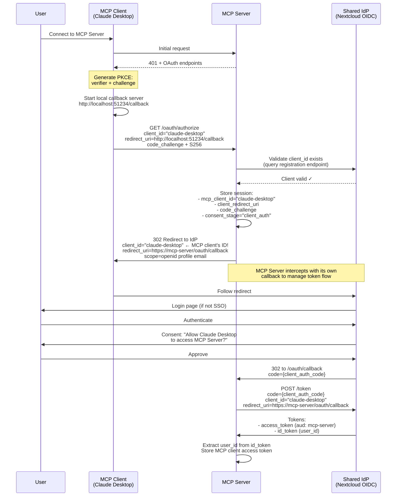
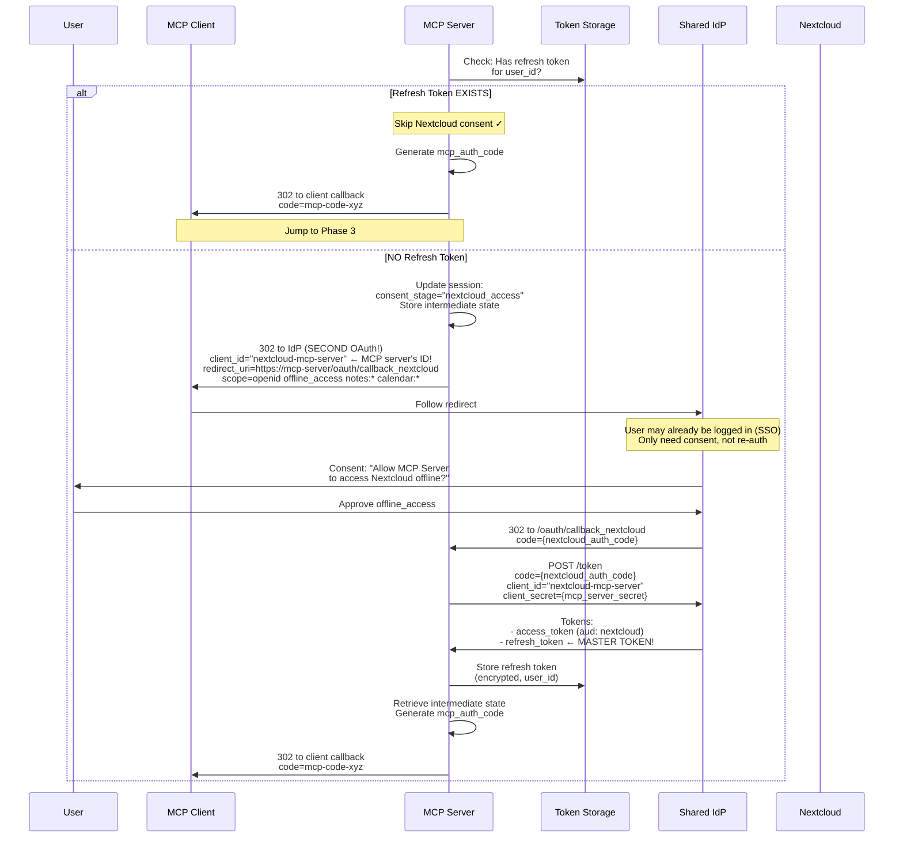
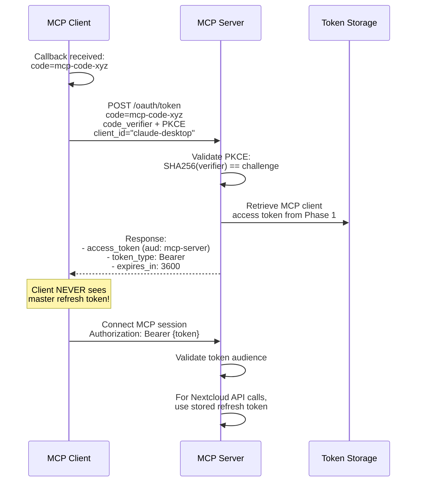

# ADR-004: Federated Authentication Architecture for Offline Access

**Status**: Draft
**Date**: 2025-11-02
**Supersedes**: ADR-002

## Context

ADR-002 attempted to solve the problem of background workers accessing user data by proposing token exchange patterns. However, it fundamentally misunderstood the MCP protocol's authentication architecture and OAuth delegation patterns.

The real challenge is that:
1. The MCP server needs to access Nextcloud APIs on behalf of users
2. Background workers need to operate when users are offline
3. We need proper OAuth compliance with user consent
4. Modern enterprise environments use federated identity providers

The solution is a **Federated Authentication Architecture** where both the MCP server and Nextcloud trust the same Identity Provider (IdP).

## Problem Statement

We need a way for:
1. Users to authenticate once to a central identity provider
2. The MCP server to obtain delegated access to Nextcloud resources
3. Background workers to access user data using stored refresh tokens
4. Clean separation between identity management and resource access

The core issue: **How can the MCP server obtain refresh tokens from a shared IdP to access Nextcloud on behalf of users?**

## Decision

We will implement a **Federated Authentication Architecture using a Shared Identity Provider** where:

1. **Shared IdP**: A central identity provider (e.g., Keycloak, Okta, Azure AD) manages user authentication
2. **MCP Server as OAuth Client**: The MCP server registers with the shared IdP to request tokens
3. **Nextcloud as Resource Server**: Nextcloud validates tokens issued by the shared IdP
4. **On-Behalf-Of Flow**: The MCP server requests tokens scoped for Nextcloud access

The MCP server will:
- Act as an OAuth client to the shared IdP
- Request tokens on behalf of users, scoped for Nextcloud API access
- Store refresh tokens securely with rotation
- Use stored tokens for both MCP sessions and background operations

## Architecture

### Token Broker Architecture with Linked Authorization

The MCP server acts as a **token broker** using a linked authorization pattern:

#### The Core Challenge
When the MCP client authenticates to the MCP server, we need to:
1. Authenticate the client to the MCP server (audience: "mcp-server")
2. Obtain refresh tokens for Nextcloud access (audience: "nextcloud")
3. Do this in a single OAuth flow from the user's perspective

#### Solution: Linked Authorization with Scope-Based Audiences

During initial OAuth authorization, the MCP server requests:
- **Scopes**: `openid profile offline_access nextcloud:*`
- **Initial audience**: `mcp-server` (for client authentication)
- **Linked resources**: Configured in Keycloak to allow refresh tokens to mint tokens for Nextcloud

The IdP (Keycloak) is configured to:
1. Issue initial access token with `audience: "mcp-server"`
2. Issue refresh token that can obtain tokens for BOTH audiences based on requested scopes
3. Allow the MCP server to request different audiences when using the refresh token

#### Token Types and Lifecycles

1. **MCP Access Tokens** (audience: "mcp-server")
   - Initial token from OAuth flow
   - Authenticates MCP clients to MCP server
   - Short-lived (1 hour)
   - Cannot access Nextcloud directly

2. **Nextcloud Access Tokens** (audience: "nextcloud")
   - Obtained by MCP server using refresh token with audience parameter
   - Used for Nextcloud API access
   - Never exposed to MCP clients
   - Refreshed as needed using stored refresh token

3. **Master Refresh Token**
   - Issued during initial OAuth with `offline_access` scope
   - Can mint tokens for multiple configured audiences
   - Stored encrypted by MCP server
   - Enables both MCP authentication and Nextcloud access

```
┌─────────────┐                ┌─────────────────┐                ┌──────────────┐              ┌────────────┐
│  MCP Client │◄──────401──────│   MCP Server    │◄───Exchange────│  Shared IdP  │──Validates──►│ Nextcloud  │
│  (Native)   │                │  (Token Broker) │    Tokens      │  (Keycloak)  │   Tokens     │(Resource)  │
└─────────────┘                └─────────────────┘                └──────────────┘              └────────────┘
       │                                │                                 │
       │ Token (aud: mcp-server)        │                                 │
       │ Via PKCE OAuth                 ├── Refresh Token ────────────────┤
       ▼                                │                                 │
┌─────────────┐                        ├── Get Token (aud: nextcloud) ───┤
│   Validate  │                        │                                 │
│ aud == "mcp"│                        ▼                                 ▼
└─────────────┘                ┌───────────────┐                  ┌──────────────┐
                               │Refresh Tokens │                  │Token Exchange│
                               │   (Encrypted) │                  │   Endpoint   │
                               └───────────────┘                  └──────────────┘
```

**Key Components:**
- **MCP Client**: Native application using PKCE flow, receives tokens with `aud: "mcp-server"`
- **MCP Server**: Token broker that validates MCP tokens, exchanges for Nextcloud tokens
- **Shared IdP**: Issues audience-specific tokens, supports token exchange/refresh
- **Nextcloud**: Validates tokens with `aud: "nextcloud"` for API access

### MCP Client Registration

**IMPORTANT**: MCP SDK clients (like Claude Desktop) are **proper OAuth clients registered at the IdP level**, not with the MCP server itself.

#### Client Registration Options

**Option 1: Dynamic Client Registration (DCR) - Recommended**
```python
# MCP client registers itself at IdP startup
import httpx

async def register_with_idp():
    response = await httpx.post(
        "https://idp.example.com/register",
        json={
            "client_name": "Claude Desktop",
            "redirect_uris": ["http://localhost:51234/callback"],
            "grant_types": ["authorization_code", "refresh_token"],
            "token_endpoint_auth_method": "none",  # Public client with PKCE
            "application_type": "native",
        }
    )
    client_id = response.json()["client_id"]
    # Store client_id for subsequent OAuth flows
```

**Option 2: Pre-registered Client**
```bash
# Admin pre-registers known MCP clients in Keycloak/Nextcloud
# Client IDs: "claude-desktop", "continue-dev", "zed-editor", etc.
```

**Key Points:**
- MCP clients are registered at **IdP level** (Nextcloud OIDC, Keycloak, Auth0, etc.)
- MCP server validates `client_id` against IdP registry during authorization
- Public clients use PKCE (no client_secret) per RFC 8252
- Each MCP client has its own identity and permissions

### Authentication Flows

#### Initial Setup with Progressive Consent (One-Time Per User)

This flow demonstrates **progressive consent**: separate authorization for MCP client authentication and Nextcloud resource access.

**Phase 1: MCP Client Authentication (Always Required)**



**Phase 2: Conditional Nextcloud Consent (Only If No Refresh Token)**



**Phase 3: Complete MCP Client Flow (Standard PKCE)**



**Key Innovations in Progressive Consent:**

1. **Dual OAuth Flows**:
   - Flow 1: Authenticate MCP client with IdP using client's own `client_id`
   - Flow 2: Obtain Nextcloud permissions with MCP server's `client_id` (conditional)

2. **IdP-Level Client Validation**: MCP clients are registered at IdP, validated against registry

3. **Conditional Consent**: Nextcloud access only requested once per user, reused for subsequent sessions

4. **Token Isolation**:
   - MCP client receives: `access_token` (aud: mcp-server)
   - MCP server stores: `refresh_token` for Nextcloud access
   - Complete separation of concerns

5. **SSO Efficiency**: If user authenticated in Phase 1, Phase 2 only requires consent (no re-login)

#### Subsequent MCP Sessions (Token Broker Pattern)


#### Background Operations


**Token Rotation Strategy:**
- **Access Tokens**: Refreshed frequently (every 5-60 minutes) as needed
- **Master Refresh Token**: Only rotated periodically (e.g., daily/weekly) or when explicitly refreshing the MCP session
- **Separation**: Getting Nextcloud access tokens does NOT rotate the master refresh token

## Implementation

### 1. Token Broker Service

```python
import jwt
from datetime import datetime, timedelta

class TokenBrokerService:
    """
    Token broker that exchanges master refresh tokens for audience-specific access tokens.
    Works alongside the required_scopes decorator which handles MCP token validation.
    """

    def __init__(self,
                 token_storage: RefreshTokenStorage,
                 idp_client: OAuthClient):
        self.storage = token_storage
        self.idp_client = idp_client
        self.nextcloud_token_cache = {}  # Short-lived cache

    async def get_nextcloud_token(self, user_id: str) -> str | None:
        """
        Get or refresh token with Nextcloud audience.
        Called AFTER the required_scopes decorator has validated the MCP token.
        """
        # Check cache first
        cached = self.nextcloud_token_cache.get(user_id)
        if cached and cached['exp'] > datetime.utcnow().timestamp():
            return cached['token']

        # Get master refresh token (stored during OAuth flow)
        refresh_token = await self.storage.get_refresh_token(user_id)
        if not refresh_token:
            logger.warning(f"No refresh token for user {user_id}")
            return None  # User needs to re-authenticate

        try:
            # Request new ACCESS token with Nextcloud audience
            # This does NOT rotate the master refresh token!
            response = await self.idp_client.refresh_token(
                refresh_token=refresh_token,
                audience='nextcloud'  # CRITICAL: Request Nextcloud audience
            )

            # Verify the new token has correct audience
            payload = jwt.decode(
                response.access_token,
                options={"verify_signature": False}
            )

            audiences = payload.get('aud', [])
            if isinstance(audiences, str):
                audiences = [audiences]

            if 'nextcloud' not in audiences:
                raise ValueError(f"IdP returned wrong audience: {audiences}")

            # Cache for short period (5 minutes)
            self.nextcloud_token_cache[user_id] = {
                'token': response.access_token,
                'exp': payload.get('exp', 0)
            }

            return response.access_token

        except Exception as e:
            logger.error(f"Failed to get Nextcloud token: {e}")
            return None

    async def refresh_master_token(self, user_id: str):
        """
        Refresh the master refresh token (with rotation).
        This should only be called periodically (e.g., weekly) or when
        explicitly refreshing the MCP session, NOT on every API call.
        """
        old_refresh = await self.storage.get_refresh_token(user_id)
        if not old_refresh:
            raise ValueError("No refresh token found")

        # Mark as used (rotation)
        await self.storage.mark_token_used(old_refresh.token_id)

        try:
            # Get new refresh token from IdP
            response = await self.idp_client.refresh_token(
                refresh_token=old_refresh.token,
                scope='openid profile offline_access nextcloud:*'
            )

            # Store new refresh token
            await self.storage.store_refresh_token(
                user_id=user_id,
                token_family_id=old_refresh.token_family_id,
                refresh_token=response.refresh_token,
                status='active'
            )

            return response.refresh_token

        except RefreshTokenReuseError:
            # Possible token theft - revoke entire family
            await self.storage.revoke_token_family(old_refresh.token_family_id)
            await self.alert_user_possible_breach(user_id)
            raise

# Integration with FastMCP framework
class MCPTokenVerifier(TokenVerifier):
    """
    Simple verifier that checks audience for MCP tokens.
    Used by FastMCP framework alongside required_scopes decorator.
    """

    async def verify_token(self, token: str) -> AccessToken | None:
        """Verify token has correct audience for MCP server."""
        try:
            payload = jwt.decode(
                token,
                options={"verify_signature": False}  # IdP handles signature
            )

            # CRITICAL: Verify audience is MCP server
            audiences = payload.get('aud', [])
            if isinstance(audiences, str):
                audiences = [audiences]

            if 'mcp-server' not in audiences:
                logger.warning(f"Token rejected: wrong audience {audiences}")
                return None

            # Check expiry
            if payload.get('exp', 0) < datetime.utcnow().timestamp():
                return None

            return AccessToken(
                token=token,  # Keep original MCP token
                scopes=payload.get('scope', '').split(),
                resource=json.dumps({
                    "user_id": payload['sub'],
                    "session_id": payload.get('jti')
                })
            )

        except jwt.InvalidTokenError:
            return None
```

### 2. OAuth Endpoints with PKCE (Native Client Support)

```python
import hashlib
import secrets
from urllib.parse import urlencode

@app.get("/oauth/authorize")
async def oauth_authorize(
    response_type: str = "code",
    client_id: str = None,
    redirect_uri: str = None,
    scope: str = None,
    state: str = None,
    code_challenge: str = None,  # PKCE
    code_challenge_method: str = "S256"  # PKCE
):
    """MCP Server OAuth endpoint with PKCE support."""
    # Validate redirect_uri is localhost (native client)
    if not redirect_uri or not redirect_uri.startswith(('http://localhost:', 'http://127.0.0.1:')):
        return {"error": "invalid_request", "error_description": "Invalid redirect_uri for native client"}

    # Store MCP client details with PKCE
    session_id = str(uuid4())
    mcp_authorization_code = f"mcp-code-{secrets.token_urlsafe(32)}"

    await store_oauth_session(
        session_id=session_id,
        client_id=client_id,
        client_redirect_uri=redirect_uri,  # Store client's redirect URI
        state=state,
        code_challenge=code_challenge,
        code_challenge_method=code_challenge_method,
        mcp_authorization_code=mcp_authorization_code  # Pre-generate MCP code
    )

    # Build IdP authorization URL
    # CRITICAL: Use MCP server's callback URL, NOT the client's!
    idp_params = {
        "client_id": MCP_SERVER_CLIENT_ID,
        "redirect_uri": f"{MCP_SERVER_URL}/oauth/callback",  # Server's callback!
        "response_type": "code",
        "scope": "openid profile email offline_access "  # Identity + offline
                 "nextcloud:notes:read nextcloud:notes:write "  # Nextcloud scopes
                 "nextcloud:calendar:read nextcloud:calendar:write",
        "state": f"{session_id}:{state}",  # Preserve client state
        "prompt": "consent"  # Ensure refresh token
    }

    idp_auth_url = f"{IDP_AUTHORIZATION_ENDPOINT}?{urlencode(idp_params)}"
    return RedirectResponse(idp_auth_url)

@app.get("/oauth/callback")
async def oauth_callback(code: str, state: str):
    """
    Handle IdP callback - the server receives the IdP code!
    This is the CRITICAL difference in the Hybrid Flow.
    """
    # Extract session ID and original client state
    try:
        session_id, client_state = state.split(":", 1)
    except ValueError:
        return {"error": "invalid_state"}

    oauth_session = await get_oauth_session(session_id)
    if not oauth_session:
        return {"error": "invalid_session"}

    # STEP 1: Exchange IdP code for master tokens
    # The server gets the master refresh token!
    tokens = await idp_client.exchange_code(
        code=code,  # IdP authorization code
        redirect_uri=f"{MCP_SERVER_URL}/oauth/callback",
        client_id=MCP_SERVER_CLIENT_ID,
        client_secret=MCP_SERVER_CLIENT_SECRET  # Server has client secret
    )

    # Verify the access token has correct audience
    payload = jwt.decode(
        tokens.access_token,
        options={"verify_signature": False}
    )

    audiences = payload.get('aud', [])
    if isinstance(audiences, str):
        audiences = [audiences]

    if 'mcp-server' not in audiences:
        logger.error(f"IdP returned token with wrong audience: {audiences}")
        return {"error": "invalid_token", "error_description": "Wrong audience"}

    # Decode ID token to get user info
    userinfo = decode_id_token(tokens.id_token)

    # Create or update user account
    user = await create_or_update_user(
        idp_sub=userinfo.sub,
        username=userinfo.preferred_username,
        email=userinfo.email
    )

    # Generate new token family for rotation
    token_family_id = str(uuid4())

    # STEP 2: Store master tokens (encrypted)
    # These are the IdP tokens with offline_access!
    await token_storage.store_tokens(
        user_id=user.id,
        token_family_id=token_family_id,
        access_token=tokens.access_token,  # Initial MCP access token
        refresh_token=tokens.refresh_token,  # Master refresh token!
        status='active',
        scopes=tokens.scope,
        idp_subject=userinfo.sub
    )

    # Link session to user and store the access token for later
    await update_oauth_session(
        session_id,
        user_id=user.id,
        idp_access_token=tokens.access_token  # Store for /oauth/token endpoint
    )

    # STEP 3: Redirect to native client with MCP-generated code
    # Client will exchange this code for tokens at /oauth/token
    redirect_params = {
        "code": oauth_session.mcp_authorization_code,  # MCP code, NOT IdP code!
        "state": client_state  # Return original client state
    }

    redirect_url = f"{oauth_session.client_redirect_uri}?{urlencode(redirect_params)}"
    return RedirectResponse(redirect_url, status_code=302)

@app.post("/oauth/token")
async def oauth_token(
    grant_type: str = Form(...),
    code: str = Form(None),
    code_verifier: str = Form(None),  # PKCE
    redirect_uri: str = Form(None),
    client_id: str = Form(None),
    refresh_token: str = Form(None)
):
    """
    Token endpoint - client exchanges MCP code for tokens.
    CRITICAL: The client sends the MCP-generated code, NOT the IdP code!
    """

    if grant_type == "authorization_code":
        # Find session by MCP authorization code (e.g., mcp-code-xyz...)
        oauth_session = await get_oauth_session_by_mcp_code(code)
        if not oauth_session:
            return JSONResponse(
                {"error": "invalid_grant", "error_description": "Invalid authorization code"},
                status_code=400
            )

        # Verify PKCE
        if oauth_session.code_challenge:
            if not code_verifier:
                return JSONResponse(
                    {"error": "invalid_request", "error_description": "code_verifier required"},
                    status_code=400
                )

            # Compute challenge from verifier
            computed_challenge = base64.urlsafe_b64encode(
                hashlib.sha256(code_verifier.encode()).digest()
            ).decode().rstrip('=')

            if computed_challenge != oauth_session.code_challenge:
                return JSONResponse(
                    {"error": "invalid_grant", "error_description": "PKCE verification failed"},
                    status_code=400
                )

        # Verify redirect_uri matches
        if redirect_uri != oauth_session.client_redirect_uri:
            return JSONResponse(
                {"error": "invalid_grant", "error_description": "redirect_uri mismatch"},
                status_code=400
            )

        # Get the IdP access token that was stored during /oauth/callback
        # This token was already obtained when the server exchanged the IdP code
        idp_access_token = oauth_session.idp_access_token

        # Get user's refresh token from storage (for creating response)
        # But DO NOT return the master refresh token to the client!
        user_tokens = await get_user_tokens(oauth_session.user_id)

        # Invalidate MCP authorization code (one-time use)
        await invalidate_oauth_session(oauth_session.session_id)

        # Return tokens to client
        # CRITICAL: Client gets access token but NOT the master refresh token
        return {
            "access_token": idp_access_token,  # IdP token with aud: mcp-server
            "token_type": "Bearer",
            "expires_in": 3600,
            "scope": user_tokens.scope,
            # Optional: Return an MCP session refresh token (NOT the master token!)
            # This allows the client to refresh without re-auth
            "refresh_token": await generate_mcp_session_refresh_token(oauth_session.user_id)
        }

    elif grant_type == "refresh_token":
        # Refresh with IdP for new MCP-audience token
        try:
            # Use master refresh token to get new MCP token
            response = await idp_client.refresh_token(
                refresh_token=refresh_token,
                audience='mcp-server'  # Request MCP audience
            )

            # Verify audience
            payload = jwt.decode(
                response.access_token,
                options={"verify_signature": False}
            )

            audiences = payload.get('aud', [])
            if isinstance(audiences, str):
                audiences = [audiences]

            if 'mcp-server' not in audiences:
                return JSONResponse(
                    {"error": "invalid_grant", "error_description": "Refreshed token missing MCP audience"},
                    status_code=400
                )

            return {
                "access_token": response.access_token,
                "token_type": "Bearer",
                "expires_in": response.expires_in,
                "scope": response.scope,
                "refresh_token": response.refresh_token  # New refresh token if rotated
            }
        except Exception as e:
            return JSONResponse(
                {"error": "invalid_grant", "error_description": str(e)},
                status_code=400
            )

    return JSONResponse(
        {"error": "unsupported_grant_type"},
        status_code=400
    )
```

### 3. MCP Tool Token Verification with Audience Check

```python
from functools import wraps

def required_scopes(*scopes):
    """
    Decorator that verifies token audience and scopes.
    The existing required_scopes decorator needs to be updated
    to verify audience: "mcp-server" for all incoming tokens.
    """
    def decorator(func):
        @wraps(func)
        async def wrapper(ctx: Context, *args, **kwargs):
            # Get token from context (set by FastMCP framework)
            token = ctx.authorization.token if ctx.authorization else None

            if not token:
                raise Unauthorized("No token provided")

            # Decode and verify audience
            try:
                payload = jwt.decode(
                    token,
                    options={"verify_signature": False}  # IdP handles signature
                )

                # CRITICAL: Verify token is for MCP server
                audiences = payload.get('aud', [])
                if isinstance(audiences, str):
                    audiences = [audiences]

                if 'mcp-server' not in audiences:
                    raise Unauthorized(f"Invalid audience: {audiences}")

                # Verify required scopes
                token_scopes = set(payload.get('scope', '').split())
                required = set(scopes)

                if not required.issubset(token_scopes):
                    missing = required - token_scopes
                    raise Forbidden(f"Missing scopes: {missing}")

                # Token is valid for MCP server with required scopes
                return await func(ctx, *args, **kwargs)

            except jwt.InvalidTokenError as e:
                raise Unauthorized(f"Invalid token: {e}")

        return wrapper
    return decorator

# Example usage in MCP tools
@mcp.tool()
@required_scopes("notes:read")
async def list_notes(ctx: Context) -> dict:
    """List notes - token audience and scopes are automatically verified."""
    # Token already verified to have audience: "mcp-server"
    # Now get Nextcloud token for backend access

    token_broker = get_token_broker(ctx)
    nextcloud_token = await token_broker.get_nextcloud_token(ctx.user_id)

    # Use Nextcloud token for API access
    client = NextcloudClient.from_token(
        base_url=NEXTCLOUD_HOST,
        token=nextcloud_token  # Token with aud: "nextcloud"
    )

    notes = await client.notes.list_notes()
    return {"notes": notes}
```

### 4. Token Storage Schema

```sql
-- User accounts (created from IdP identity)
CREATE TABLE users (
    id TEXT PRIMARY KEY,
    idp_sub TEXT UNIQUE NOT NULL,      -- IdP subject identifier
    username TEXT NOT NULL,
    email TEXT,
    created_at INTEGER NOT NULL,
    last_login INTEGER NOT NULL
);

-- IdP tokens with rotation support
CREATE TABLE idp_tokens (
    id INTEGER PRIMARY KEY AUTOINCREMENT,
    user_id TEXT NOT NULL REFERENCES users(id),
    token_family_id TEXT NOT NULL,    -- Groups all tokens in rotation chain
    encrypted_access_token BLOB NOT NULL,
    encrypted_refresh_token BLOB NOT NULL,
    access_expires_at INTEGER NOT NULL,
    status TEXT NOT NULL CHECK(status IN ('active', 'used', 'revoked')),
    scopes TEXT NOT NULL,              -- Includes Nextcloud scopes
    idp_subject TEXT NOT NULL,         -- IdP user identifier
    created_at INTEGER NOT NULL,
    used_at INTEGER,                   -- When token was exchanged

    -- Only one active token per family
    UNIQUE(token_family_id, status) WHERE status = 'active'
);

-- Index for quick lookups
CREATE INDEX idx_active_tokens ON idp_tokens(user_id, status)
    WHERE status = 'active';
CREATE INDEX idx_token_families ON idp_tokens(token_family_id);

-- MCP session tokens (separate from IdP tokens)
CREATE TABLE mcp_sessions (
    session_token TEXT PRIMARY KEY,
    user_id TEXT NOT NULL REFERENCES users(id),
    created_at INTEGER NOT NULL,
    expires_at INTEGER NOT NULL,
    last_used INTEGER
);

-- OAuth flow sessions with PKCE support (temporary during auth)
CREATE TABLE oauth_sessions (
    session_id TEXT PRIMARY KEY,
    client_id TEXT,
    client_redirect_uri TEXT NOT NULL,  -- Client's localhost redirect URI
    state TEXT,
    code_challenge TEXT,                -- PKCE code challenge from client
    code_challenge_method TEXT,         -- PKCE method (S256)
    mcp_authorization_code TEXT UNIQUE, -- MCP-generated code (e.g., mcp-code-xyz)
    idp_access_token TEXT,              -- Stored after IdP exchange in /oauth/callback
    user_id TEXT,                       -- Set after IdP authentication
    created_at INTEGER NOT NULL,
    expires_at INTEGER NOT NULL
);

-- Audit log for security
CREATE TABLE token_audit_log (
    id INTEGER PRIMARY KEY AUTOINCREMENT,
    user_id TEXT NOT NULL,
    token_family_id TEXT,
    operation TEXT NOT NULL,  -- 'authorize', 'refresh', 'revoke', 'reuse_detected'
    timestamp INTEGER NOT NULL,
    ip_address TEXT,
    user_agent TEXT,
    details TEXT
);
```

### 5. Background Worker (Access Token Only)

```python
class BackgroundSyncWorker:
    """Background workers use master refresh token to get Nextcloud access tokens."""

    def __init__(self, token_storage: RefreshTokenStorage):
        self.storage = token_storage
        self.idp_client = OAuthClient.from_discovery(IDP_DISCOVERY_URL)
        self.nextcloud_url = os.getenv("NEXTCLOUD_HOST")
        self.nextcloud_token_cache = {}  # Short-lived cache

    async def sync_user_data(self, user_id: str):
        """
        Sync data using master refresh token to get Nextcloud access tokens.

        Key Points:
        - Workers use the master refresh token stored during OAuth flow
        - Workers request access tokens with audience: "nextcloud"
        - NO refresh token rotation during normal operations
        - Master refresh token only rotated periodically (e.g., weekly)
        """
        # Get master refresh token (stored during initial OAuth)
        master_refresh_token = await self.storage.get_refresh_token(user_id)
        if not master_refresh_token:
            logger.warning(f"No master refresh token for user {user_id}")
            return

        try:
            # Check cache for valid Nextcloud access token
            cached = self.nextcloud_token_cache.get(user_id)
            if cached and cached['exp'] > datetime.utcnow().timestamp():
                nextcloud_token = cached['token']
            else:
                # Get new ACCESS token with Nextcloud audience
                # This does NOT rotate the refresh token!
                response = await self.idp_client.refresh_token(
                    refresh_token=master_refresh_token,
                    audience='nextcloud'  # Request Nextcloud audience
                )

                # Verify audience is for Nextcloud (security check)
                payload = jwt.decode(
                    response.access_token,
                    options={"verify_signature": False}
                )

                audiences = payload.get('aud', [])
                if isinstance(audiences, str):
                    audiences = [audiences]

                if 'nextcloud' not in audiences:
                    raise ValueError(f"IdP returned wrong audience: {audiences}")

                # Cache the access token for 5 minutes
                self.nextcloud_token_cache[user_id] = {
                    'token': response.access_token,
                    'exp': payload.get('exp', 0)
                }
                nextcloud_token = response.access_token

            # Create Nextcloud client with access token
            # Token has audience: "nextcloud" and proper scopes
            client = NextcloudClient.from_token(
                base_url=self.nextcloud_url,
                token=nextcloud_token,  # Access token with aud: nextcloud
                username=user_id
            )

            # Perform sync operations with Nextcloud
            await self.sync_notes(user_id, client)
            await self.sync_calendar(user_id, client)
            await self.sync_contacts(user_id, client)

            logger.info(f"Background sync completed for user {user_id}")

        except HTTPStatusError as e:
            if e.response.status_code == 401:
                # Access token rejected - try clearing cache
                self.nextcloud_token_cache.pop(user_id, None)
                # If persistent, may need to trigger re-authentication
                await self.log_security_event(
                    user_id,
                    "access_token_rejected",
                    f"Nextcloud rejected access token for user {user_id}"
                )
            raise
        except Exception as e:
            logger.error(f"Background sync failed for user {user_id}: {e}")
            raise

    async def log_security_event(self, user_id: str, event: str, details: str):
        """Log security events for audit."""
        await self.storage.log_audit(
            user_id=user_id,
            operation=event,
            details=details,
            timestamp=datetime.utcnow().isoformat()
        )
```

### 6. Configuration

```python
# Environment variables for federated setup
IDP_DISCOVERY_URL = os.getenv("IDP_DISCOVERY_URL")  # e.g., https://keycloak.example.com/realms/master/.well-known/openid-configuration
MCP_SERVER_CLIENT_ID = os.getenv("MCP_SERVER_CLIENT_ID")  # MCP server's client ID in IdP
MCP_SERVER_CLIENT_SECRET = os.getenv("MCP_SERVER_CLIENT_SECRET")  # Client secret
MCP_SERVER_URL = os.getenv("MCP_SERVER_URL", "http://localhost:8000")

# Nextcloud configuration
NEXTCLOUD_HOST = os.getenv("NEXTCLOUD_HOST")  # Nextcloud instance URL

# Parse IdP discovery document
async def setup_idp_client():
    """Initialize OAuth client from IdP discovery."""
    async with httpx.AsyncClient() as client:
        discovery = await client.get(IDP_DISCOVERY_URL)
        discovery_doc = discovery.json()

    return OAuthClient(
        authorization_endpoint=discovery_doc["authorization_endpoint"],
        token_endpoint=discovery_doc["token_endpoint"],
        introspection_endpoint=discovery_doc.get("introspection_endpoint"),
        userinfo_endpoint=discovery_doc["userinfo_endpoint"],
        client_id=MCP_SERVER_CLIENT_ID,
        client_secret=MCP_SERVER_CLIENT_SECRET
    )
```

## Advantages

1. **Single Sign-On**: Users authenticate once to the shared IdP
2. **Federated Identity**: Enterprise-ready with support for SAML, LDAP backends
3. **True Offline Access**: Background workers operate with stored IdP refresh tokens
4. **OAuth Compliant**: Proper delegation with on-behalf-of pattern
5. **Security Isolation**: MCP clients never see IdP or Nextcloud credentials
6. **Flexible Backend**: Can swap Nextcloud for other resources without changing auth
7. **Standard Pattern**: Industry-standard federated OAuth architecture

## Disadvantages

1. **IdP Dependency**: Requires a shared identity provider infrastructure
2. **Complex Token Lifecycle**: Managing tokens from IdP for Nextcloud access
3. **Token Validation Overhead**: Nextcloud must validate tokens with IdP
4. **Migration Complexity**: Existing deployments need IdP setup

## Security Considerations

### Audience Isolation Architecture

#### Core Security Principle: Token Audience Separation
The architecture enforces **strict audience isolation** to prevent token misuse:

- **Tokens with `audience: "mcp-server"`** can ONLY authenticate to MCP server
- **Tokens with `audience: "nextcloud"`** can ONLY access Nextcloud APIs
- **No token has multiple audiences** - this would be a security boundary violation
- **Compromised MCP tokens cannot access Nextcloud** directly

#### Token Broker Security Model

The MCP server acts as a **secure token broker**:
1. Validates incoming tokens have `audience: "mcp-server"`
2. Uses stored refresh tokens to obtain `audience: "nextcloud"` tokens
3. Never exposes Nextcloud tokens to MCP clients
4. Maintains separate token lifecycles for each audience

#### Audience Validation Examples
```python
# MCP Access Token (from IdP)
{
  "aud": "mcp-server",      # Single audience ONLY
  "sub": "user-123",
  "scope": "mcp:full",
  "exp": 1234567890
}

# Nextcloud Access Token (obtained via refresh)
{
  "aud": "nextcloud",        # Different audience
  "sub": "user-123",
  "scope": "notes:read calendar:write",
  "exp": 1234567890
}

# Master Refresh Token Claims
{
  "sub": "user-123",
  "scope": "openid profile offline_access nextcloud:*",
  "allowed_audiences": ["mcp-server", "nextcloud"]  # Can mint both
}
```

### PKCE Protection
- **Mandatory for native clients** (RFC 7636)
- Code verifier: 43-128 character random string
- Code challenge: SHA256(code_verifier)
- Prevents authorization code interception
- Validated before token issuance

### Native Client Security
- **Localhost redirect only** (RFC 8252)
  - Restrict to `http://localhost:*` or `http://127.0.0.1:*`
  - Dynamic port allocation per session
  - No custom URL schemes allowed
- **System browser required** - no embedded browsers
- **302 redirect flow** - direct redirect, no HTML page

### Token Storage Security
- **Master refresh tokens**: Encrypted at rest (Fernet/AES-256)
- **Audience-specific caching**: Short-lived cache for Nextcloud tokens
- **Database isolation**: Refresh tokens never exposed to application layer
- **Key rotation**: Support for encryption key rotation
- **Hardware security**: Consider HSM for production

### Token Rotation with Audience Preservation
- **Rotation maintains audience**: New tokens keep same audience
- **Reuse detection**: Previous use revokes entire token family
- **Atomic operations**: Database transactions prevent races
- **Audit trail**: All exchanges logged with audience info

### Trust Boundaries

```
┌──────────────┐     aud:"mcp-server"     ┌──────────────┐
│  MCP Client  │──────────────────────────►│  MCP Server  │
└──────────────┘                           └───────┬──────┘
                                                   │
                                          Refresh for different
                                               audience
                                                   │
┌──────────────┐     aud:"nextcloud"      ┌───────▼──────┐
│  Nextcloud   │◄──────────────────────────│     IdP      │
└──────────────┘                           └──────────────┘
```

1. **MCP Client → MCP Server**: Only `aud:"mcp-server"` tokens
2. **MCP Server → IdP**: Refresh with audience parameter
3. **MCP Server → Nextcloud**: Only `aud:"nextcloud"` tokens
4. **No direct path**: Client cannot use MCP tokens for Nextcloud

### Revocation and Breach Response
- **Audience-specific revocation**: Can revoke MCP without affecting Nextcloud
- **Token family tracking**: All tokens from same refresh chain
- **Immediate propagation**: Revocation flows through trust chain
- **Breach isolation**: Compromised MCP tokens don't grant Nextcloud access

## Migration Strategy

### Phase 1: IdP Setup
1. Deploy shared IdP (Keycloak recommended)
2. Register MCP server as OAuth client
3. Configure Nextcloud to accept IdP tokens
4. Test token validation flow

### Phase 2: Parallel Operation
1. Keep existing pass-through authentication
2. Add federated auth as optional feature flag
3. Test with subset of users
4. Monitor token lifecycle and refresh patterns

### Phase 3: Migration
1. Migrate existing users to IdP accounts
2. Map existing permissions to IdP scopes
3. Update clients to use new OAuth flow
4. Maintain backward compatibility period

### Phase 4: Deprecation
1. Announce end-of-life for pass-through mode
2. Complete user migration
3. Remove legacy authentication code
4. Document new auth flow

## Alternatives Considered

### 1. Pass-Through Only (Current)
- **Pros**: Simple, stateless
- **Cons**: No offline access possible
- **Rejected**: Doesn't meet requirements

### 2. Service Accounts (ADR-002 Tier 1)
- **Pros**: Simple to implement
- **Cons**: Violates OAuth principles, creates audit issues
- **Rejected**: Security and compliance concerns

### 3. Token Exchange (ADR-002 Tier 2)
- **Pros**: Standards-based (RFC 8693)
- **Cons**: Circular dependency, doesn't solve bootstrap problem
- **Rejected**: Doesn't enable true offline access

### 4. Sign-in with Nextcloud (Previous ADR-004)
- **Pros**: Direct Nextcloud integration
- **Cons**: Tight coupling, no enterprise IdP support
- **Rejected**: Not suitable for federated environments

### 5. Double OAuth (Manual)
- **Pros**: Clear separation of concerns
- **Cons**: Poor UX with two login prompts
- **Rejected**: Users shouldn't authenticate twice

## Token Exchange Pattern Implementation

### How Audience-Specific Token Exchange Works

The key to this architecture is the IdP's ability to issue tokens with different audiences from a single refresh token. This is achieved through:

#### 1. Keycloak Configuration

```javascript
// Keycloak Client Configuration for MCP Server
{
  "clientId": "mcp-server",
  "standardFlowEnabled": true,
  "serviceAccountsEnabled": false,
  "publicClient": false,
  "attributes": {
    // Allow refresh tokens to request different audiences
    "oauth2.device.authorization.grant.enabled": "false",
    "oidc.ciba.grant.enabled": "false",
    "oauth2.token.exchange.grant.enabled": "true"  // Enable token exchange
  }
}

// Audience Mapper Configuration
{
  "name": "dynamic-audience-mapper",
  "protocol": "openid-connect",
  "protocolMapper": "oidc-audience-mapper",
  "config": {
    "included.client.audience": "mcp-server",  // Default audience
    "access.token.claim": "true",
    "id.token.claim": "false"
  }
}

// Scope-to-Audience Mapping
{
  "mcp:*": "mcp-server",        // MCP scopes → mcp-server audience
  "nextcloud:*": "nextcloud"     // Nextcloud scopes → nextcloud audience
}
```

#### 2. Refresh Token with Audience Parameter

When the MCP server needs a token for a specific audience:

```http
POST /realms/nextcloud-mcp/protocol/openid-connect/token
Content-Type: application/x-www-form-urlencoded

grant_type=refresh_token
&refresh_token=eyJhbGc...
&client_id=mcp-server
&client_secret=secret
&audience=nextcloud  # Request specific audience
```

Response:
```json
{
  "access_token": "eyJhbGc...",  // Token with aud: "nextcloud"
  "expires_in": 300,
  "refresh_token": "eyJhbGc...",  // Same or rotated refresh token
  "token_type": "Bearer"
}
```

#### 3. Alternative: Token Exchange (RFC 8693)

For IdPs that support token exchange:

```http
POST /realms/nextcloud-mcp/protocol/openid-connect/token
Content-Type: application/x-www-form-urlencoded

grant_type=urn:ietf:params:oauth:grant-type:token-exchange
&subject_token=eyJhbGc...  # Token with aud: "mcp-server"
&subject_token_type=urn:ietf:params:oauth:token-type:access_token
&requested_token_type=urn:ietf:params:oauth:token-type:access_token
&audience=nextcloud  # Request different audience
```

### Why This Pattern Is Secure

1. **Audience Validation at Every Layer**:
   - MCP server validates `aud: "mcp-server"` for incoming requests
   - Nextcloud validates `aud: "nextcloud"` for API calls
   - Tokens with wrong audience are rejected

2. **Unidirectional Token Flow**:
   - Client → MCP: Only `aud: "mcp-server"`
   - MCP → Nextcloud: Only `aud: "nextcloud"`
   - No reverse flow possible

3. **Breach Containment**:
   - Stolen MCP token: Cannot access Nextcloud
   - Stolen Nextcloud token: Cannot authenticate to MCP
   - Stolen refresh token: Requires client credentials to use

### Configuration for Popular IdPs

#### Keycloak
- Enable Token Exchange in realm settings
- Configure audience mappers per client
- Use protocol mappers for dynamic audiences

#### Auth0
- Use custom rules for audience selection
- Configure API identifiers as audiences
- Enable refresh token rotation

#### Azure AD
- Configure app registrations for each audience
- Use scope-to-resource mapping
- Enable conditional access policies

#### Okta
- Define custom authorization servers
- Configure audience claim per API
- Use inline hooks for dynamic audiences

## Decision Outcome

The Token Broker Architecture with **Hybrid Flow** and Audience Isolation provides a secure, enterprise-ready solution for offline access while maintaining strict security boundaries. By using a shared identity provider with audience-specific tokens, we achieve:

1. **Security through isolation**: Different audiences prevent token misuse
2. **Single authentication**: Users authenticate once to the IdP
3. **Offline capabilities**: Master refresh tokens enable background operations
4. **Enterprise compliance**: Follows OAuth best practices and security standards

### Key Implementation: Progressive Consent with Dual OAuth Flows

The **Progressive Consent architecture** (see "Initial Setup with Progressive Consent" above) solves the critical challenges of token brokering while maintaining standards compliance:

1. **MCP Client Authentication** (Phase 1):
   - MCP clients are registered at IdP level (DCR or pre-configured)
   - Client uses own `client_id` (e.g., "claude-desktop") for authentication
   - MCP server validates client exists at IdP before proceeding
   - User consents to "Claude Desktop accessing MCP Server"

2. **Conditional Nextcloud Consent** (Phase 2):
   - Only triggered if MCP server doesn't have refresh token for user
   - MCP server uses own `client_id` ("nextcloud-mcp-server") to request Nextcloud access
   - User consents to "MCP Server accessing Nextcloud offline"
   - MCP server stores master refresh token (encrypted)

3. **Token Exchange** (Phase 3):
   - Standard PKCE flow between MCP client and MCP server
   - Client exchanges MCP authorization code for access token
   - Client never sees master refresh token
   - Complete token isolation

**Benefits:**
- **Standards-compliant**: Proper OAuth 2.0 patterns throughout
- **Secure**: Client validation at IdP level, not local storage
- **Efficient**: Nextcloud consent only needed once per user
- **Transparent**: Users understand what they're authorizing at each step
- **SSO-friendly**: If authenticated in Phase 1, Phase 2 only requires consent

### Token Lifecycle Clarification

- **Access Token Refresh**: Happens frequently (every 5-60 minutes) without rotating the master refresh token
- **Master Refresh Token**: Only rotated periodically (e.g., weekly) or during explicit session refresh
- **Audience Separation**: Each token request specifies the target audience (mcp-server or nextcloud)

This architecture follows industry best practices for federated systems and positions the MCP server as a secure token broker in an enterprise identity ecosystem.

## Implementation Status

**Current Status**: Partially Implemented (Refactoring Required)

The current implementation (`nextcloud_mcp_server/auth/oauth_routes.py`) implements a **simplified hybrid flow** but needs refactoring to match the progressive consent architecture documented above:

### What's Currently Implemented ✅

1. **Basic OAuth endpoints**: `/oauth/authorize`, `/oauth/callback`, `/oauth/token`
2. **PKCE validation**: Code challenge/verifier flow works
3. **Session storage**: OAuth sessions stored in SQLite
4. **Token storage**: Master refresh tokens stored encrypted
5. **Integration tests**: Playwright-based tests pass (3/3)

### What Needs Refactoring 🔄

1. **Client Validation**:
   - Current: `client_id` is ignored
   - Needed: Validate `client_id` exists at IdP registry

2. **Dual OAuth Flow**:
   - Current: Single OAuth using MCP server's `client_id`
   - Needed: Phase 1 (MCP client auth) + Phase 2 (conditional Nextcloud consent)

3. **Consent Separation**:
   - Current: Monolithic consent screen
   - Needed: Separate consents for client authentication vs resource access

4. **Intermediate Session State**:
   - Current: Simple session with MCP code generated upfront
   - Needed: Store state between OAuth phases, support `consent_stage` field

5. **New Callback Endpoint**:
   - Current: Single `/oauth/callback`
   - Needed: Add `/oauth/callback_nextcloud` for Phase 2

### Migration Plan

The refactoring will be tracked in a separate issue. The current implementation serves as a proof-of-concept for the hybrid flow pattern and demonstrates:
- MCP server can intercept OAuth callbacks
- Refresh tokens can be securely stored
- MCP clients can connect using PKCE
- End-to-end tool execution works

The progressive consent architecture documented here represents the **target state** for production deployments.

## Testing

The ADR-004 Hybrid Flow is currently tested via automated integration tests (using the simplified implementation):

### Integration Tests

```bash
# Run all ADR-004 tests
uv run pytest tests/server/oauth/test_adr004_hybrid_flow.py --browser firefox -v

# Run specific test
uv run pytest tests/server/oauth/test_adr004_hybrid_flow.py::test_adr004_hybrid_flow_tool_execution --browser firefox -v
```

**Test Coverage:**
- `test_adr004_hybrid_flow_connection`: Verifies MCP session establishment with hybrid flow token
- `test_adr004_hybrid_flow_tool_execution`: Tests complete flow including tool execution
- `test_adr004_hybrid_flow_multiple_operations`: Validates persistent access without re-authentication

**What the tests verify:**
1. ✅ PKCE code challenge/verifier flow
2. ✅ MCP server intercepts OAuth callback and stores master refresh token
3. ✅ Client receives MCP access token (not master token)
4. ✅ MCP session establishment with hybrid flow token
5. ✅ Tool execution using stored refresh tokens (on-behalf-of pattern)
6. ✅ Multiple operations without re-authentication

### Test Implementation

The tests use Playwright automation to complete the OAuth flow:
1. Generate PKCE challenge/verifier
2. Navigate to MCP server `/oauth/authorize` endpoint
3. MCP server redirects to IdP
4. Playwright fills login form and consents
5. IdP redirects to MCP server `/oauth/callback`
6. MCP server stores master refresh token
7. MCP server redirects client with MCP authorization code
8. Client exchanges MCP code for access token using PKCE verifier
9. Create MCP session and execute tools

See `tests/server/oauth/test_adr004_hybrid_flow.py` for complete implementation.

## References

- [RFC 6749: OAuth 2.0](https://datatracker.ietf.org/doc/html/rfc6749)
- [RFC 8693: OAuth 2.0 Token Exchange](https://datatracker.ietf.org/doc/html/rfc8693)
- [RFC 7636: PKCE](https://datatracker.ietf.org/doc/html/rfc7636)
- [OAuth 2.0 Security Best Practices](https://datatracker.ietf.org/doc/html/draft-ietf-oauth-security-topics)
- [OpenID Connect Core 1.0](https://openid.net/specs/openid-connect-core-1_0.html)
- [OAuth 2.0 for Native Apps](https://datatracker.ietf.org/doc/html/rfc8252)
- [OAuth 2.0 Device Authorization Grant](https://datatracker.ietf.org/doc/html/rfc8628)