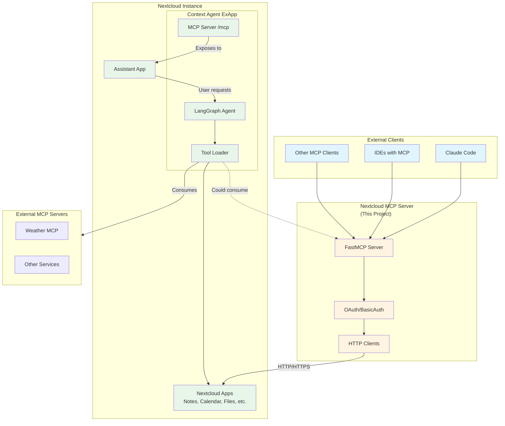
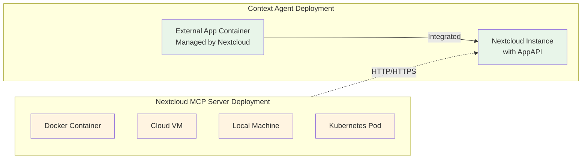
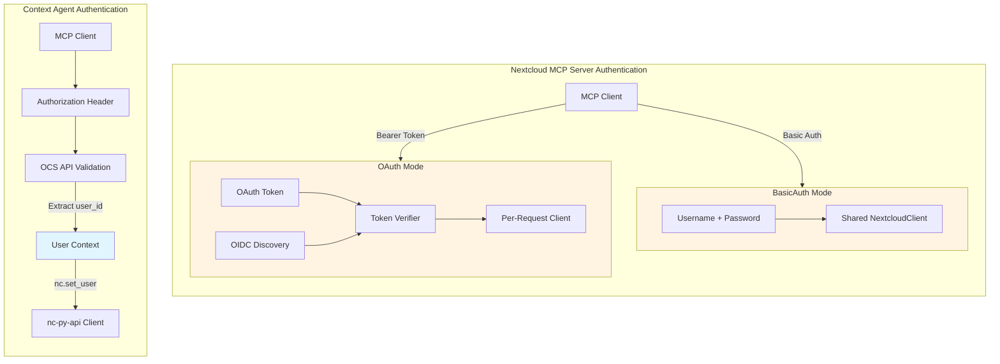
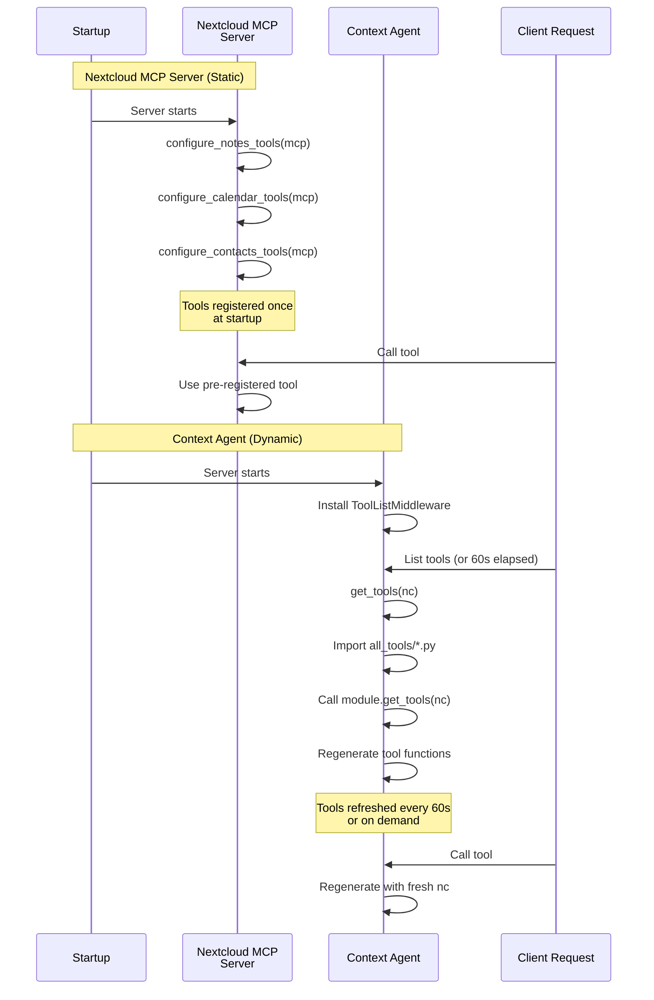
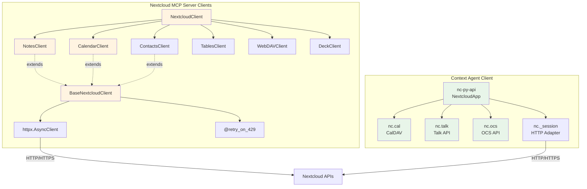
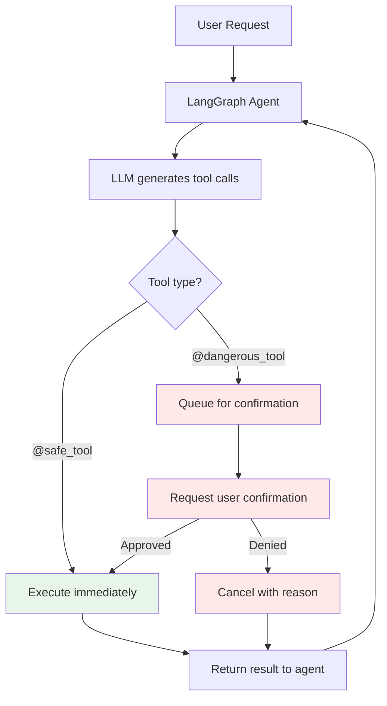
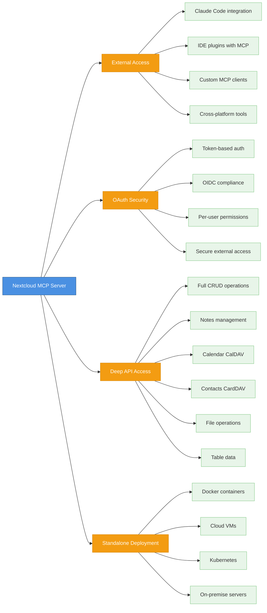
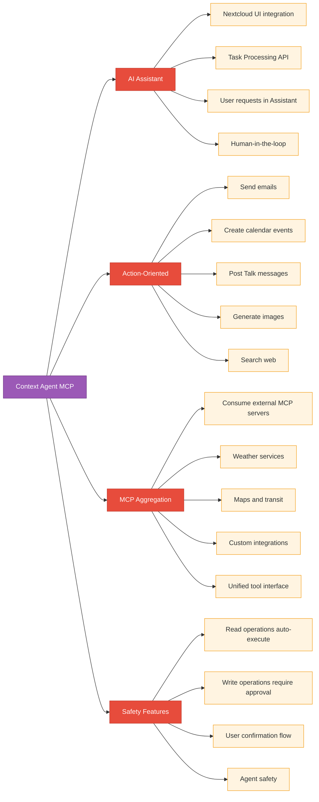
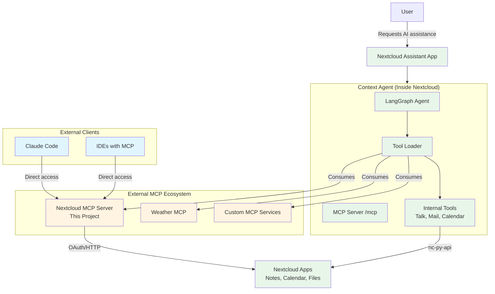

# MCP Server Comparison: Nextcloud MCP Server vs Context Agent

This document compares the two MCP server implementations in the Nextcloud ecosystem:

1. **Nextcloud MCP Server** (this project) - Standalone MCP server for external access to Nextcloud
2. **Context Agent MCP Server** - MCP server embedded within Nextcloud as an External App

## Executive Summary

Both projects expose Nextcloud functionality via the Model Context Protocol (MCP), but serve different purposes and audiences:

- **Nextcloud MCP Server**: Brings Nextcloud OUT to external MCP clients (Claude Code, etc.)
- **Context Agent**: Brings external MCP servers IN to Nextcloud's AI Assistant

## Architecture Overview



## Deployment Models



### Nextcloud MCP Server
- **Location**: Runs anywhere with network access to Nextcloud
- **Deployment**: Docker, VM, local machine, Kubernetes
- **Connection**: HTTP/HTTPS to Nextcloud APIs
- **Independence**: Fully standalone service

### Context Agent
- **Location**: Runs inside Nextcloud as External App
- **Deployment**: Managed by Nextcloud AppAPI
- **Connection**: Native nc-py-api integration
- **Integration**: Deep Nextcloud integration

## Authentication Architecture



## Tool Registration & Loading



## Tool Definition Patterns

### Nextcloud MCP Server

```python
# Static registration at startup
def configure_notes_tools(mcp: FastMCP):
    @mcp.tool()
    async def nc_notes_create_note(
        title: str,
        content: str,
        category: str,
        ctx: Context
    ) -> CreateNoteResponse:
        """Create a new note"""
        client = get_client(ctx)  # Auto-detects auth mode
        note_data = await client.notes.create_note(
            title=title,
            content=content,
            category=category
        )
        return CreateNoteResponse(
            id=note_data["id"],
            title=note_data["title"],
            etag=note_data["etag"]
        )

    # Resources for structured data access
    @mcp.resource("nc://Notes/{note_id}")
    async def nc_get_note_resource(note_id: int):
        """Get user note using note id"""
        ctx = mcp.get_context()
        client = get_client(ctx)
        note_data = await client.notes.get_note(note_id)
        return Note(**note_data)
```

**Key Features**:
- Native FastMCP `@mcp.tool()` decorator
- Pydantic models for type safety
- MCP Resources support
- Comprehensive error handling with McpError
- Context-based client resolution

### Context Agent

```python
# Dynamic loading at runtime
async def get_tools(nc: Nextcloud):
    @tool
    @safe_tool
    def list_calendars():
        """List all existing calendars by name"""
        principal = nc.cal.principal()
        calendars = principal.calendars()
        return ", ".join([cal.name for cal in calendars])

    @tool
    @dangerous_tool
    def schedule_event(
        calendar_name: str,
        title: str,
        description: str,
        start_date: str,
        end_date: str,
        attendees: list[str] | None,
        start_time: str | None,
        end_time: str | None
    ):
        """Create a new event or meeting in a calendar"""
        # Parse dates and times
        start_datetime = datetime.strptime(start_date, "%Y-%m-%d")
        # ... event creation logic
        principal = nc.cal.principal()
        calendar = {cal.name: cal for cal in calendars}[calendar_name]
        calendar.add_event(str(c))
        return True

    return [list_calendars, schedule_event, ...]

def get_category_name():
    return "Calendar and Tasks"

def is_available(nc: Nextcloud):
    return True  # or check capabilities
```

**Key Features**:
- LangChain `@tool` decorator
- `@safe_tool` / `@dangerous_tool` decorators
- Dynamic tool regeneration with fresh context
- Tools returned as list from async function
- Availability checking per module

## Client Architecture



## Functionality Comparison

### Available Tools & Features

| Feature Category | Nextcloud MCP Server | Context Agent MCP |
|-----------------|---------------------|-------------------|
| **Notes** | ✅ Full CRUD, search, attachments (7 tools) | ❌ Not implemented |
| **Calendar** | ✅ Full CalDAV (events, recurring, attendees) | ✅ Schedule events, list calendars, free/busy, tasks (4 tools) |
| **Contacts** | ✅ Full CardDAV (address books, contacts) | ✅ Find person, current user details (2 tools) |
| **Files** | ✅ Full WebDAV (read, write, directories) | ✅ Get content, folder tree, sharing (3 tools) |
| **Tables** | ✅ Row CRUD operations | ❌ Not implemented |
| **Deck** | ✅ Boards, stacks, cards | ✅ Create board, add card (2 tools) |
| **Talk** | ❌ Not implemented | ✅ List/send messages, create conversation (4 tools) |
| **Mail** | ❌ Not implemented | ✅ Send email, list mailboxes (2 tools) |
| **AI Features** | ❌ Not implemented | ✅ Image gen, audio2text, doc-gen, context_chat (4 tools) |
| **Web Search** | ❌ Not implemented | ✅ DuckDuckGo, YouTube search (2 tools) |
| **Location** | ❌ Not implemented | ✅ OpenStreetMap, HERE transit, weather (3 tools) |
| **OpenProject** | ❌ Not implemented | ✅ Integration (2 tools) |
| **MCP Resources** | ✅ notes://, nc:// URIs | ❌ Not supported |
| **External MCP** | ❌ Pure server only | ✅ Consumes external MCP servers |
| **Sharing** | ✅ Share management API | ❌ Not implemented |
| **Capabilities** | ✅ Server info resource | ❌ Not exposed |

### Tool Count Summary

- **Nextcloud MCP Server**: ~50+ tools and resources
  - Deep integration with specific apps
  - Full CRUD operations
  - MCP Resources for structured data

- **Context Agent**: ~28+ tools
  - Broader feature coverage
  - Action-oriented (agent tasks)
  - Can aggregate external MCP servers

## Tool Safety & Confirmation

### Context Agent Safety Model



**Safe Tools** (read-only):
- `list_calendars`
- `find_person_in_contacts`
- `list_talk_conversations`
- `get_file_content`
- `get_folder_tree`

**Dangerous Tools** (write operations):
- `schedule_event`
- `send_message_to_conversation`
- `create_public_sharing_link`
- `send_email`

### Nextcloud MCP Server Safety

**No built-in safety classification**:
- All tools treated equally
- Relies on MCP client for validation
- OAuth scopes could control permissions
- User must review all actions

## Error Handling

### Nextcloud MCP Server

```python
try:
    note_data = await client.notes.create_note(...)
    return CreateNoteResponse(...)
except HTTPStatusError as e:
    if e.response.status_code == 403:
        raise McpError(ErrorData(
            code=-1,
            message="Access denied: insufficient permissions"
        ))
    elif e.response.status_code == 413:
        raise McpError(ErrorData(
            code=-1,
            message="Note content too large"
        ))
    elif e.response.status_code == 409:
        raise McpError(ErrorData(
            code=-1,
            message="Note with this title already exists"
        ))
```

**Features**:
- Comprehensive HTTP status code handling
- User-friendly error messages
- Specific error codes
- Guidance on resolution

### Context Agent

```python
def schedule_event(...):
    """Create event"""
    # ... implementation
    calendar.add_event(str(c))
    return True  # Simple boolean return
```

**Features**:
- Minimal error handling
- Exceptions propagate to agent
- LangChain handles retries
- Agent interprets failures

## Use Cases

### When to Use Nextcloud MCP Server



**Best for**:
1. External clients accessing Nextcloud (Claude Code, IDEs)
2. OAuth/OIDC authentication requirements
3. Full CRUD on Notes, Calendar, Contacts, Tables
4. WebDAV file system access
5. MCP Resources for structured data
6. Flexible deployment scenarios
7. Building external integrations

### When to Use Context Agent MCP Server



**Best for**:
1. AI-driven actions inside Nextcloud UI
2. Assistant app integration
3. Safe/dangerous tool distinction
4. Talk, Mail, Deck operations
5. AI features (image gen, audio2text)
6. Web search and maps
7. Aggregating external MCP servers
8. Agent acting on behalf of users

## Complementary Architecture

The two MCP servers can work together in complementary ways:



### Example Workflows

**Workflow 1: External Client → Nextcloud MCP Server**
```
Claude Code → Nextcloud MCP Server → Nextcloud Notes API
```
- User asks Claude Code to search notes
- Claude Code calls `nc_notes_search_notes` tool
- Returns results directly to user

**Workflow 2: Assistant → Context Agent → Internal Tools**
```
User → Assistant → Context Agent → Send Email Tool
```
- User asks Assistant to send an email
- Context Agent identifies "send_email" as dangerous
- Requests user confirmation
- Sends email via nc-py-api

**Workflow 3: Assistant → Context Agent → External MCP**
```
User → Assistant → Context Agent → Nextcloud MCP Server → Notes
```
- User asks Assistant about notes
- Context Agent consumes Nextcloud MCP Server as external MCP
- Gets notes data via MCP protocol
- Returns to user via Assistant

## Technical Comparison Matrix

| Aspect | Nextcloud MCP Server | Context Agent MCP |
|--------|---------------------|-------------------|
| **Framework** | FastMCP (native) | FastMCP + LangChain |
| **Tool Decorator** | `@mcp.tool()` | `@tool` from LangChain |
| **Tool Loading** | Static (startup) | Dynamic (runtime) |
| **Tool Refresh** | No (restart required) | Every 60 seconds |
| **Resources** | Yes (`@mcp.resource()`) | No |
| **Transports** | SSE, HTTP, Streamable-HTTP | Stateless HTTP only |
| **MCP Mode** | Server only | Server + Client (hybrid) |
| **Client Type** | httpx (custom HTTP) | nc-py-api (native) |
| **Deployment** | Standalone external | Inside Nextcloud (ExApp) |
| **Auth** | BasicAuth or OAuth/OIDC | Session-based (ExApp) |
| **User Context** | Shared or per-token | Per-request `nc.set_user()` |
| **Error Handling** | McpError with codes | Basic exceptions |
| **Type Safety** | Pydantic models | Python types |
| **Safety Model** | No built-in | Safe/Dangerous classification |
| **Dependencies** | FastMCP, httpx, Pydantic | nc-py-api, LangChain, LangGraph |
| **Integration** | HTTP APIs | AppAPI + Task Processing |
| **External MCP** | No | Yes (consumes) |

## Summary

Both MCP servers serve important but different roles in the Nextcloud ecosystem:

### Nextcloud MCP Server (This Project)
- **Purpose**: Expose Nextcloud to external MCP clients
- **Strength**: Deep CRUD operations, OAuth security, standalone deployment
- **Audience**: External developers, Claude Code users, integration builders

### Context Agent MCP Server
- **Purpose**: Bring AI agent capabilities to Nextcloud users
- **Strength**: Action-oriented, safe/dangerous tools, MCP aggregation
- **Audience**: Nextcloud users via Assistant app, AI-driven workflows

**Key Insight**: These are complementary, not competing. Context Agent could even consume Nextcloud MCP Server as one of its external MCP sources, creating a unified ecosystem where:
- External clients access Nextcloud via Nextcloud MCP Server
- Internal users leverage Context Agent for AI assistance
- Context Agent aggregates both internal tools and external MCP servers (including Nextcloud MCP Server)
