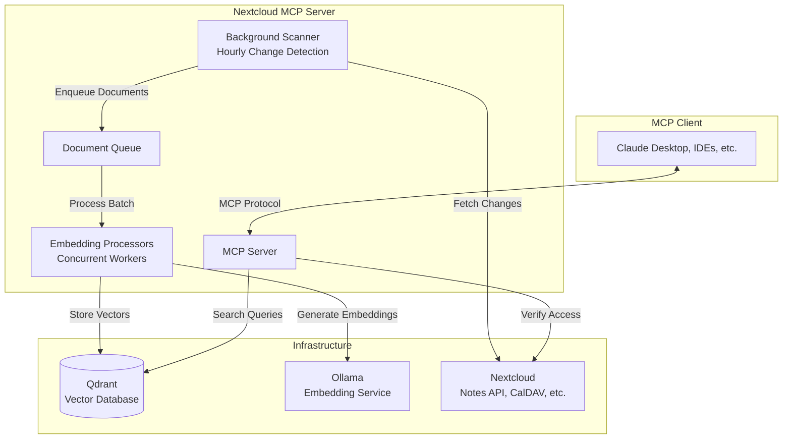
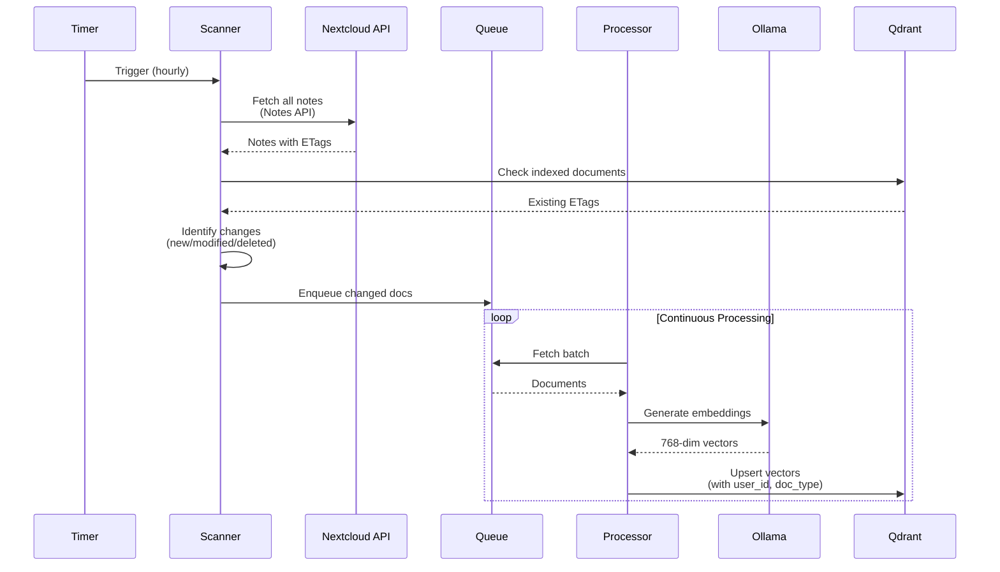
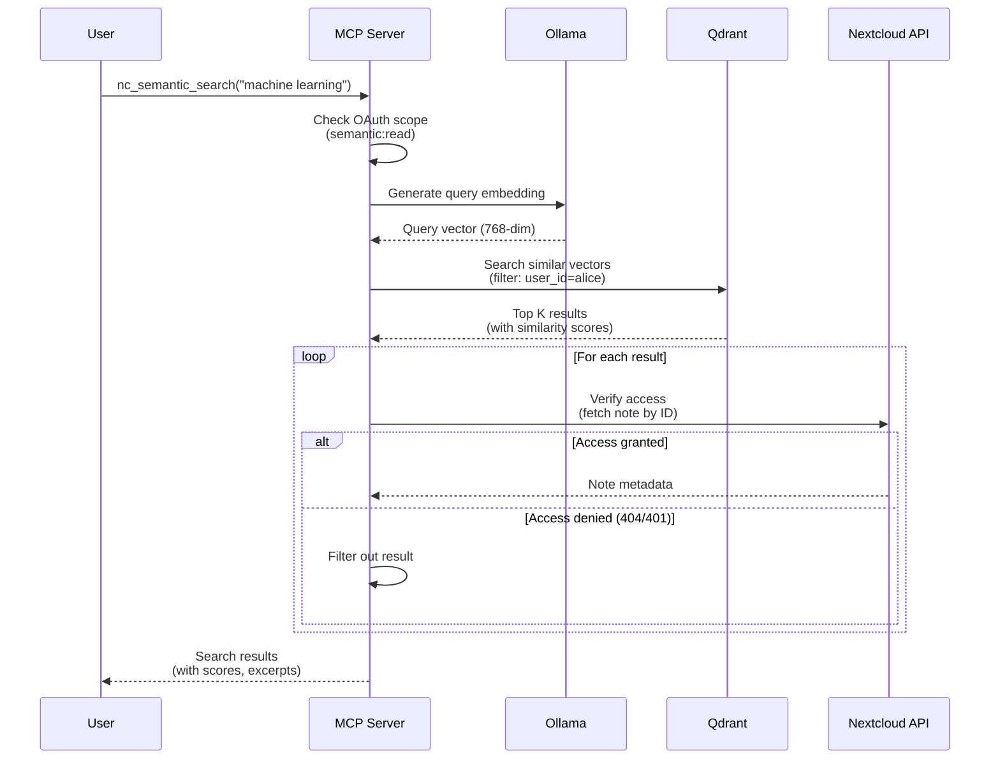
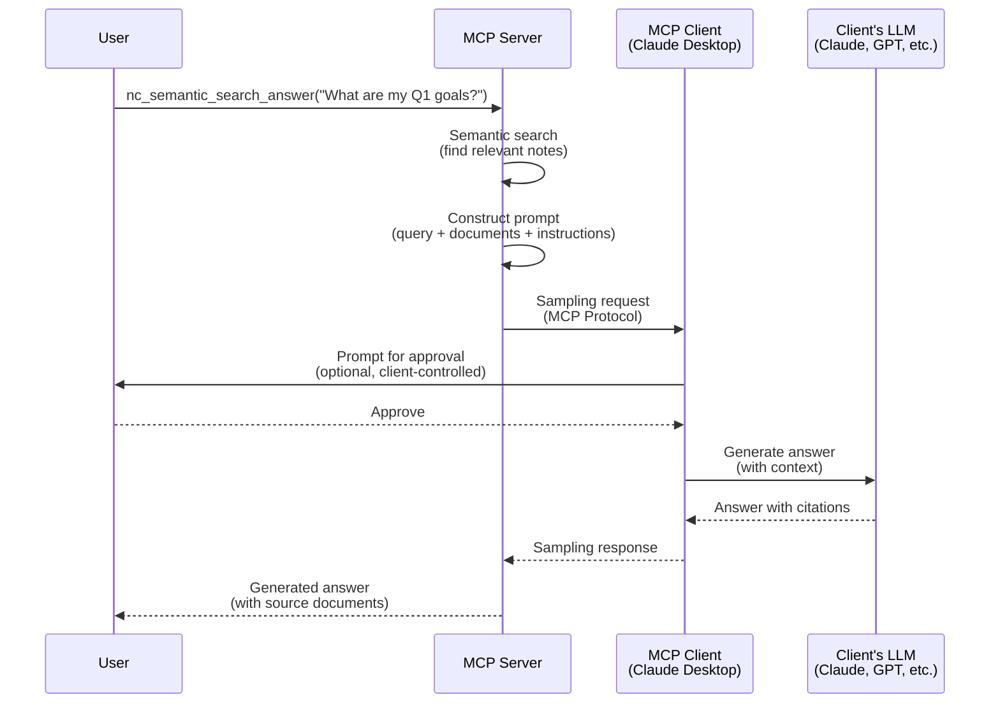

# Semantic Search Architecture

This document explains the architecture of the semantic search feature in the Nextcloud MCP Server, including background synchronization, vector search, and optional AI-generated answers via MCP sampling.

> [!IMPORTANT]
> **Status: Experimental**
> - Disabled by default (`VECTOR_SYNC_ENABLED=false`)
> - Currently supports **Notes app only** (multi-app architecture ready, additional apps planned)
> - Requires additional infrastructure (Qdrant vector database + Ollama embedding service)
> - RAG answer generation requires MCP client sampling support

## Overview

### What is Semantic Search?

**Semantic search** finds information based on **meaning** rather than exact keyword matches. It uses vector embeddings to understand that "car" and "automobile" are similar, or that "bread recipe" matches "how to bake bread."

**Traditional keyword search:**
```
Query: "machine learning"
Matches: Only notes containing "machine learning" exactly
Misses: Notes with "neural networks", "AI models", "deep learning"
```

**Semantic search:**
```
Query: "machine learning"
Matches: Notes about machine learning, neural networks, AI, deep learning, etc.
Understanding: Semantic similarity via vector embeddings
```

### Why It Matters

Semantic search enables:
- **Natural language queries** - Ask questions in plain language
- **Conceptual discovery** - Find related content even with different terminology
- **Cross-reference insights** - Connect ideas across your knowledge base
- **AI-powered answers** - Generate summaries with citations (optional, requires MCP sampling)

### Current Support

- **Supported Apps**: Notes (fully implemented)
- **Planned Apps**: Calendar events, Calendar tasks, Deck cards, Files (with text extraction), Contacts
- **Architecture**: Multi-app plugin system ready, awaiting implementation

## System Components



**Component Roles:**

- **MCP Server**: Exposes semantic search tools (`nc_semantic_search`, `nc_semantic_search_answer`, `nc_get_vector_sync_status`)
- **Background Scanner**: Discovers changed documents every hour using ETag-based change detection
- **Document Queue**: Holds pending documents for embedding generation
- **Embedding Processors**: Generate vector embeddings via Ollama (concurrent workers)
- **Qdrant Vector Database**: Stores document vectors with metadata and user_id filtering
- **Ollama Embedding Service**: Converts text to 768-dimensional vectors (default: `nomic-embed-text` model)
- **Nextcloud APIs**: Source of truth for documents and access control verification

## How It Works: Background Synchronization

Background synchronization runs automatically when `VECTOR_SYNC_ENABLED=true`, discovering changes and indexing documents without user intervention.



### Scanner Behavior

**Hourly Trigger:**
- Runs every hour (configurable)
- Fetches all notes from Nextcloud Notes API
- Compares ETags with Qdrant's indexed state
- Enqueues new/modified documents

**Change Detection:**
- **New documents**: No entry in Qdrant → enqueue for indexing
- **Modified documents**: ETag mismatch → enqueue for re-indexing
- **Deleted documents**: In Qdrant but not in Nextcloud → delete from Qdrant

**Multi-App Plugin Architecture:**
```python
# Each app implements DocumentScanner interface
class NotesScanner(DocumentScanner):
    async def scan(self) -> list[Document]:
        # Fetch notes, detect changes, return documents
```

Currently only `NotesScanner` is implemented. Future: `CalendarScanner`, `DeckScanner`, `FilesScanner`, etc.

### Queue Processing

**Document Queue:**
- In-memory FIFO queue (not persistent across restarts)
- Holds documents pending embedding generation
- Batch processing for efficiency

**Processor Pool:**
- Concurrent workers using `anyio.TaskGroup`
- Process documents in parallel (default: 4 workers)
- Each worker: fetch document → generate embedding → store in Qdrant

**Backpressure Handling:**
- Queue size limits prevent memory exhaustion
- Slow consumers (Ollama) naturally pace the system

### Vector Storage

**Qdrant Collection Schema:**
```
{
  "id": "note_123",
  "vector": [768 dimensions],
  "payload": {
    "user_id": "alice",
    "doc_type": "note",
    "doc_id": "123",
    "title": "Machine Learning Notes",
    "content": "Neural networks are...",
    "etag": "abc123",
    "last_modified": "2025-01-15T10:30:00Z"
  }
}
```

**Key Fields:**
- `user_id`: Multi-tenancy filtering (each user's vectors isolated)
- `doc_type`: App identifier ("note", "event", "card", etc.)
- `etag`: Change detection for incremental updates

### Collection Naming and Model Switching

**Auto-generated collection names:**
- **Format:** `{deployment-id}-{model-name}`
- **Deployment ID:** `OTEL_SERVICE_NAME` (if configured) or `hostname` (fallback)
- **Model name:** `OLLAMA_EMBEDDING_MODEL`
- **Example:** `"my-mcp-server-nomic-embed-text"`, `"mcp-container-all-minilm"`

**Why model-based naming:**
- Ensures each embedding model gets its own collection
- Prevents dimension mismatches when switching models
- Enables safe model experimentation (new model = new collection)
- Supports multi-server deployments (different deployment IDs)

**Switching embedding models:**

Collections are **mutually exclusive** - vectors from one embedding model cannot be used with another. When you change the embedding model:

1. **New collection is created** with the new model's dimensions
2. **Full re-embedding occurs** - scanner processes all documents again
3. **Old collection remains** - can be deleted manually if no longer needed
4. **Dimension validation** - server fails fast if collection dimension doesn't match model

**Example workflow:**
```bash
# Start with nomic-embed-text (768 dimensions)
OLLAMA_EMBEDDING_MODEL=nomic-embed-text
# Collection: "my-server-nomic-embed-text"
# → Scanner indexes 1000 notes → 1000 vectors in collection

# Switch to all-minilm (384 dimensions)
OLLAMA_EMBEDDING_MODEL=all-minilm
# Collection: "my-server-all-minilm"
# → Scanner detects 0 indexed documents → re-embeds 1000 notes
# → Old collection "my-server-nomic-embed-text" still exists in Qdrant
```

**Re-embedding performance:**
- CPU-only: 1-5 notes/second
- With GPU: 50-200 notes/second
- 1000 notes: 3-16 minutes (CPU) or 5-20 seconds (GPU)

**Multi-server deployments:**

Multiple MCP servers can share one Qdrant instance safely:

```bash
# Server 1 (Production)
OTEL_SERVICE_NAME=mcp-prod
OLLAMA_EMBEDDING_MODEL=nomic-embed-text
# → Collection: "mcp-prod-nomic-embed-text"

# Server 2 (Staging with different model)
OTEL_SERVICE_NAME=mcp-staging
OLLAMA_EMBEDDING_MODEL=all-minilm
# → Collection: "mcp-staging-all-minilm"
```

Each deployment gets its own collection - no naming collisions or dimension conflicts.

## How It Works: Semantic Search

Semantic search converts user queries into vectors and finds similar documents using cosine similarity.



### Dual-Phase Authorization

**Phase 1: OAuth Scope Check**
- Verify user has `semantic:read` scope
- Rejects unauthorized users immediately

**Phase 2: Per-Document Verification**
- For each search result, fetch document via app API (Notes, Calendar, etc.)
- If fetch succeeds (200 OK), user has access
- If fetch fails (404 Not Found, 401 Unauthorized), filter out result
- **Security**: Prevents information leakage from vector search alone

**Rationale:**
- Vector database doesn't know about sharing, permissions changes, or deleted documents
- App APIs are source of truth for access control
- Verification ensures users only see documents they can access

### Search Flow

1. **Query Embedding**: Convert user query to 768-dimensional vector via Ollama
2. **Vector Search**: Find top K similar vectors in Qdrant (cosine similarity)
3. **User Filtering**: Qdrant pre-filters by `user_id` (multi-tenancy)
4. **Access Verification**: Fetch each document via app API to verify current access
5. **Result Ranking**: Return results sorted by similarity score
6. **Response**: Include document excerpts, metadata, and similarity scores

### Performance

- **Query latency**: 50-200ms typical (embedding + vector search + verification)
- **Accuracy**: Depends on embedding model quality (`nomic-embed-text` recommended)
- **Scalability**: Qdrant handles millions of vectors efficiently

## How It Works: RAG with MCP Sampling (Optional)

The `nc_semantic_search_answer` tool generates AI-powered answers with citations using **MCP sampling** - requesting the MCP client's LLM to generate text.



### MCP Sampling Architecture

**Why MCP Sampling?**
- **No server-side LLM**: MCP server has no API keys, doesn't call LLMs directly
- **Client controls everything**: Which model, who pays, user approval prompts
- **Privacy**: Documents stay with the client's LLM provider, not a third-party
- **Flexibility**: Works with any MCP client that supports sampling (Claude Desktop, future clients)

**Prompt Construction:**
```
User Query: {query}

Relevant Documents:
1. Document: {title} (Note)
   Content: {excerpt}

2. Document: {title} (Note)
   Content: {excerpt}

Instructions:
- Provide a comprehensive answer to the user's query
- Use the documents above as context
- Include citations: "According to Document 1 (title)..."
- If documents don't contain enough information, say so
```

**Graceful Fallback:**
```python
try:
    result = await ctx.session.create_message(...)
    return answer_with_citations
except Exception as e:
    # Fallback: Return documents without generated answer
    return SearchResponse(
        generated_answer=f"[Sampling unavailable: {e}]",
        sources=search_results
    )
```

**Client Support:**
- **Requires**: MCP client with sampling capability
- **Known support**: Claude Desktop (as of Claude 3.5+)
- **Graceful degradation**: Returns raw documents if sampling unavailable

## Authentication & Security

### OAuth Scopes

**`semantic:read`** - Search permission
- Allows using `nc_semantic_search` and `nc_semantic_search_answer` tools
- Does NOT grant access to documents (verified via app APIs)
- Required for any semantic search operation

**`semantic:write`** - Sync control permission
- Allows enabling/disabling background sync (`provision_vector_sync`, `deprovision_vector_sync`)
- Controls whether user's documents are indexed
- Currently not implemented in OAuth mode (BasicAuth only)

### Dual-Phase Authorization Pattern

**Phase 1: Scope Check** (semantic:read)
- Verifies user authorized to search
- Prevents unauthorized vector database access

**Phase 2: Document Verification** (app-specific APIs)
- For each search result, fetch via Notes API, CalDAV, etc.
- If user can fetch → include in results
- If user cannot fetch (404/401) → filter out
- **Security**: Vector search cannot leak documents user shouldn't see

**Example Scenario:**
1. Alice creates note "Secret Project X"
2. Background sync indexes note with `user_id=alice`
3. Bob searches for "project"
4. Vector search finds "Secret Project X" (vector similarity)
5. Qdrant filters by `user_id=bob` → no match (Alice's note excluded)
6. Even if Bob somehow got the doc_id, Phase 2 verification would fail (404 Not Found)

### Offline Access for Background Sync

**Why needed:**
- Background scanner runs hourly without user interaction
- Requires valid access tokens to fetch documents from Nextcloud APIs
- User's session token expires after hours/days

**OAuth Mode (ADR-004 Flow 2):**
- User explicitly provisions offline access via `provision_nextcloud_access` tool
- Server requests `offline_access` scope → receives refresh token
- Refresh token stored securely (database, encrypted)
- Background sync uses refresh tokens to obtain access tokens

**BasicAuth Mode:**
- Username/password stored in environment variables
- Always available for background operations
- Simpler but less secure (credentials never expire)

## Deployment Modes

### Authentication Modes

| Mode | Security | Offline Access | Background Sync | Best For |
|------|----------|----------------|-----------------|----------|
| **BasicAuth** | Lower (credentials in env) | Always available | ✅ Works immediately | Single-user, development, testing |
| **OAuth** | Higher (tokens, scopes) | User must provision | ⚠️ Not yet implemented | Multi-user, production |

**BasicAuth:**
- Set `NEXTCLOUD_USERNAME` and `NEXTCLOUD_PASSWORD`
- Background sync works immediately when `VECTOR_SYNC_ENABLED=true`
- Credentials stored in `.env` file (secure server access required)

**OAuth:**
- Client authenticates with `semantic:read` scope
- User must explicitly provision offline access (future: `provision_vector_sync` tool)
- Background sync only works for users who provisioned access
- More secure: tokens expire, user controls access

### Qdrant Deployment Modes

| Mode | Configuration | Persistence | Scalability | Best For |
|------|---------------|-------------|-------------|----------|
| **In-Memory** (default) | `QDRANT_LOCATION=:memory:` | ❌ Lost on restart | Single instance | Testing, development |
| **Persistent Local** | `QDRANT_LOCATION=/data/qdrant` | ✅ Survives restarts | Single instance | Small deployments |
| **Network** | `QDRANT_URL=http://qdrant:6333` | ✅ Dedicated service | ✅ Horizontal scaling | Production |

**In-Memory Mode:**
```bash
VECTOR_SYNC_ENABLED=true
# QDRANT_LOCATION not set → defaults to :memory:
```
- Fastest startup
- No disk I/O
- **Warning**: All vectors lost when server restarts (must re-index)

**Persistent Local Mode:**
```bash
VECTOR_SYNC_ENABLED=true
QDRANT_LOCATION=/var/lib/qdrant
```
- Vectors survive restarts
- Single server only (no distributed setup)
- Disk I/O for durability

**Network Mode (Recommended for Production):**
```bash
VECTOR_SYNC_ENABLED=true
QDRANT_URL=http://qdrant:6333
QDRANT_API_KEY=secret  # optional
```
- Dedicated Qdrant service (Docker, Kubernetes)
- Horizontal scaling (multiple MCP servers → one Qdrant)
- High availability options

### Embedding Service Options

| Service | Configuration | Cost | Performance | Best For |
|---------|---------------|------|-------------|----------|
| **Ollama** (recommended) | `OLLAMA_BASE_URL=http://ollama:11434` | Free (self-hosted) | Fast (local GPU) | Production, development |
| **OpenAI** (future) | `OPENAI_API_KEY=sk-...` | Paid (API) | Fast (cloud) | Cloud deployments |
| **Fallback** | No config | Free | Slow (random) | Testing only (not production) |

**Ollama Setup (Recommended):**
```bash
# docker-compose.yml
services:
  ollama:
    image: ollama/ollama
    volumes:
      - ollama-data:/root/.ollama
    ports:
      - "11434:11434"

# Pull embedding model
docker compose exec ollama ollama pull nomic-embed-text
```

**Environment Configuration:**
```bash
OLLAMA_BASE_URL=http://ollama:11434
OLLAMA_EMBEDDING_MODEL=nomic-embed-text  # 768-dimensional vectors
```

**Model Options:**
- `nomic-embed-text` (default): 768-dim, optimized for semantic search
- `all-minilm`: Smaller, faster, slightly less accurate
- `mxbai-embed-large`: Larger, more accurate, slower

## Configuration Overview

### Key Environment Variables

**Enable Semantic Search:**
```bash
VECTOR_SYNC_ENABLED=true  # Default: false (opt-in)
```

**Qdrant Vector Database:**
```bash
# In-memory mode (default if VECTOR_SYNC_ENABLED=true)
# QDRANT_LOCATION not set → uses :memory:

# Persistent local mode
QDRANT_LOCATION=/var/lib/qdrant

# Network mode (production)
QDRANT_URL=http://qdrant:6333
QDRANT_API_KEY=secret  # optional
```

**Ollama Embedding Service:**
```bash
OLLAMA_BASE_URL=http://ollama:11434
OLLAMA_EMBEDDING_MODEL=nomic-embed-text  # Default
```

**Scanner Configuration:**
```bash
VECTOR_SYNC_INTERVAL=3600  # Scan interval in seconds (default: 1 hour)
```

### Resource Requirements

**Qdrant:**
- **Memory**: ~100-200 MB base + ~1 KB per vector (1M vectors ≈ 1 GB)
- **Disk**: Persistent mode only, ~200 bytes per vector
- **CPU**: Low (indexing) to moderate (search)

**Ollama:**
- **Memory**: 2-4 GB for `nomic-embed-text` model
- **CPU**: High during embedding generation, idle otherwise
- **GPU**: Optional but recommended (10-100x faster)

**MCP Server:**
- **Memory**: +50-100 MB for background sync workers
- **CPU**: Moderate during scanning/processing, low otherwise

### Trade-offs

| Consideration | In-Memory Qdrant | Persistent Qdrant | Network Qdrant |
|---------------|------------------|-------------------|----------------|
| Setup complexity | ✅ Minimal | ✅ Easy | ⚠️ Requires separate service |
| Durability | ❌ Lost on restart | ✅ Survives restarts | ✅ Survives restarts |
| Scalability | ❌ Single instance | ❌ Single instance | ✅ Horizontal scaling |
| Performance | ✅ Fastest | ✅ Fast | ⚠️ Network latency |

## Operational Behavior

### What Happens When VECTOR_SYNC_ENABLED=true

**Immediate (Server Startup):**
1. MCP server connects to Qdrant (creates collection if needed)
2. MCP server connects to Ollama (verifies embedding model available)
3. Background scanner starts (schedules hourly runs)
4. Document queue and processors initialize

**First Scan (Within 1 hour):**
1. Scanner fetches all notes from Nextcloud
2. Compares with Qdrant (likely empty on first run)
3. Enqueues all notes for indexing
4. Processors generate embeddings (may take minutes for large note collections)
5. Vectors stored in Qdrant with user_id filtering

**Hourly Thereafter:**
1. Scanner fetches all notes
2. Identifies new/modified/deleted notes (ETag comparison)
3. Enqueues changes only
4. Incremental updates processed

### Performance Expectations

**Embedding Generation:**
- **Without GPU**: 1-5 notes/second (CPU-bound)
- **With GPU**: 50-200 notes/second (highly parallel)
- **Initial indexing**: 100 notes ≈ 20-100 seconds (CPU), 1-2 seconds (GPU)

**Search Query:**
- **Embedding generation**: 50-100ms
- **Vector search**: 10-50ms (depends on collection size)
- **Access verification**: 20-100ms per document (Nextcloud API calls)
- **Total latency**: 100-300ms typical

**Resource Usage:**
- **Idle**: Minimal (background scanner sleeps)
- **Scanning**: Moderate CPU (ETag checks, API calls)
- **Processing**: High CPU/GPU (embedding generation)
- **Searching**: Low to moderate (depends on query frequency)

### Background Sync Behavior

**Scanner Triggers:**
- Hourly (configurable via `VECTOR_SYNC_INTERVAL`)
- Manual trigger via `nc_trigger_vector_sync` (future)

**Queue Processing:**
- Continuous (workers always running)
- Batch processing (fetch 10 documents at a time)
- Concurrent workers (4 by default)

**Error Handling:**
- Individual document failures logged but don't stop scanning
- Retries for transient errors (network timeouts, rate limits)
- Failed documents skipped, re-attempted on next scan

**What Gets Indexed:**
- **Notes**: All notes accessible to the authenticated user
- **Future**: Calendar events, tasks, deck cards, files with text extraction, contacts

## Monitoring & Observability

### MCP Tools

**`nc_get_vector_sync_status`** - Check sync status
```python
{
  "total_documents": 1234,
  "indexed_documents": 1200,
  "pending_documents": 34,
  "sync_enabled": true,
  "last_scan": "2025-01-15T14:30:00Z",
  "status": "syncing"  # idle | syncing | error
}
```

**Interpreting Status:**
- `idle`: No pending work, last scan completed successfully
- `syncing`: Currently processing documents
- `error`: Last scan failed (check logs)

### Logs to Check

**Scanner Logs:**
```
[INFO] Vector sync scanner started (interval: 3600s)
[INFO] Scanning notes: found 150 documents
[INFO] Changes detected: 5 new, 2 modified, 1 deleted
[INFO] Enqueued 7 documents for processing
```

**Processor Logs:**
```
[INFO] Processing document: note_123
[DEBUG] Generated embedding (768 dimensions)
[INFO] Stored vector in Qdrant: note_123
```

**Error Logs:**
```
[ERROR] Failed to generate embedding for note_123: Connection timeout
[WARN] Qdrant connection lost, retrying...
[ERROR] Ollama embedding failed: Model not found
```

**Log Locations:**
- **Docker**: `docker compose logs mcp`
- **Local**: stdout (redirect to file if needed)
- **Kubernetes**: `kubectl logs -f deployment/nextcloud-mcp-server`

### Metrics to Monitor

**Indexing Progress:**
- Total documents vs indexed documents
- Pending queue size
- Processing rate (docs/second)

**Search Performance:**
- Query latency (p50, p95, p99)
- Results per query
- Verification overhead (API calls per query)

**Resource Usage:**
- Qdrant memory/disk usage
- Ollama CPU/GPU usage
- MCP server memory

For detailed observability setup, see [docs/observability.md](observability.md).

## Troubleshooting from Architecture Perspective

### Documents Not Appearing in Search

**Diagnosis Flow:**
1. Check sync status: `nc_get_vector_sync_status`
   - `sync_enabled: false` → Enable with `VECTOR_SYNC_ENABLED=true`
   - `status: error` → Check scanner logs for failures
2. Check queue size:
   - `pending_documents > 0` → Processing in progress, wait
   - `pending_documents == 0` but `indexed_documents` low → Scan hasn't run yet (wait up to 1 hour)
3. Check Qdrant:
   - Connection errors in logs → Verify `QDRANT_URL` or `QDRANT_LOCATION`
   - Collection empty → First scan hasn't completed
4. Check Ollama:
   - Embedding errors in logs → Verify `OLLAMA_BASE_URL`
   - Model not found → Pull model: `ollama pull nomic-embed-text`

**Common Causes:**
- Sync disabled (default): Enable `VECTOR_SYNC_ENABLED=true`
- Ollama not running: Start Ollama service
- Qdrant not accessible: Check network/URL
- First scan in progress: Wait up to 1 hour + processing time

### Slow Search Performance

**Diagnosis:**
1. **Query embedding slow (>500ms)**:
   - Ollama overloaded or CPU-bound
   - Solution: Use GPU, upgrade CPU, or reduce concurrent requests
2. **Vector search slow (>200ms)**:
   - Large collection (millions of vectors)
   - Solution: Use network Qdrant with SSDs, add indexing
3. **Verification slow (>500ms)**:
   - Many results to verify (10+ documents)
   - Nextcloud API slow or overloaded
   - Solution: Reduce `limit` parameter, optimize Nextcloud

**Performance Tuning:**
- Reduce search `limit` (default: 10 results)
- Use network Qdrant for large collections
- Enable Ollama GPU acceleration
- Check Nextcloud API response times

### Background Sync Stopped

**Diagnosis:**
1. Check logs for errors:
   - Authentication failures (401/403) → Token expired (OAuth) or credentials invalid (BasicAuth)
   - Connection timeouts → Network issues with Nextcloud/Qdrant/Ollama
   - Rate limiting (429) → Reduce scan frequency
2. Check `nc_get_vector_sync_status`:
   - `status: error` → See logs for details
   - `last_scan` timestamp old (>2 hours) → Scanner may have crashed
3. Verify services:
   - Qdrant accessible: `curl http://qdrant:6333/`
   - Ollama accessible: `curl http://ollama:11434/api/tags`
   - Nextcloud accessible: Check API health

**OAuth Mode (Future):**
- Offline access token expired → Re-provision via `provision_vector_sync`
- User deprovisioned access → Sync stops intentionally

### Out of Memory

**Diagnosis:**
1. Check Qdrant mode:
   - In-memory mode with large collection → Switch to persistent or network mode
2. Check embedding batch size:
   - Too many documents processed simultaneously → Reduce worker count
3. Check Ollama memory:
   - Large models loaded → Use smaller embedding model

**Solutions:**
- Use persistent or network Qdrant (frees server memory)
- Reduce concurrent processor workers
- Use smaller embedding model (`all-minilm` instead of `nomic-embed-text`)
- Increase server memory allocation

## Limitations & Future Work

### Current Limitations

1. **Notes App Only**
   - Architecture supports multiple apps (plugin system ready)
   - Only `NotesScanner` and `NotesProcessor` implemented
   - Future: Calendar, Deck, Files, Contacts

2. **MCP Sampling Support**
   - `nc_semantic_search_answer` requires client sampling capability
   - Not all MCP clients support sampling yet
   - Graceful fallback: Returns documents without generated answer

3. **OAuth Background Sync**
   - User-controlled background jobs not yet implemented
   - Currently works in BasicAuth mode only
   - Future: Users opt-in via `provision_vector_sync` tool

4. **No Incremental Updates**
   - Document changes trigger full re-embedding
   - Cannot update just modified paragraphs
   - Future: Paragraph-level chunking and incremental updates

5. **No Query Caching**
   - Each search generates new query embedding
   - Repeated queries re-search Qdrant
   - Future: Cache recent query embeddings and results

6. **Single Embedding Model**
   - Uses one model for all documents and queries
   - Cannot customize per app or user
   - Future: App-specific or user-selected models

### Future Enhancements

**Multi-App Support** (In Progress):
- Scanner plugins for Calendar, Deck, Files, Contacts
- Unified vector search across all apps
- App-specific metadata in vector payloads

**User-Controlled Sync (OAuth Mode)**:
- `provision_vector_sync` and `deprovision_vector_sync` tools
- Per-user background job scheduling
- User dashboard for sync status and controls

**Advanced Search Features**:
- Hybrid search (vector + keyword combined)
- Filtering by date range, app type, tags
- Aggregations and faceted search
- Search result explanations (why this matched)

**Performance Optimizations**:
- Query caching for repeated searches
- Incremental document updates (paragraph-level)
- Batch query processing
- Qdrant HNSW indexing tuning

**Embedding Improvements**:
- Support for OpenAI embeddings (ada-002, text-embedding-3)
- Multi-language embedding models
- Fine-tuned models for Nextcloud content
- Paragraph-level chunking for long documents

## References

### Architecture Decision Records (ADRs)

- **[ADR-003: Vector Database Semantic Search](ADR-003-vector-database-semantic-search.md)** - Qdrant selection rationale, embedding strategy, hybrid search (superseded by ADR-007 but technical decisions remain valid)
- **[ADR-007: Background Vector Sync Job Management](ADR-007-background-vector-sync-job-management.md)** - Current implementation, Scanner-Queue-Processor architecture, plugin system
- **[ADR-008: MCP Sampling for Semantic Search](ADR-008-mcp-sampling-for-semantic-search.md)** - RAG with MCP sampling, client-server separation, prompt construction
- **[ADR-009: Semantic Search OAuth Scope](ADR-009-semantic-search-oauth-scope.md)** - OAuth scope model, dual-phase authorization, security rationale

### Configuration & Setup

- **[Configuration Guide](configuration.md)** - Environment variables, Qdrant setup, Ollama setup, detailed configuration options
- **[Installation Guide](installation.md)** - Deployment options (Docker, Kubernetes, local)
- **[Running the Server](running.md)** - Starting the server, transport options, testing

### Monitoring & Troubleshooting

- **[Observability Guide](observability.md)** - Logging, metrics, tracing, debugging
- **[Troubleshooting](troubleshooting.md)** - General issues and solutions

### Related Documentation

- **[OAuth Architecture](oauth-architecture.md)** - OAuth flows, scopes, token management
- **[Comparison with Context Agent](comparison-context-agent.md)** - When to use Nextcloud MCP Server vs Context Agent

---

**Questions or Issues?**
- [Open an issue](https://github.com/cbcoutinho/nextcloud-mcp-server/issues)
- [Contribute improvements](https://github.com/cbcoutinho/nextcloud-mcp-server/pulls)
