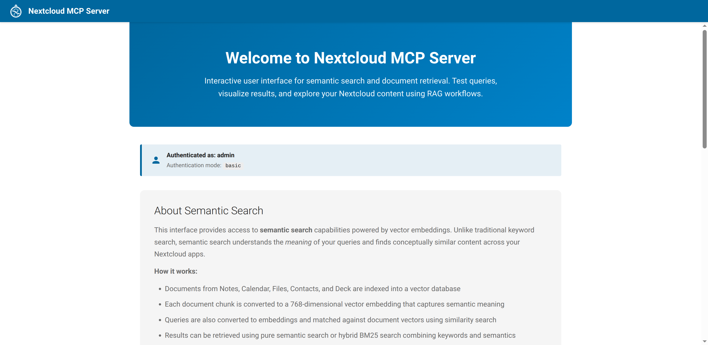
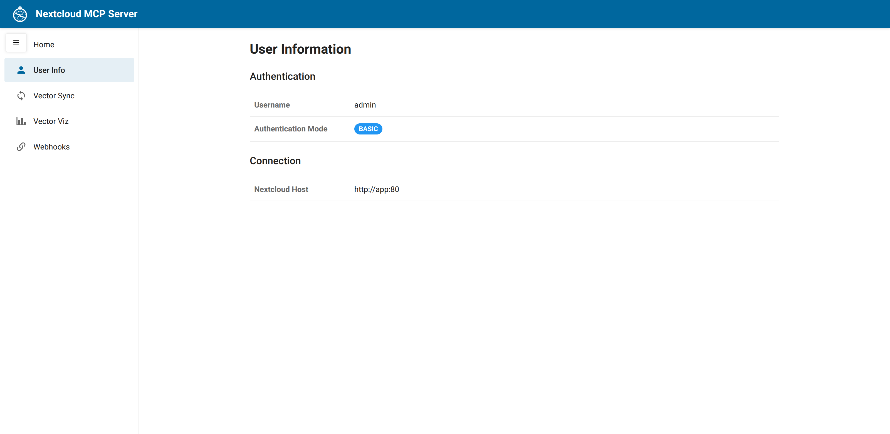
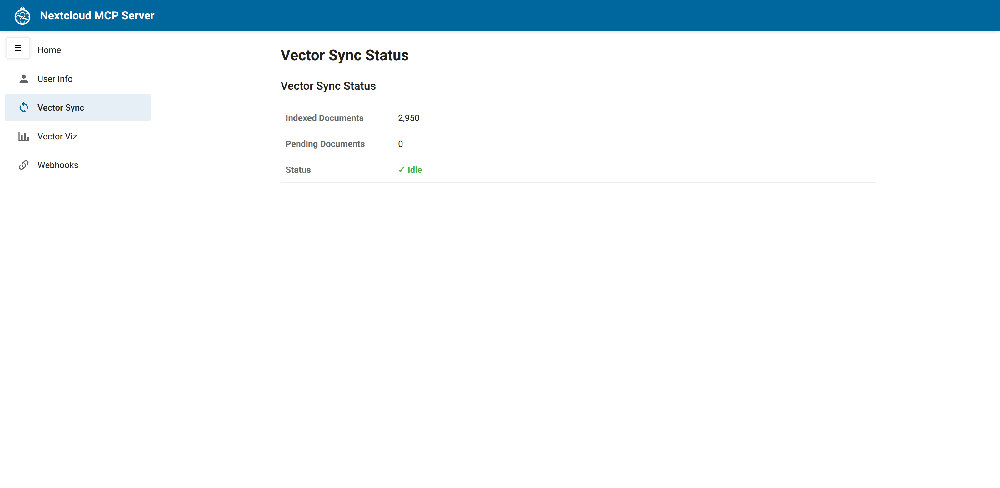
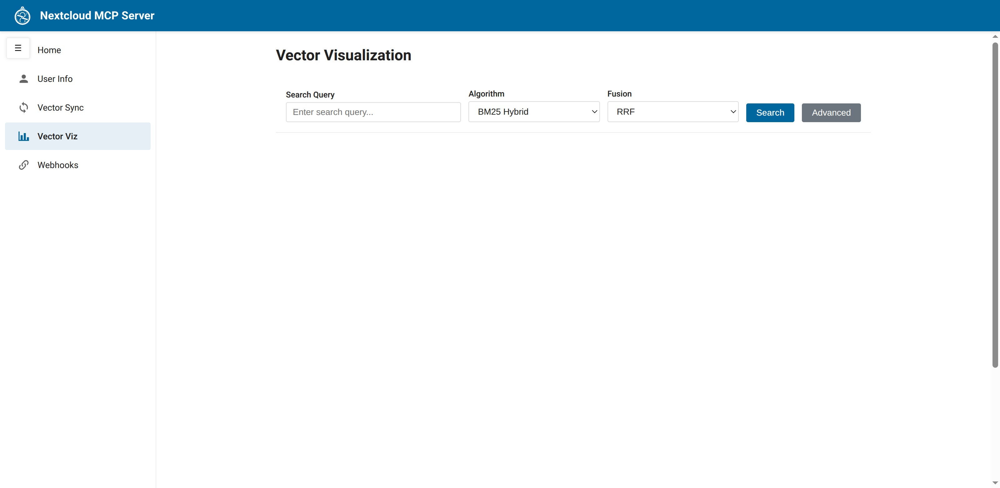
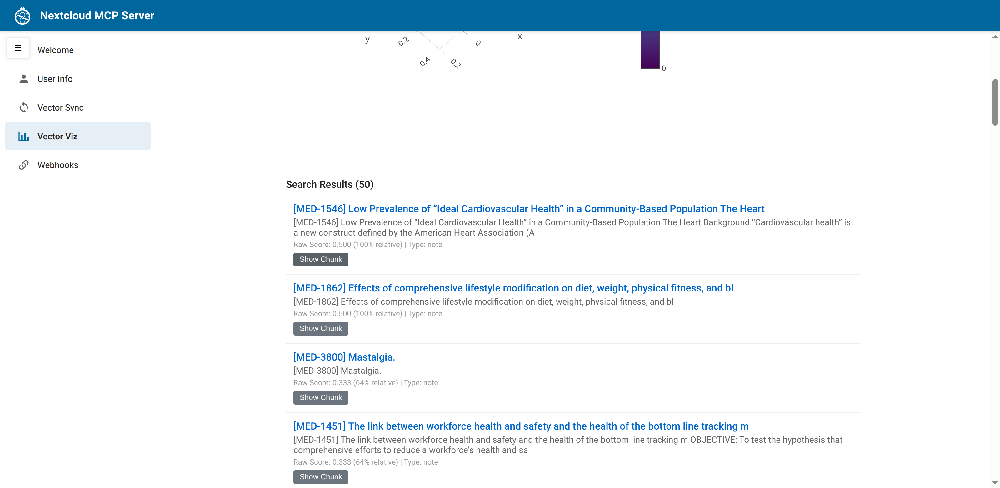
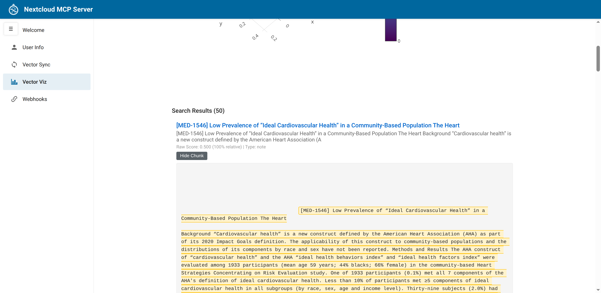

# Vector Sync UI Guide

This guide covers the browser-based user interface for the Nextcloud MCP Server's semantic search and vector synchronization features.

## Overview

The Vector Sync UI (`/app`) is a browser-based interface that allows you to interact with semantic search results from documents in your Nextcloud instance. This UI provides the same query capabilities that Large Language Models (LLMs) use in Retrieval-Augmented Generation (RAG) workflows, allowing you to test queries and visualize results in an intuitive way.

## Accessing the UI

Navigate to the `/app` endpoint of your MCP server after authentication:

- **BasicAuth mode**: `http://localhost:8000/app` (credentials from environment)
- **OAuth mode**: `http://localhost:8000/app` (redirects to login if not authenticated)

## Welcome Page

The welcome page is the default landing page when you access `/app`. It provides an introduction to the MCP server's capabilities and adapts its content based on whether vector sync is enabled.



### When Vector Sync is Enabled

The welcome page includes:

- **Authentication status** - Shows your username and authentication mode
- **About Semantic Search** - Explanation of semantic search capabilities and how it works
- **RAG Workflow Integration** - How the UI fits into RAG workflows and helps test LLM queries
- **Feature cards** - Quick navigation to User Info, Vector Sync Status, and Vector Visualization

### When Vector Sync is Disabled

If `VECTOR_SYNC_ENABLED=false`, the welcome page displays:

- A warning message explaining that vector sync is disabled
- Link to configuration documentation for enabling the feature
- Limited navigation (User Info only)

## User Info Tab

Access user information and session details by navigating to `/app/user-info` or clicking "User Info" in the welcome page.



### What's Displayed

**BasicAuth Mode:**
- Username
- Authentication mode badge
- Nextcloud host connection URL

**OAuth Mode:**
- Username
- Authentication mode badge
- Session ID (truncated for security)
- Background access status (granted or not granted)
- IdP profile information (if available)
- Option to revoke background access

### Navigation

The user info page includes a sidebar with tabs for:
- **Home** - Returns to the welcome page
- **User Info** - Current page
- **Vector Sync** - Real-time sync status (if vector sync enabled)
- **Vector Viz** - Interactive visualization (if vector sync enabled)
- **Webhooks** - Admin-only webhook management (if user is admin)

## Vector Sync Status Tab

Monitor real-time indexing progress and synchronization status.



### Metrics Displayed

| Metric | Description |
|--------|-------------|
| **Indexed Documents** | Total number of document chunks stored in Qdrant vector database |
| **Pending Documents** | Number of documents in the processing queue waiting to be embedded |
| **Status** | Current sync state: "✓ Idle" (green) or "⟳ Syncing" (orange) |

### Real-Time Updates

The status tab uses htmx to automatically refresh every 10 seconds, providing live updates without manual page refreshes.

### What the Metrics Mean

- **Indexed Documents**: These are document chunks that have been converted to 768-dimensional vector embeddings and stored in Qdrant. These documents are immediately searchable via semantic search.

- **Pending Documents**: Documents in the queue that are awaiting embedding processing. The processor workers will gradually process these documents based on available resources.

- **Idle Status**: No documents are currently being processed. The system is up-to-date.

- **Syncing Status**: Documents are actively being processed and indexed. This is normal after adding new content or on initial sync.

## Vector Visualization Tab

Interactive search interface with 2D visualization of results in semantic space.



### Search Controls

**Search Query**
- Enter natural language queries to search your Nextcloud documents
- Examples: "health benefits of coffee vs tea", "python testing frameworks", "project deadlines"

**Algorithm Selection**
- **Semantic (Dense)**: Pure semantic search using vector similarity
- **BM25 Hybrid** (default): Combines semantic search with keyword matching using BM25 sparse vectors

**Fusion Method** (for BM25 Hybrid only)
- **RRF** (Reciprocal Rank Fusion): General-purpose fusion using reciprocal ranks
- **DBSF** (Distribution-Based Score Fusion): Distribution-based normalization for better score balancing

**Advanced Options**
- Document types filter (Notes, Files, Calendar, Contacts, Deck)
- Score threshold (0.0-1.0)
- Result limit (default: 50, max: 100)

### Search Results



The visualization displays:

1. **2D PCA Plot** - Documents projected into 2D space using Principal Component Analysis
   - Point size indicates relevance score (larger = more relevant)
   - Point opacity correlates with score (more opaque = higher score)
   - Color scale (Viridis) represents similarity (yellow = highest match)
   - Hover over points to see document details

2. **Results List** - Searchable documents with:
   - Document title (clickable link to Nextcloud app)
   - Snippet preview of matched content
   - Raw score and relative score percentage
   - Document type (note, file, calendar, etc.)
   - "Show Chunk" button to expand matched text

### Viewing Chunk Context

Click "Show Chunk" to view the matched text with surrounding context.



The chunk context view displays:
- **Highlighted matched chunk** - The specific text segment that matched your query (highlighted in yellow)
- **Surrounding context** - Up to 500 characters before and after the match for better understanding
- **Full document link** - Click the title to open the document in the Nextcloud app

### Understanding the 2D Visualization

The PCA (Principal Component Analysis) plot reduces 768-dimensional vector embeddings to 2D for visualization:

- **Proximity** - Documents closer together in 2D space are semantically similar
- **Clusters** - Groups of related documents appear as clusters
- **Outliers** - Distant points represent documents with unique content
- **Query position** - Your search query is embedded and plotted alongside results

**Note**: PCA is a dimensionality reduction technique that preserves as much variance as possible, but some information is lost in the projection from 768D to 2D.

## Configuration Requirements

### Required Environment Variables

To enable vector sync features:

```bash
VECTOR_SYNC_ENABLED=true
```

### Optional Configuration

For browser-accessible links to Nextcloud apps (Notes, Files, etc.):

```bash
NEXTCLOUD_PUBLIC_ISSUER_URL=https://your-public-nextcloud-url.com
```

If not set, falls back to `NEXTCLOUD_HOST` from settings.

### Admin Access

The Webhooks tab is only visible to users with Nextcloud admin privileges. Admin status is checked via the Nextcloud Provisioning API.

## Use Cases

### 1. Monitoring Document Indexing

Use the Vector Sync Status tab to:
- Verify documents are being indexed after creation/modification
- Check if the indexing queue is backing up (high pending count)
- Confirm the system is idle after bulk document imports

### 2. Testing Search Queries

Use the Vector Visualization tab to:
- Test queries before they're used by LLMs in RAG workflows
- Compare semantic vs. hybrid search algorithms
- Verify that relevant documents are being retrieved
- Understand relevance scores and ranking

### 3. Debugging Search Results

Use chunk context to:
- See exactly which text segments match your query
- Verify that the matched content is relevant
- Identify why unexpected documents appear in results
- Understand the surrounding context of matches

### 4. Algorithm Comparison

Experiment with different search approaches:
- **Pure semantic**: Best for conceptual queries and synonyms
- **BM25 hybrid with RRF**: Balanced approach combining keywords and semantics
- **BM25 hybrid with DBSF**: Alternative fusion for different score distributions

## Technical Details

### Frontend Stack

- **Alpine.js** - Reactive state management for UI interactions
- **htmx** - Server-driven dynamic updates for status polling
- **Plotly.js** - Interactive 2D scatter plot visualization
- **Nextcloud design system** - Consistent styling matching Nextcloud ecosystem

### Backend Processing

- **Server-side PCA** - Dimensionality reduction performed on the server to minimize bandwidth
- **Chunk-level search** - Searches operate on document chunks (not whole documents)
- **Document deduplication** - Multiple chunks from the same document are deduplicated in results
- **Timing metrics** - All search operations log performance metrics for monitoring

### Supported Apps

Documents from the following Nextcloud apps are indexed and searchable:

- **Notes** - All notes and their content
- **Files** - Supported file types (text, PDF, etc.)
- **Calendar** - Calendar events and tasks (VTODO)
- **Contacts** - Contact information (CardDAV)
- **Deck** - Deck cards and board content

## Troubleshooting

### Vector Sync Tab Not Visible

**Cause**: `VECTOR_SYNC_ENABLED` is not set to `true`

**Solution**: Set the environment variable and restart the MCP server:
```bash
export VECTOR_SYNC_ENABLED=true
docker compose restart mcp
```

### No Search Results

**Possible causes**:
1. No documents have been indexed yet (check Vector Sync Status)
2. Query doesn't match indexed content
3. Score threshold is too high

**Solutions**:
- Wait for documents to be indexed (check "Indexed Documents" count)
- Try broader or different queries
- Lower the score threshold in Advanced options

### Chunk Context Not Loading

**Cause**: Network error or document no longer exists

**Solution**: Check browser console for errors and verify the document still exists in Nextcloud

### Links to Nextcloud Apps Not Working

**Cause**: `NEXTCLOUD_PUBLIC_ISSUER_URL` not configured or incorrect

**Solution**: Set the public URL for browser-accessible links:
```bash
export NEXTCLOUD_PUBLIC_ISSUER_URL=https://your-public-nextcloud-url.com
```

## Related Documentation

- [Configuration Guide](../configuration.md) - Environment variables and settings
- [Authentication Modes](../authentication.md) - BasicAuth vs OAuth setup
- [Installation Guide](../installation.md) - Getting started with the MCP server
- [ADR-008: MCP Sampling for RAG](../ADR-008-mcp-sampling-for-rag.md) - Technical details on RAG workflows

## FAQ

**Q: Can I use this UI without vector sync enabled?**

A: Yes, but you'll only have access to the User Info tab. Vector Sync and Vector Visualization features require `VECTOR_SYNC_ENABLED=true`.

**Q: How often does the status refresh?**

A: The Vector Sync Status tab polls every 10 seconds automatically using htmx.

**Q: What's the difference between BM25 Hybrid and Semantic search?**

A: Semantic search uses only vector embeddings for conceptual similarity. BM25 Hybrid combines semantic search with traditional keyword matching (BM25 sparse vectors) for better precision on exact terms.

**Q: Can I search across multiple Nextcloud apps at once?**

A: Yes! By default, searches query all indexed apps. Use the Advanced options to filter by specific document types.

**Q: Why do some documents have higher scores than others?**

A: Scores represent semantic similarity to your query. Higher scores indicate better matches based on vector similarity (semantic search) or a combination of vector similarity and keyword matching (BM25 hybrid).

**Q: What does the color scale represent in the PCA plot?**

A: The Viridis color scale represents relative relevance scores, with yellow indicating the most relevant documents and purple indicating lower relevance.
